# KETHAM_ARCHITECTURE.md
# SalonAI Workforce Platform — Complete Architecture Guide

> **Who is this for?** This document is written for anyone completely new to this project.
> Every technical term is explained before it is used.
> By the end, you should be able to explain this system confidently to a professor, colleague, or interviewer.

---

## Table of Contents

1. [High-Level System Overview](#1-high-level-system-overview)
2. [Overall Workflow](#2-overall-workflow)
3. [Every Agent Explained](#3-every-agent-explained)
4. [MultiAgent Orchestrator Deep Dive](#4-multiagent-orchestrator-deep-dive)
5. [MCP Architecture](#5-mcp-architecture)
6. [RAG Architecture](#6-rag-architecture)
7. [Database Architecture](#7-database-architecture)
8. [Tool Calling Architecture](#8-tool-calling-architecture)
9. [Service Layer](#9-service-layer)
10. [Security Layers](#10-security-layers)
11. [Event-Driven Architecture](#11-event-driven-architecture)
12. [Complete End-to-End Booking Workflow](#12-complete-end-to-end-booking-workflow)
13. [Folder Structure](#13-folder-structure)
14. [Code Walkthrough](#14-code-walkthrough)
15. [End-to-End Architecture Diagram](#15-end-to-end-architecture-diagram)

---

# 1. High-Level System Overview

## What Is This Project?

**SalonAI Workforce Platform** is an enterprise-grade AI system that automates and manages a salon business using multiple AI agents.

Imagine walking into a salon and instead of calling the front desk, you open a chat window and talk to an AI. That AI:
- Books your appointment
- Reschedules or cancels it
- Sends you promotions
- Reads and responds to your reviews
- Helps staff check their daily schedule
- Gives the owner real-time business analytics

This platform does ALL of that — automatically — using **multiple specialized AI agents**, each with a different role.

---

## Why Multiple Agents Instead of One?

Imagine one person trying to be a receptionist, sales agent, marketing manager, data analyst, and customer service representative at the same time. That person would be overwhelmed and make mistakes.

The same is true for AI. One AI model handling everything would:
- Get confused about what to answer
- Mix up different types of information
- Be harder to maintain and upgrade

Instead, this platform uses **6 specialized AI agents** — each focused on one job:

| Agent | Name | Job |
|---|---|---|
| **Clara** | Clara_Receptionist | Books/reschedules/cancels appointments |
| **Mia** | Mia_LeadFollowup | Manages CRM pipeline and prospect leads |
| **Max** | Max_Upsell | Suggests upgrades and additional services |
| **Olivia** | Olivia_Reputation | Manages reviews and brand reputation |
| **Atlas Staff** | Atlas_Staff | Helps stylists manage their workflow |
| **Atlas BI** | Atlas_BI | Provides business analytics and reports |

A **MultiAgent Orchestrator** sits in the middle and routes each message to the right agent.

---

## Complete Architecture Diagram

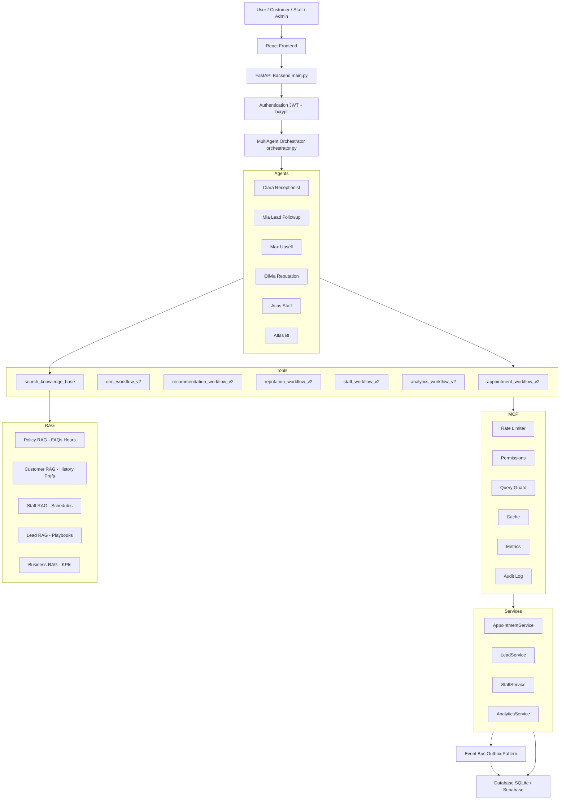

---

## Complete Request Lifecycle

When a user sends "Book me a haircut for tomorrow at 10 AM":

1. **User Types Message** -> Frontend sends HTTP POST to `/api/agent/chat`
2. **FastAPI Receives** -> Routes to the chat endpoint
3. **JWT Authentication** -> Verifies the user's identity and role
4. **Orchestrator Entry** -> `MultiAgentOrchestrator.process()` is called
5. **Cache Check** -> Checks if this analytics query was recently answered
6. **Permission Check** -> Verifies role-level access
7. **Fast Path Check** -> Handles greetings/thanks/farewells instantly without LLM
8. **Session State** -> Loads conversation history for this user
9. **Entity Resolution** -> Converts names like "Alice Smith" to database UUIDs
10. **Intent Detection** -> Detects: is this booking? upsell? reputation?
11. **Query Enrichment** -> Injects system time, customer context, conversation history
12. **RAG Injection** -> Retrieves relevant salon policies/info and adds to prompt
13. **Token Budget** -> Trims context to fit within LLM token limits
14. **Agent Selection** -> Picks `Clara_Receptionist` for this booking query
15. **LLM Reasoning** -> Clara reads the enriched prompt and decides to call a tool
16. **Tool Calling** -> `appointment_workflow_v2(action="book", params={...})` is called
17. **WorkflowRegistry** -> Routes to `BookAppointmentHandler`
18. **Entity Resolver** -> Converts service names / dates to UUIDs / ISO timestamps
19. **AppointmentService** -> Validates, checks overlaps, creates the record in DB
20. **Event Published** -> `AppointmentBookedEvent` is fired
21. **Event Consumers** -> Analytics, Notifications, Memory services react
22. **Response Formatted** -> Tool result converted to friendly text by LLM
23. **Session Saved** -> Conversation turn stored in DB
24. **Response Returned** -> `{"success": true, "response": "Your appointment is confirmed..."}` sent back

---

# 2. Overall Workflow

## Step-By-Step Visual Flow

```
User Input
    |
    v
Frontend (React)
    | HTTP POST /api/agent/chat
    v
FastAPI Router (agent_routes.py)
    |
    v
JWT Authentication (api/deps.py)
    | Decodes JWT -> extracts user_id, role, customer_id
    v
Orchestrator.process() (orchestrator.py)
    |
    |-> [1] Cache Lookup (analytics only)
    |-> [2] Enterprise Permission Check
    v
Orchestrator._process_base()
    |
    |-> [3] Fast Path (greetings/farewells -> instant reply)
    |-> [4] Session State Load (conversation history)
    |-> [5] Entity Context Resolution
    |         customer_id / staff_id / branch_id -> UUID
    |-> [6] Intent Detection
    |         keyword rules -> LLM fallback -> BOOKING / STAFF / BI / etc.
    |-> [7] Role Validation
    |         CUSTOMER cannot access BI agent
    |-> [8] Query Enrichment
    |         + system time
    |         + customer context
    |         + session history (last 6 turns)
    |         + pending booking slots
    |         + RAG context (policies, customer prefs, etc.)
    |         + token budget enforcement
    v
Agent.run(enriched_query) [AutoGen AssistantAgent]
    |
    |-> LLM reads system prompt + enriched query
    |-> LLM reasons: "I need to call appointment_workflow_v2(action='book',...)"
    |-> Tool called -> WorkflowRegistry.dispatch()
    |         v
    |     HandlerContext built
    |         v
    |     BookAppointmentHandler.validate() -> handle()
    |         v
    |     Entity Resolver -> UUID resolution
    |         v
    |     AppointmentService.book()
    |         v
    |     [DB Write: INSERT INTO appointments]
    |         v
    |     EventBus.publish(AppointmentBookedEvent)
    |         v
    |     Analytics, Notifications, Memory react
    |
    |-> LLM receives tool result
    |-> LLM formats friendly response
    v
Orchestrator receives response text
    |
    |-> JSON formatter (if response was raw JSON, re-format via LLM)
    |-> Session.add_turn("assistant", response)
    |-> Session saved to database
    v
FastAPI returns JSON response
    |
    v
Frontend displays message to user
```

## Mermaid Sequence Diagram

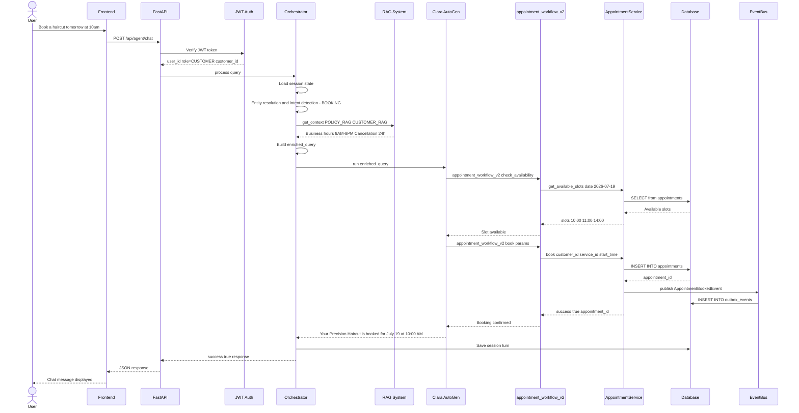

---

# 3. Every Agent Explained

---

## 3.1 Clara — The Receptionist Agent

### Agent Purpose

**Clara** (`Clara_Receptionist`) is the primary customer-facing agent. She is the AI equivalent of a salon receptionist — friendly, professional, and focused on scheduling.

**Why she exists:** Customers need to book, reschedule, and cancel appointments 24/7. Clara handles this automatically without human staff.

### Inputs

- Customer message
- Enriched context from Orchestrator:
  - Current system time
  - Customer ID and history
  - Conversation history (last 6 turns)
  - RAG context: salon policies, business hours
  - Pending booking state

### Decision Making

Clara uses her system prompt rules to decide which tool to call:
- If customer asks about availability -> call `check_availability`
- If customer confirms booking details -> call `book`
- If customer asks to cancel -> call `cancel`
- If customer asks about hours/pricing/policies -> call `search_knowledge_base`

### Critical Rules

- Always check availability before booking
- Confirm all details before submitting
- Never invent time slots — only use slots returned by the tool
- Convert relative dates ("tomorrow") to absolute ISO timestamps

### Memory

- **Session Memory**: Last 6 turns of conversation injected into every prompt
- **Pending Booking**: Partially collected booking details stored in session state
- **Curated Memory**: Customer styling preferences retrieved via RAG (CUSTOMER_RAG)

### RAG Usage

- **POLICY_RAG**: Salon hours, cancellation policies, service prices
- **CUSTOMER_RAG**: Customer past appointment preferences

### Database Access

**Reads:** `appointments`, `services`, `branches`, `staff`, `customers`
**Writes:** `appointments` (INSERT on booking, UPDATE on reschedule/cancel)

### Tools

#### `appointment_workflow_v2`

| Item | Details |
|---|---|
| Purpose | Executes all appointment operations |
| Parameters | `action: str`, `params: dict` |
| Actions | check_availability, book, cancel, reschedule, history, list_services, list_staff, search_customers |
| Returns | JSON string with result |
| Service Called | AppointmentService via WorkflowRegistry |

#### `search_knowledge_base`

| Item | Details |
|---|---|
| Purpose | Retrieves salon policies FAQs business hours from RAG |
| Parameters | `domain: str`, `query: str` |
| Returns | String of relevant retrieved documents |
| Service Called | EnterpriseRAGManager -> FAISS index |

### Sequence Diagram for Clara

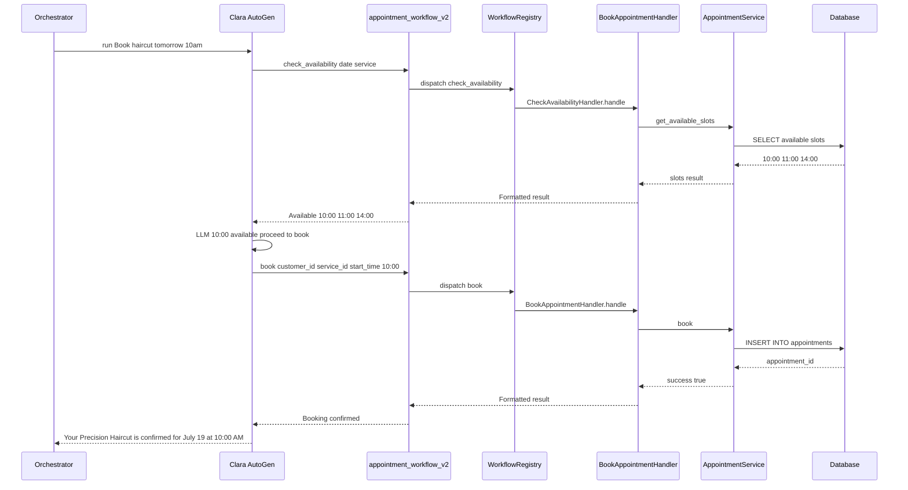

---

## 3.2 Mia — The Lead Follow-up Agent

**Mia** (`Mia_LeadFollowup`) manages the CRM pipeline — tracking potential customers who have not booked yet.

### Tools: `crm_workflow_v2`

| Action | Purpose |
|---|---|
| `search_leads` | Find leads by status/name |
| `create_lead` | Register a new prospect |
| `advance_lead` | Move lead to next pipeline stage |
| `send_followup` | Send automated follow-up |
| `generate_message` | AI-write a personalized message |
| `abandoned_bookings` | Find customers who did not finish booking |
| `conversion_analytics` | Lead-to-booking conversion metrics |
| `pipeline_snapshot` | Full CRM funnel overview |

---

## 3.3 Max — The Upsell Agent

**Max** (`Max_Upsell`) drives additional revenue by recommending complementary services.

### Tools: `recommendation_workflow_v2`

| Action | Purpose |
|---|---|
| `get_recommendations` | Fetch personalized service suggestions |
| `accept` | Mark a recommendation as accepted |
| `reject` | Mark a recommendation as rejected |
| `analytics` | View upsell acceptance rate metrics |

---

## 3.4 Olivia — The Reputation Agent

**Olivia** (`Olivia_Reputation`) manages online reviews and brand reputation.

### Tools: `reputation_workflow_v2`

| Action | Purpose |
|---|---|
| `get_reviews` | Fetch reviews by rating/status |
| `analytics` | Review statistics and trends |
| `critical` | Get all 1-star escalation-flagged reviews |
| `respond` | Draft an AI-generated review response |
| `scorecard` | Brand health scorecard |
| `escalate` | Flag a review for immediate manager attention |

---

## 3.5 Atlas Staff — The Staff Assistant Agent

**Atlas Staff** (`Atlas_Staff`) helps salon stylists manage their daily workflow.

### Tools: `staff_workflow_v2`

| Action | Purpose |
|---|---|
| `today_schedule` | Stylists appointments for today |
| `get_schedule` | Schedule for any specific date |
| `next_customer` | Details of the next upcoming customer |
| `customer_history` | Full booking history for a customer |
| `customer_preferences` | Styling notes, color formulas, allergies |
| `staff_revenue` | Revenue generated by stylist |
| `staff_performance` | Performance scorecard |
| `create_leave` | Submit a leave request |
| `get_leaves` | View registered leaves |
| `cancel_leave` | Cancel a leave request |
| `send_reminders` | Send appointment reminders to customers |

---

## 3.6 Atlas BI — The Business Intelligence Agent

**Atlas BI** (`Atlas_BI`) gives owners and managers deep business insights. Can also run raw SELECT SQL queries (ADMIN/OWNER only).

### Tools: `analytics_workflow_v2`

| Action | Purpose |
|---|---|
| `dashboard` | Full business summary dashboard |
| `revenue` | Revenue breakdown by period/branch/staff |
| `customers` | Customer acquisition and retention analytics |
| `staff` | Staff performance comparison |
| `leads` | Lead conversion funnel |
| `reviews` | Review sentiment distribution |
| `upsell` | Upsell conversion statistics |
| `insights` | AI-generated business insights |
| `forecast` | Revenue and demand forecasting |
| `raw_sql` | Execute custom SELECT queries |
| `cohort_reminders` | Identify returning customer cohorts |

---

# 4. MultiAgent Orchestrator Deep Dive

The `MultiAgentOrchestrator` in `orchestrator.py` is the heart of the system. Every user message goes through it.

## 4.1 Intent Detection

The Orchestrator uses a 4-layer detection system:

**Layer 1: Override** — Frontend explicitly passes `intent_override`

**Layer 2: Keyword Rules (Fast)**
- `book`, `appointment`, `reschedule`, `cancel` -> BOOKING
- `my schedule`, `next customer`, `customer history` -> STAFF
- `dashboard`, `revenue`, `lead conversion` -> BUSINESS_INTELLIGENCE
- `lead`, `pipeline`, `CRM` -> LEAD_FOLLOWUP
- `upsell`, `upgrade`, `recommendation` -> UPSELL
- `review`, `feedback`, `rating` -> REPUTATION

**Layer 3: Sticky State** — If session has pending booking, stay BOOKING

**Layer 4: LLM Fallback** — IntentClassifier AutoGen agent classifies with 8-second timeout

### Role-Based Intent Enforcement

| Role | Allowed Intents |
|---|---|
| CUSTOMER | BOOKING, REPUTATION, UPSELL |
| STAFF | BOOKING, REPUTATION, STAFF, UPSELL |
| MANAGER/OWNER/ADMIN | All intents |

## 4.2 Context Building (Query Enrichment)

The `_build_enriched_query()` method builds:

```
[SYSTEM TIME CONTEXT: 2026-07-18 17:23:00 UTC]
[SYSTEM CUSTOMER CONTEXT: Logged-in customer ID: 6cc7a37a-..., Role: CUSTOMER]
[BOOKING CONTEXT (collected so far): {"service": "Precision Haircut"}]

[Last 6 turns of conversation]

[RAG CONTEXT: Retrieved policy documents about business hours...]

Latest User Message: book me a haircut tomorrow at 10am
```

## 4.3 RAG Injection

| Intent | RAG Domains |
|---|---|
| BOOKING | POLICY_RAG, CUSTOMER_RAG |
| LEAD_FOLLOWUP | LEAD_RAG |
| UPSELL | CUSTOMER_RAG |
| REPUTATION | CUSTOMER_RAG |
| STAFF | STAFF_RAG |
| BUSINESS_INTELLIGENCE | BUSINESS_RAG |

## 4.4 Conversation Memory

Three levels:
1. **Short-Term (Session)**: Last 6 turns from `conversation_sessions` DB table
2. **Medium-Term (Curated)**: `CuratedMemory` table for significant facts (allergies, preferences)
3. **Long-Term (RAG)**: `AgentMemory` and `BusinessMetricsHistory` indexed into FAISS

## 4.5 Error Handling

- **Agent Timeout**: 180-second timeout per agent run
- **LLM Classifier Timeout**: 8-second timeout, falls back to BOOKING
- **JSON Formatter**: Second LLM call if agent returns raw JSON
- **Session Isolation**: `contextvars.ContextVar` prevents role/tenant bleed between requests

## 4.6 Complete Orchestrator Sequence Diagram

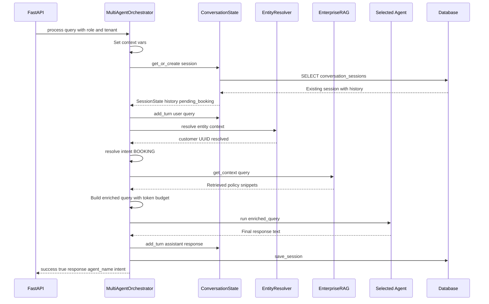

---

# 5. MCP Architecture

## What is MCP?

**MCP** stands for **Model Context Protocol**. It is the security and data access gateway between AI agents and the database.

Think of MCP as a **security guard at a bank vault**. Even if an AI agent wants to access customer data, it must go through MCP first.

## MCP vs Agent vs Tool vs Database

| Concept | What It Is | Analogy |
|---|---|---|
| **Agent** | The AI brain LLM plus tools | The employee |
| **Tool** | A Python function the LLM can call | The employee action |
| **MCP** | Security plus data access layer | The manager approval system |
| **Database** | Where all data is stored | The company records room |

## MCP Pipeline (7 Steps)

```
1. Rate Limiter (rate_limiter.py)
   -> Has this agent/user made too many requests?

2. Permission Check (permissions.py)
   -> Is this role allowed to access this resource?

3. Query Guard (query_guard.py)
   -> Is this query safe? Inject mandatory filters.

4. Cache Lookup (cache.py)
   -> Was this same query cached recently?

5. SQLAlchemy Query (models.py)
   -> Execute the actual database read/write.

6. Metrics Collection (metrics.py)
   -> Record query latency and success/failure.

7. Audit Logging (audit_log.py)
   -> Write who accessed what when from which agent.
```

## MCP Role Access Matrix

```
CUSTOMER: appointments, reviews, loyalty_points, services, branches, offers, knowledge
STAFF:    appointments, staff, reviews, services, branches
ADMIN:    * (wildcard - everything)
```

## MCP Architecture Diagram

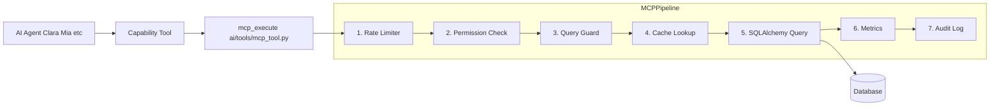

---

# 6. RAG Architecture

## What is RAG?

**RAG** stands for **Retrieval Augmented Generation**. It gives the AI access to a knowledge base of documents without retraining the LLM.

**Simple analogy:** Imagine an AI taking an exam open book. Instead of memorizing everything, it can look up relevant pages from a book before answering.

## RAG Domains (5 Knowledge Bases)

| Domain | Contents | Who Uses It |
|---|---|---|
| **POLICY_RAG** | Salon policies, FAQs, business hours, cancellation rules | Clara, All agents |
| **CUSTOMER_RAG** | Customer interaction history, styling notes, preferences | Clara, Max, Olivia |
| **STAFF_RAG** | Staff performance notes, scheduling expertise | Atlas Staff |
| **LEAD_RAG** | CRM follow-up playbooks, nurturing templates | Mia |
| **BUSINESS_RAG** | Business KPI history, BI memory, cohort snapshots | Atlas BI |

## How RAG Works

1. User query is embedded into a vector (list of numbers)
2. FAISS (vector database) finds the most similar document chunks
3. Chunks above a score threshold are returned
4. Results are formatted as a context string and injected into the prompt

## RAG Flow

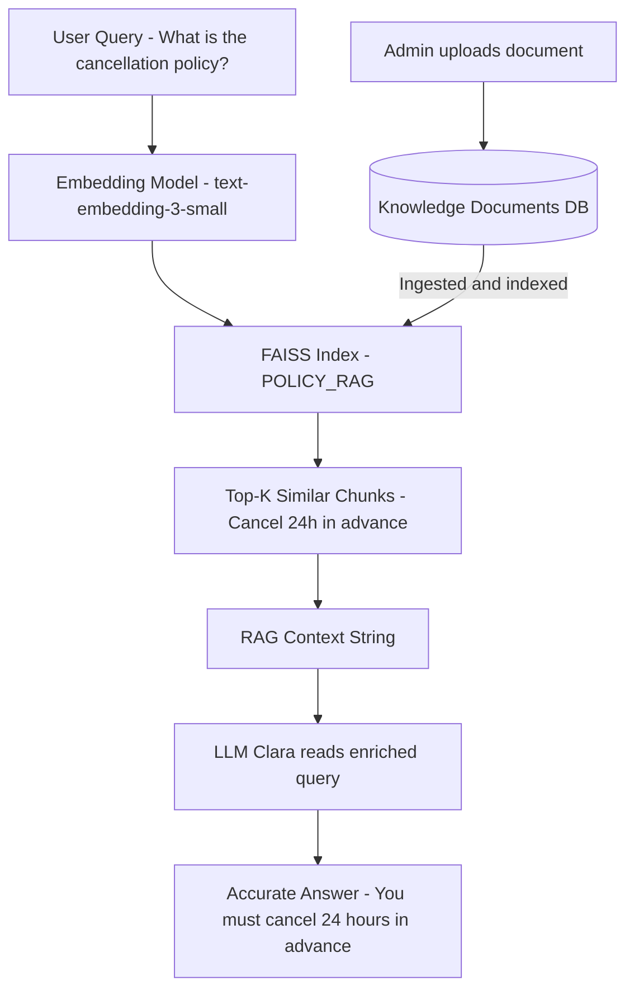

## When RAG is Skipped

- FAISS index file does not exist yet (graceful fallback with warn_once)
- Retrieved score falls below similarity threshold
- Request is in `is_testing` mode

## Key RAG Files

| File | Purpose |
|---|---|
| `enterprise_rag.py` | 5-domain RAG manager and DomainRetriever |
| `rag_unified.py` | Unified search_knowledge_base function |
| `retriever.py` | Low-level FAISS search and scoring |
| `embeddings.py` | Embedding generation OpenAI plus SentenceTransformer |
| `ingest.py` | Document chunking and index building |
| `curated_faiss_store.py` | FAISS index CRUD operations |

---

# 7. Database Architecture

## Overview

SQLite in development (file: `backend/test.db`). Supabase PostgreSQL in production.

All models extend `BaseModel` which provides:
- `id`: UUID primary key (auto-generated)
- `created_at`: Timezone-aware creation timestamp
- `updated_at`: Auto-updating modification timestamp

## Entity Relationship Diagram

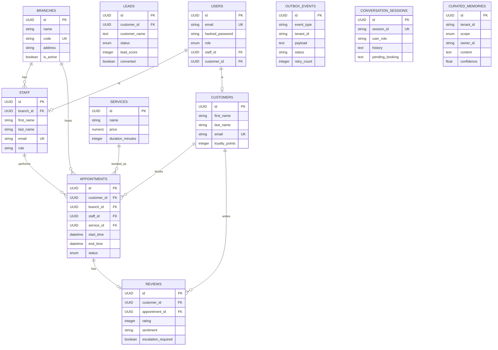

## Key Tables

### `appointments` — The Core Business Table

| Column | Type | Purpose |
|---|---|---|
| `id` | UUID | Unique appointment identifier |
| `customer_id` | UUID FK | Who booked |
| `branch_id` | UUID FK | Which location |
| `staff_id` | UUID FK | Which stylist (nullable) |
| `service_id` | UUID FK | What service |
| `start_time` | TIMESTAMPTZ | When it starts |
| `end_time` | TIMESTAMPTZ | When it ends |
| `status` | ENUM | PENDING/CONFIRMED/COMPLETED/CANCELLED/NO_SHOW |

### `outbox_events` — The Event System Safety Net

| Column | Type | Purpose |
|---|---|---|
| `event_type` | STRING | appointment.booked, appointment.cancelled |
| `tenant_id` | STRING | Which salon |
| `payload` | TEXT JSON | Event data |
| `status` | STRING | PENDING -> PROCESSED or FAILED |
| `retry_count` | INTEGER | How many times we tried |

### `conversation_sessions` — Multi-Turn Memory

| Column | Type | Purpose |
|---|---|---|
| `session_id` | STRING unique | Chat session identifier |
| `history` | TEXT JSON | List of conversation turns |
| `pending_booking` | TEXT JSON | Partially collected booking details |
| `metadata_json` | TEXT JSON | customer_id, staff_id, etc |

### `curated_memories` — Long-Term Agent Memory

| Column | Type | Purpose |
|---|---|---|
| `scope` | ENUM | CUSTOMER / STAFF / LEAD / BUSINESS / REPUTATION |
| `owner_id` | STRING | Who this memory belongs to |
| `content` | TEXT | The actual memory content |
| `confidence` | FLOAT | How reliable 0 to 1 |
| `importance` | FLOAT | How important 0 to 1 |
| `consent_class` | ENUM | STANDARD / SENSITIVE / RESTRICTED |

---

# 8. Tool Calling Architecture

## What is Tool Calling?

**Tool calling** is a feature of modern LLMs where instead of just generating text, the LLM can output structured requests to call Python functions.

**Simple analogy:** Asking a smart assistant to book a haircut. Instead of making up a fake booking, the assistant fills out a form (tool parameters) and passes it to the actual booking system.

## How the LLM Decides to Call a Tool

The LLM is given a system prompt listing available tools and their schemas. When the LLM needs data, it outputs a tool call structured like:

```json
{
  "name": "appointment_workflow_v2",
  "arguments": {
    "action": "check_availability",
    "params": {
      "date": "2026-07-20",
      "service_id": "284376c3-134b-44a3-b767-bcb9d7ecd0ca"
    }
  }
}
```

AutoGen intercepts this, executes the Python function, and feeds the result back to the LLM.

## Tool Calling Flow

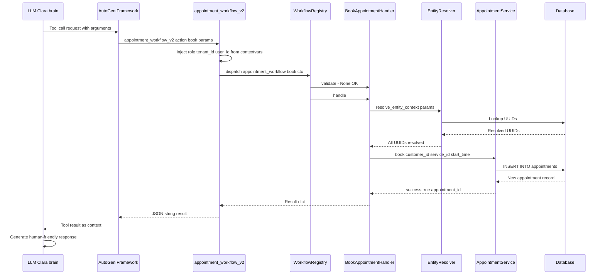

## Entity Resolution

**Entity Resolution** converts human-friendly identifiers to database UUIDs.

Resolution strategies (tried in order):
1. Direct UUID: If value is already a valid UUID, use it
2. Name Search: Search database by name (case-insensitive fuzzy match)
3. Default Fallback: Use default branch/staff if not specified

What gets resolved:
- `service_id`: "haircut" -> UUID of matching Service
- `customer_id`: "Alice Smith" -> UUID of matching Customer
- `branch_id`: "Main Salon" -> UUID of matching Branch
- `staff_id`: "Alexandra Chen" -> UUID of matching Staff

## Handler Validation

```python
def validate(self, ctx: HandlerContext) -> Optional[str]:
    if not ctx.get("customer_id"):
        return "customer_id is required to book."
    if not ctx.get("service_id"):
        return "service_id is required to book."
    return None  # None = validation passed
```

---

# 9. Service Layer

The **Service Layer** is where all business logic lives.

## AppointmentService

**File:** `application/services/appointment_service.py`

**Business Logic:**
- **Overlap Detection**: Checks if customer or staff already has appointment at requested time
- **Business Hours**: Rejects slots outside 9 AM to 8 PM
- **Status Transitions**: PENDING -> CONFIRMED -> COMPLETED; cannot reschedule CANCELLED
- **Customer ID Fallback**: If appointment_id is actually a customer_id, finds their latest active appointment
- **Loyalty Points**: Calls LoyaltyService on completion/cancellation
- **Notifications**: Creates Notification records for the user
- **Events**: Publishes AppointmentBookedEvent, AppointmentCancelledEvent, AppointmentRescheduledEvent

## AnalyticsService

**File:** `application/services/analytics_service.py`

Tracks revenue, appointment counts, lead conversions. Listens to appointment events to update metrics. Generates dashboard summaries and forecasts.

## EntityResolverService

**File:** `application/services/entity_resolver_service.py`

- `resolve_entity_context()`: Batch-resolve all entity IDs in a context dict
- `resolve_customer()`: Name or UUID -> Customer UUID
- `resolve_service()`: Name -> Service UUID
- `resolve_branch()`: Name -> Branch UUID
- `resolve_staff()`: Name -> Staff UUID

## ConversationStateService

**File:** `application/services/conversation_state_service.py`

- Create or load SessionState objects from DB
- Add conversation turns (user + assistant messages)
- Persist state to `conversation_sessions` table
- Build formatted context strings for prompt injection

## MemoryCuratorService

**File:** `application/services/memory_curator_service.py`

- Extract important facts from conversations (allergies, preferences, complaints)
- Store as CuratedMemory records
- React to appointment and review events to capture business knowledge
- Manage memory lifecycle (superseding old memories, expiry)

## LoyaltyService

- Award loyalty points on appointment completion
- Deduct points on cancellation (penalty)
- Award points on review submission
- Maintain LoyaltyTransaction records

## ReviewService

- Submit and moderate customer reviews
- AI-powered sentiment analysis
- Auto-generate AI responses using LLM
- Escalate 1-star reviews

## StaffService

- CRUD operations for staff records
- Schedule retrieval with date filtering
- Performance metrics calculation
- Leave request management

---

# 10. Security Layers

## Security Architecture Overview

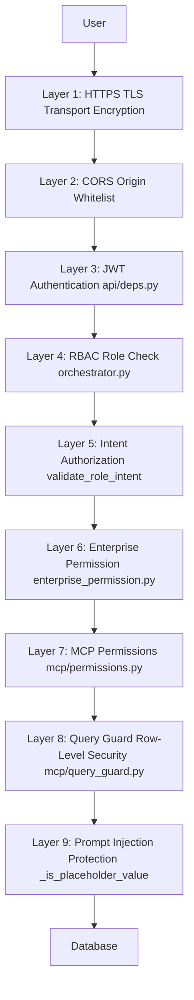

## Layer 1: JWT Authentication

**Where:** `api/deps.py`, `core/security.py`

- **Access Token**: Short-lived (15 minutes). Contains user_id, role, type=access
- **Refresh Token**: Long-lived (7 days)
- **Algorithm**: HS256 (HMAC-SHA256 with secret key)
- **Password Hashing**: bcrypt with auto-generated salt

```python
# Token structure (decoded)
{
    "sub": "3593b841-179e-497c-a956-7fb77b7ea503",  # user_id
    "role": "CUSTOMER",
    "type": "access",
    "exp": 1750000000
}
```

## Layer 2: CORS

Only allowed origins can make requests to the API.

## Layer 3: Role-Based Access Control (RBAC)

| Role | Allowed Agents |
|---|---|
| CUSTOMER | BOOKING, REPUTATION, UPSELL |
| STAFF | BOOKING, REPUTATION, STAFF, UPSELL |
| MANAGER/OWNER/ADMIN | All |

## Layer 4: MCP Permissions

Resource-level access control. CUSTOMER can only read their own data.

## Layer 5: Row-Level Security via Query Guard

Query Guard automatically injects `customer_id = current_user_id` filter for CUSTOMER role. Customers can only see their own data even through the AI agent.

## Layer 6: Rate Limiting

Per-agent, per-user rate limiting prevents abuse. Raises `RateLimitExceeded` if too many requests.

## Layer 7: Prompt Injection Protection

Detects and rejects hallucinated/placeholder values from LLM outputs:

```python
_PLACEHOLDER_VALUES = {"first_branch_id", "appointment_id", "customer_id", "placeholder", "null", ...}
```

If the LLM generates a fake UUID or placeholder, the service rejects it with a clear error.

## Layer 8: SQL Injection Protection

All database queries use SQLAlchemy ORM or parameterized queries — never raw string concatenation.

## Layer 9: Tenant Isolation

Each salon is a separate **tenant** with its own `tenant_id`. All queries are scoped to the current tenant.

## Layer 10: Conversation Isolation

`contextvars.ContextVar` is used for `current_user_role`, `current_user_id`, `current_tenant_id`. These are reset after each request ensuring concurrent requests never share context.

## Secrets Management

All sensitive values stored in `.env` files:
- `SECRET_KEY`: JWT signing key
- `DATABASE_URL`: Database connection string
- `OPENAI_API_KEY`: LLM API key
- `SUPABASE_URL`, `SUPABASE_KEY`: Supabase credentials

---

# 11. Event-Driven Architecture

## What is Event-Driven Architecture?

Instead of one component directly calling another, components communicate through **events** — messages that say "something happened".

**Simple analogy:** When a package is delivered, the courier does not call every department — they just put it in the mailbox. Each department checks the mailbox and reacts to packages meant for them.

## The Outbox Pattern

**Problem:** When an appointment is booked, we want to update analytics, send a notification, and create a curated memory. What if the server crashes halfway through?

**Solution:** Every event is **first persisted to the database** (`outbox_events` table) as part of the same transaction as the booking. If the server crashes, the event is still in the database and can be reprocessed on restart.

## Event Types

| Event | Trigger | Subscribers |
|---|---|---|
| `appointment.booked` | New booking | Analytics, Notifications, Memory |
| `appointment.cancelled` | Cancellation | Analytics, Notifications, Loyalty penalty |
| `appointment.rescheduled` | Reschedule | Analytics, Notifications |
| `appointment.completed` | Service done | Analytics, Loyalty reward, Memory |
| `review.submitted` | New review | Analytics, Memory |
| `lead.converted` | Lead to Customer | Analytics, Memory |
| `recommendation.accepted` | Upsell accepted | Analytics |

## Event Bus Architecture

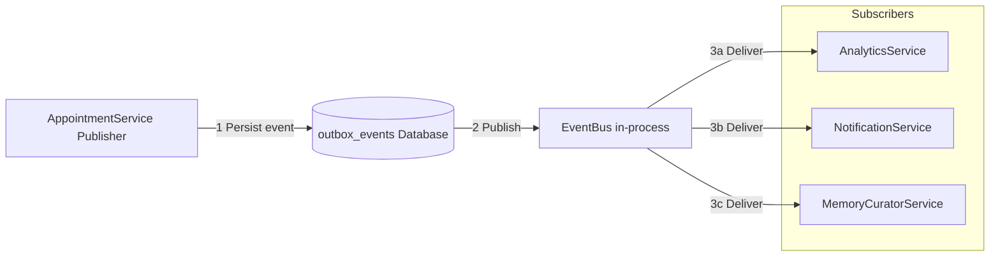

## EventBus Key Features

- **Thread-safe**: Uses `threading.Lock` for subscriber registration
- **Singleton**: `get_event_bus()` returns the same instance throughout the application
- **Error Isolation**: One subscriber failing does not prevent others from receiving the event

## Background Workers

APScheduler Jobs (in `main.py`):
- **Lead Follow-up**: Runs every 60 minutes
- **Cohort Reminders**: Runs every 60 minutes — identifies customers who have not visited in a while

---

# 12. Complete End-to-End Booking Workflow

**Customer Alice Smith** types: "Book me a Precision Haircut for tomorrow at 10 AM"

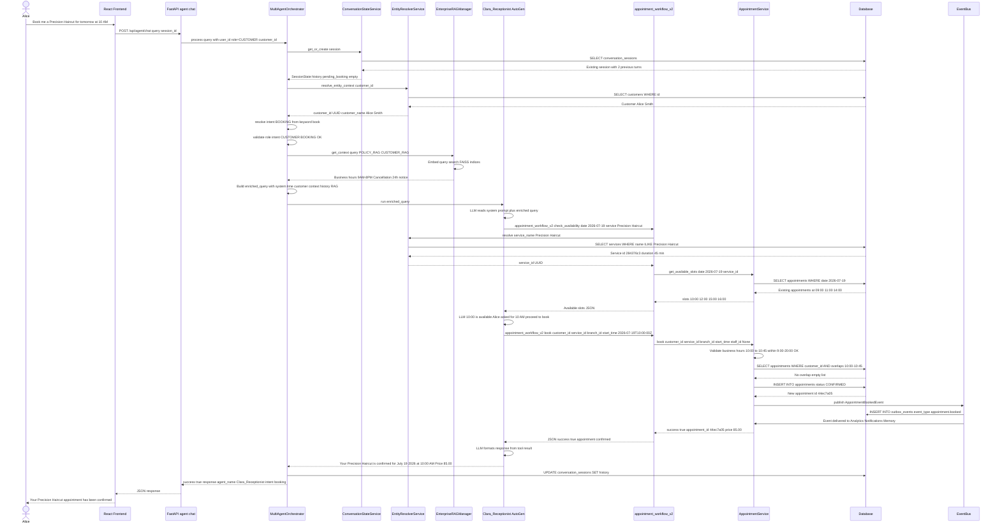

---

# 13. Folder Structure

```
saloon-AI/
├── frontend/                    # React frontend application
│
└── backend/                     # Python FastAPI backend
    ├── main.py                  # Application entry point, startup/shutdown events
    ├── worker.py                # Background event processing worker
    │
    ├── ai/                      # AI Layer
    │   ├── orchestrator.py      # MultiAgentOrchestrator - the brain of the system
    │   ├── agents/              # Agent definitions (receptionist, bi, lead, reputation, staff, upsell)
    │   └── tools/               # Tool functions exposed to LLM
    │       ├── capabilities.py          # 6 capability tools v2 architecture
    │       └── mcp_tool.py              # mcp_execute MCP integration
    │
    ├── core/                    # Core infrastructure shared by all
    │   ├── config.py            # Settings management pydantic-settings
    │   ├── security.py          # JWT creation/verification bcrypt
    │   ├── handlers.py          # HandlerContext and all Handler classes
    │   ├── workflow_registry.py # WorkflowRegistry maps actions to Handlers
    │   ├── capability_registry.py # CapabilityRegistry validates available actions
    │   ├── tenant_context.py    # Multi-tenant isolation
    │   └── observability.py     # Structured logging metrics warn_once
    │
    ├── api/                     # API Layer
    │   ├── deps.py              # FastAPI dependencies get_current_user get_db
    │   └── routes/              # API route handlers
    │       ├── auth_routes.py   # Login logout refresh token register
    │       ├── agent_routes.py  # /api/agent/chat main chat endpoint
    │       ├── core_routes.py   # Appointment CRUD availability cancellation
    │       ├── analytics_routes.py # Analytics dashboard endpoints
    │       ├── customer_routes.py  # Customer management endpoints
    │       ├── lead_routes.py      # CRM lead management endpoints
    │       ├── staff_routes.py     # Staff management endpoints
    │       └── review_routes.py    # Review management endpoints
    │
    ├── application/             # Application Business Logic Layer
    │   └── services/
    │       ├── appointment_service.py    # Booking logic overlap checks events
    │       ├── analytics_service.py      # Business metrics dashboards forecasting
    │       ├── entity_resolver_service.py # Name/UUID resolution for all entities
    │       ├── conversation_state_service.py # Session management and history
    │       ├── customer_service.py        # Customer CRUD and search
    │       ├── staff_service.py           # Staff management and scheduling
    │       ├── lead_service.py            # CRM pipeline and follow-ups
    │       ├── review_service.py          # Review moderation and sentiment
    │       ├── loyalty_service.py         # Loyalty points calculation
    │       ├── notification_service.py    # In-app notification delivery
    │       ├── recommendation_service.py  # Service recommendation engine
    │       └── memory_curator_service.py  # Long-term memory management
    │
    ├── infrastructure/          # Infrastructure Layer
    │   ├── db/
    │   │   ├── database.py      # SQLAlchemy engine setup SessionLocal
    │   │   ├── models.py        # All SQLAlchemy ORM models 20+ tables
    │   │   └── seed.py          # Database seeding with sample data
    │   ├── events/
    │   │   └── event_bus.py     # EventBus singleton all domain events
    │   └── rag/
    │       ├── enterprise_rag.py  # 5-domain RAG manager DomainRetriever
    │       ├── rag_unified.py     # search_knowledge_base unified entry point
    │       ├── retriever.py       # FAISS retrieval logic
    │       └── embeddings.py      # OpenAI plus SentenceTransformer embedding
    │
    ├── mcp/                     # Model Context Protocol Layer
    │   ├── salon_mcp.py         # Main MCP gateway read operations
    │   ├── salon_mcp_write.py   # Write operations INSERT UPDATE DELETE
    │   ├── permissions.py       # ROLE_PERMISSIONS matrix
    │   ├── query_guard.py       # SQL injection protection plus mandatory filters
    │   ├── cache.py             # MCP-level response caching
    │   ├── rate_limiter.py      # Per-user per-agent rate limiting
    │   ├── audit_log.py         # Access audit logging
    │   ├── metrics.py           # Query performance metrics
    │   └── schemas.py           # MCPContext MCPRequest MCPResponse dataclasses
    │
    ├── data/
    │   └── faiss_indices/       # FAISS vector index files per domain
    │
    ├── logs/
    │   └── salon_debug.log
    │
    ├── tests/
    │   ├── test_booking_tools.py
    │   └── test_api_endpoints.py
    │
    ├── .env                     # Environment variables never commit to git
    ├── requirements.txt         # Python dependencies
    └── pyproject.toml           # Project configuration plus pytest settings
```

---

# 14. Code Walkthrough

## `main.py` — Application Entry Point

### `lifespan(application)` — Startup Sequence

1. `validate_llm_startup()` — Checks OpenAI API key is valid
2. `check_db_health()` — Verifies database connection
3. `Base.metadata.create_all()` — Creates tables if they do not exist (dev only)
4. `seed_database()` — Seeds sample data if database is empty
5. Initializes all service singletons
6. Registers event bus subscribers (analytics, notifications)
7. Starts APScheduler background jobs (leads follow-up, cohort reminders)

---

## `ai/orchestrator.py` — The Heart

### `class MultiAgentOrchestrator`

**Constructor:** Creates LLM model client, instantiates 6 AutoGen AssistantAgent objects (one per intent), creates IntentClassifier agent, initializes token budget enforcer.

### `_build_agents()` — Agent Factory

Creates all 6 AutoGen agents with system prompts, allowed tools, and tool iteration limits.

**Key design:** Wrapper functions hide `role`, `tenant_id`, and `user_id` from the LLM schema. The LLM only sees `action` and `params`. Security context is injected from `contextvars.ContextVar`.

### `_classify_intent(query)` — LLM Classifier

Uses IntentClassifier AutoGen agent to LLM-classify when keyword rules are insufficient. Timeout: 8 seconds.

### `_run_group_chat(agent, query)` — Agent Executor

Executes a single-agent run with 180-second timeout. Extracts the agent text response from AutoGen message history.

### `_build_enriched_query()` — Context Builder

Assembles: system time + customer/staff context + pending booking + last 6 turns + RAG context + token budget.

### `process(input_data)` — Main Entry Point

**Input:**
```python
{
    "query": "Book me a haircut",
    "user_id": "3593b841-...",
    "user_role": "CUSTOMER",
    "customer_id": "6cc7a37a-...",
    "session_id": "sess_abc123",
    "tenant_id": "default"
}
```

**Output:**
```python
{
    "success": True,
    "response": "Your appointment is confirmed!",
    "agent_name": "Clara_Receptionist",
    "session_id": "sess_abc123",
    "intent": "booking"
}
```

---

## `core/handlers.py` — Business Logic Handlers

### `class HandlerContext`

Holds everything a handler needs:
- `params`: Tool parameters from LLM
- `tenant_id`: Current tenant
- `user_id`: Current user
- `user_role`: CUSTOMER / STAFF / ADMIN
- `session_id`: Conversation session

### Key Handlers

| Handler | Action | What It Does |
|---|---|---|
| `BookAppointmentHandler` | book | Creates a new appointment |
| `CancelAppointmentHandler` | cancel | Cancels an appointment |
| `RescheduleAppointmentHandler` | reschedule | Changes appointment time |
| `CheckAvailabilityHandler` | check_availability | Returns free slots |
| `ListAppointmentsHandler` | list | Lists customer appointments |
| `CreateLeadHandler` | create_lead | Creates a CRM lead |
| `AdvanceLeadHandler` | advance_lead | Moves lead to next stage |
| `GetReviewsHandler` | get_reviews | Fetches reviews |
| `RespondReviewHandler` | respond | Drafts review response |

---

## `infrastructure/events/event_bus.py`

### `class EventBus`

**Thread-safe in-process publish-subscribe event bus.**

**`subscribe(event_type, handler)`** — Registers a handler function.

**`publish(event)`** — Synchronous publish:
1. Persists to `outbox_events` table
2. Notifies all subscribers for `event.event_type`
3. Logs any subscriber errors but continues delivery

---

## `mcp/salon_mcp.py`

### `class SalonMCP`

The main MCP gateway class. All read database access from agents goes through this.

### `get_appointments(context, filters, limit, offset, agent_name)`

Full pipeline: Rate limit check -> Permission check -> Query guard -> Cache lookup -> SQLAlchemy query -> Cache store -> Metrics record -> Audit log -> Return `MCPResponse{data: [...], count: N}`

---

# 15. End-to-End Architecture Diagram

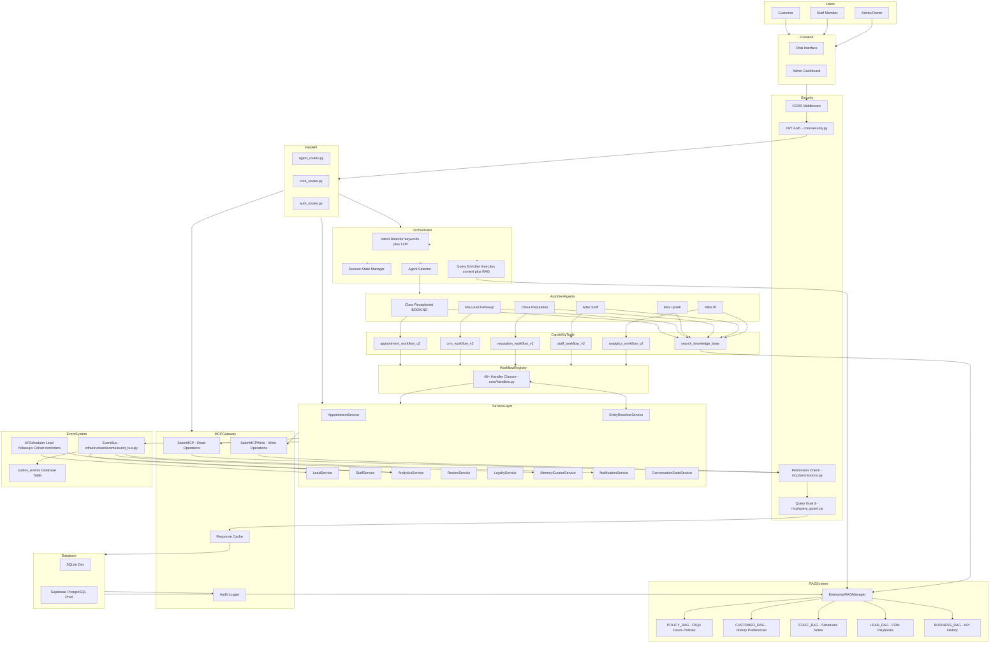

---

## Summary Table: Which Component Does What

| Component | File | Responsibility |
|---|---|---|
| **FastAPI** | `main.py` | HTTP server, routing, startup lifecycle |
| **JWT Auth** | `core/security.py`, `api/deps.py` | Authenticate every request |
| **Orchestrator** | `ai/orchestrator.py` | Route messages to correct agent |
| **Intent Detector** | `ai/orchestrator.py` | Understand what user wants |
| **Entity Resolver** | `application/services/entity_resolver_service.py` | Convert names to database UUIDs |
| **Session State** | `application/services/conversation_state_service.py` | Remember conversation history |
| **RAG System** | `infrastructure/rag/enterprise_rag.py` | Retrieve relevant knowledge |
| **AutoGen Agents** | `ai/orchestrator.py` | LLM reasoning plus tool calling |
| **Capability Tools** | `ai/tools/capabilities.py` | Tool functions exposed to LLM |
| **WorkflowRegistry** | `core/workflow_registry.py` | Route actions to handlers |
| **Handlers** | `core/handlers.py` | Validate and execute each action |
| **Service Layer** | `application/services/*.py` | Business logic and validation |
| **MCP Layer** | `mcp/salon_mcp.py` | Secure database access gateway |
| **Event Bus** | `infrastructure/events/event_bus.py` | Async event delivery |
| **Database** | `infrastructure/db/models.py` | All data storage |
| **FAISS** | `infrastructure/rag/` | Vector similarity search |

---

*This document was written to be read from top to bottom for a complete understanding, or used as a reference for specific components. Every technical decision has been explained in plain English with diagrams to aid understanding.*

*Generated for: Kethambabu's SalonAI Workforce Platform mini-project documentation.*
