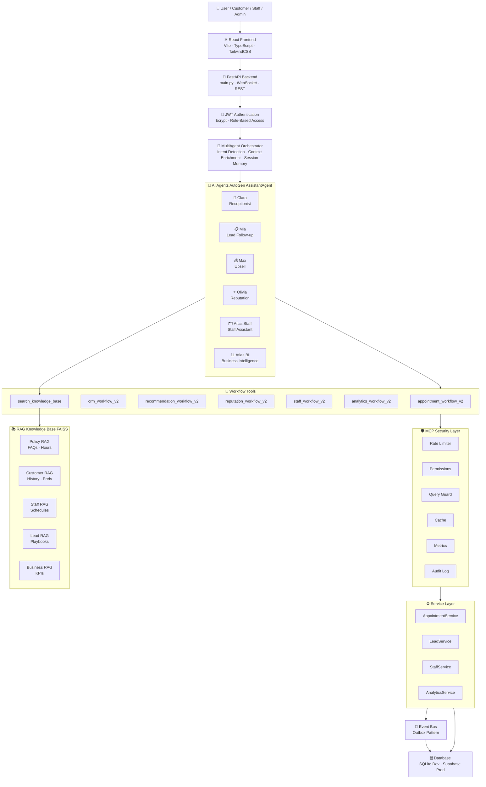

<div align="center">

# 💈 SalonAI Workforce Platform

### *Enterprise-Grade Multi-Agent AI System for Modern Salon Management*

[](https://fastapi.tiangolo.com/)
[](https://reactjs.org/)
[](https://www.typescriptlang.org/)
[](https://python.org)
[](https://microsoft.github.io/autogen/)
[](https://langchain.com/)
[](https://supabase.com/)
[](LICENSE)

<br/>

> **SalonAI** automates every aspect of a salon business using **6 specialized AI agents**, each powered by LLMs, RAG, and enterprise-grade tooling — from booking appointments to business intelligence dashboards.

<br/>

---

</div>

## 🏛️ System Architecture



---

## ✨ Features at a Glance

| Feature | Description |
|---|---|
| 🤖 **6 Specialized AI Agents** | Each agent handles a distinct business domain, reducing confusion and errors |
| 🧠 **MultiAgent Orchestrator** | 4-layer intent detection: override → keyword rules → sticky state → LLM fallback |
| 📚 **RAG-Powered Knowledge** | FAISS vector store with Policy, Customer, Staff, Lead & Business knowledge bases |
| 🛡️ **MCP Security Gateway** | 7-step pipeline: rate limiting, permissions, query guard, caching, metrics, audit log |
| 📅 **Smart Booking Flow** | Availability checks, conflict detection, auto-confirmation, reschedule & cancel |
| 📊 **BI Dashboard** | Revenue analytics, staff performance, customer cohorts, AI-generated insights |
| 📋 **CRM Pipeline** | Lead tracking, follow-up automation, abandoned booking recovery |
| 💰 **Upsell Engine** | Personalized service recommendations based on customer history |
| ⭐ **Reputation Management** | Review monitoring, AI-written responses, escalation alerts |
| 🔔 **Event-Driven** | Outbox pattern event bus — Analytics, Notifications & Memory react automatically |
| 💬 **3-Level Memory** | Session (6 turns) + Curated (key facts) + Long-term (RAG indexed) |
| 🔐 **Role-Based Access** | CUSTOMER · STAFF · MANAGER · OWNER · ADMIN with intent-level enforcement |

---

## 🤖 The Six AI Agents

<table>
<tr>
<td width="50%">

### 💬 Clara — Receptionist
> Books, reschedules and cancels appointments 24/7

- Checks real-time slot availability
- Resolves relative dates ("tomorrow at 10") to ISO timestamps
- Enforces cancellation policies via Policy RAG
- Maintains pending booking state across turns
- **Tool:** `appointment_workflow_v2`

</td>
<td width="50%">

### 📋 Mia — Lead Follow-up
> Manages the full CRM sales pipeline

- Tracks prospects from inquiry to booking
- Sends AI-personalized follow-up messages
- Identifies abandoned bookings for recovery
- Generates conversion analytics
- **Tool:** `crm_workflow_v2`

</td>
</tr>
<tr>
<td width="50%">

### 💰 Max — Upsell Agent
> Drives additional revenue with smart recommendations

- Surfaces complementary services post-booking
- Tracks acceptance / rejection rates
- Personalized to each customer's history
- **Tool:** `recommendation_workflow_v2`

</td>
<td width="50%">

### ⭐ Olivia — Reputation Agent
> Protects and grows the salon brand online

- Monitors reviews by rating and sentiment
- Drafts AI-generated professional responses
- Escalates 1-star reviews to managers
- Generates brand health scorecards
- **Tool:** `reputation_workflow_v2`

</td>
</tr>
<tr>
<td width="50%">

### 🗂️ Atlas Staff — Staff Assistant
> Empowers stylists to self-manage their workflow

- Today's schedule & next customer details
- Customer styling preferences & allergy notes
- Leave request creation and management
- Revenue & performance scorecards
- **Tool:** `staff_workflow_v2`

</td>
<td width="50%">

### 📊 Atlas BI — Business Intelligence
> Owner-level insights and raw SQL access

- Full business dashboard & KPIs
- Revenue by period, branch, and staff
- Demand forecasting & customer cohort analysis
- AI-generated strategic insights
- Raw SELECT SQL (ADMIN/OWNER only)
- **Tool:** `analytics_workflow_v2`

</td>
</tr>
</table>

---

## 🔄 Request Lifecycle

```
User Input
    │
    ▼
⚛️  React Frontend  ──── HTTP POST /api/agent/chat ────►
                                                        🚀 FastAPI Router
                                                            │
                                                            ▼
                                                        🔐 JWT Auth (extract user_id, role, customer_id)
                                                            │
                                                            ▼
                                                    🧠 Orchestrator.process()
                                                            │
                    ┌───────────────────────────────────────┤
                    │  [1] Cache Lookup (analytics only)    │
                    │  [2] Permission Check                 │
                    │  [3] Fast Path (greetings → instant)  │
                    │  [4] Session History Load             │
                    │  [5] Entity Resolution (UUID)         │
                    │  [6] Intent Detection (4 layers)      │
                    │  [7] Role Validation                  │
                    │  [8] Query Enrichment + RAG Injection │
                    └───────────────────────────────────────┘
                                                            │
                                                            ▼
                                                    🤖 AutoGen Agent.run()
                                                            │
                                                    LLM → Tool Call
                                                            │
                                                    🔧 WorkflowRegistry
                                                            │
                                                    ⚙️ Service Layer
                                                            │
                                                    🗄️ Database Write
                                                            │
                                                    📨 EventBus.publish()
                                                            │
                                                            ▼
                                                    📤 JSON Response → Frontend
```

---

## 🗂️ Project Structure

```
saloon-AI/
│
├── 🖥️  frontend/                     # React + Vite + TypeScript + TailwindCSS
│   └── src/
│       ├── components/
│       │   ├── AgentChat/            # AI chat interface
│       │   ├── Admin/                # Admin panel
│       │   ├── Staff/                # Staff dashboard & StaffChat
│       │   ├── Customer/             # Customer portal
│       │   ├── Loyalty/              # Loyalty program
│       │   ├── Auth/                 # Login / Register
│       │   └── ui/                   # Reusable UI components
│       ├── api/                      # Axios API clients
│       ├── context/                  # React context providers
│       ├── hooks/                    # Custom React hooks
│       └── services/                 # Frontend service layer
│
├── ⚙️  backend/                      # FastAPI Python Backend
│   ├── main.py                       # App entrypoint & router registration
│   ├── ai/
│   │   ├── orchestrator.py           # MultiAgent Orchestrator (heart of the system)
│   │   ├── agents/                   # 6 AutoGen AssistantAgents
│   │   │   ├── receptionist_agent.py # Clara
│   │   │   ├── lead_followup_agent.py# Mia
│   │   │   ├── upsell_agent.py       # Max
│   │   │   ├── reputation_agent.py   # Olivia
│   │   │   ├── staff_assistant_agent.py # Atlas Staff
│   │   │   └── bi_agent.py           # Atlas BI
│   │   ├── tools/                    # Tool definitions & MCP dispatcher
│   │   │   ├── mcp_tool.py           # MCP security gateway
│   │   │   ├── capabilities.py       # Workflow action handlers
│   │   │   └── bi_tools.py           # BI-specific tools
│   │   └── workflows/                # Business workflow handlers
│   ├── api/
│   │   └── routes/                   # 16 API route modules
│   │       ├── agent_routes.py
│   │       ├── auth_routes.py
│   │       ├── analytics_routes.py
│   │       ├── staff_routes.py
│   │       ├── customer_routes.py
│   │       ├── lead_routes.py
│   │       └── ... (10 more)
│   ├── infrastructure/
│   │   ├── db/                       # SQLAlchemy models & migrations
│   │   ├── rag/                      # FAISS + LangChain RAG system
│   │   │   ├── enterprise_rag.py     # EnterpriseRAGManager
│   │   │   ├── retriever.py          # Multi-domain retriever
│   │   │   ├── embeddings.py         # HuggingFace embeddings
│   │   │   └── ingest.py             # Document ingestion pipeline
│   │   ├── events/                   # Event bus (Outbox pattern)
│   │   ├── cache/                    # Query result caching
│   │   └── integrations/             # External integrations
│   ├── core/                         # Shared utilities & OpenAI adapter
│   ├── application/                  # Service layer (business logic)
│   └── mcp/                          # MCP server configuration
│
├── 🗄️  prisma/                       # Prisma schema (frontend DB client)
├── 📜  supabase_init.sql             # Production DB schema
├── 🔧  alembic.ini                   # DB migration config
├── 🚀  start.ps1                     # One-command startup script
└── 📘  KETHAM_ARCHITECTURE.md        # Full architecture deep-dive (1690 lines)
```

---

## 🛡️ MCP Security Pipeline

Every agent tool call passes through **7 security layers** before touching the database:

```
Agent Tool Call
      │
      ▼
1️⃣  Rate Limiter     → Too many requests? Throttle.
      │
      ▼
2️⃣  Permission Check → Is this role allowed this resource?
      │
      ▼
3️⃣  Query Guard      → Safe query? Inject mandatory tenant filters.
      │
      ▼
4️⃣  Cache Lookup     → Already answered recently? Return cached result.
      │
      ▼
5️⃣  SQLAlchemy Query → Execute against the database.
      │
      ▼
6️⃣  Metrics Recorder → Log latency & success/failure.
      │
      ▼
7️⃣  Audit Logger     → Permanent record of every data access.
      │
      ▼
    Result returned to Agent
```

---

## 📚 RAG Architecture

The system uses **5 specialized knowledge domains**, each a separate FAISS index:

| Domain | Contains | Used By |
|---|---|---|
| **POLICY_RAG** | Business hours, cancellation policies, service prices, FAQs | Clara, all agents |
| **CUSTOMER_RAG** | Customer appointment history, styling preferences, notes | Clara, Max, Olivia |
| **STAFF_RAG** | Staff schedules, specializations, leave records | Atlas Staff |
| **LEAD_RAG** | CRM playbooks, follow-up scripts, pipeline best practices | Mia |
| **BUSINESS_RAG** | KPI benchmarks, business metrics history | Atlas BI |

```
User Query
    │
    ▼
EnterpriseRAGManager
    │
    ├── HuggingFace Embeddings (sentence-transformers)
    │
    ├── FAISS Similarity Search
    │        │
    │        ├── top-k relevant document chunks retrieved
    │        └── injected into agent's enriched prompt
    │
    └── Returns context string → Orchestrator → Agent prompt
```

---

## 🚀 Quick Start

### Prerequisites

- **Python** 3.11+
- **Node.js** 18+
- **Git**

### 1. Clone the Repository

```bash
git clone https://github.com/Kethambabu/saloon-AI.git
cd saloon-AI
```

### 2. Backend Setup

```bash
cd backend

# Create & activate virtual environment
python -m venv venv
venv\Scripts\activate          # Windows
# source venv/bin/activate    # Linux/Mac

# Install dependencies
pip install -r requirements.txt

# Configure environment
cp .env.example .env           # Edit with your keys

# Initialize the database
python init_db.py

# Run the backend
uvicorn main:app --reload --port 8000
```

### 3. Frontend Setup

```bash
cd frontend

# Install dependencies
npm install

# Run the dev server
npm run dev
```

### 4. One-Command Startup (Windows)

```powershell
.\start.ps1
```

> The frontend will be available at **http://localhost:5173**
> The API docs will be available at **http://localhost:8000/docs**

---

## ⚙️ Environment Variables

### Backend (`backend/.env`)

| Variable | Description |
|---|---|
| `OPENAI_API_KEY` | OpenAI API key for LLM inference |
| `GROQ_API_KEY` | Groq API key (fast LLM inference) |
| `DATABASE_URL` | PostgreSQL connection string (Supabase) |
| `SECRET_KEY` | JWT signing secret |
| `SUPABASE_URL` | Supabase project URL |
| `SUPABASE_KEY` | Supabase anon/service key |
| `ENVIRONMENT` | `development` or `production` |

---

## 🧪 Running Tests

```bash
cd backend

# Run all tests
pytest tests/ -v

# Run specific test file
pytest tests/test_bi_performance_fixes.py -v

# Run with coverage
pytest tests/ --cov=. --cov-report=html
```

---

## 🛠️ Tech Stack

### Backend
| Layer | Technology |
|---|---|
| **API Framework** | FastAPI 0.104 + Uvicorn |
| **AI Agents** | Microsoft AutoGen (AssistantAgent) |
| **LLM Providers** | OpenAI GPT-4o · Groq (LLaMA) |
| **RAG Framework** | LangChain + FAISS + HuggingFace Embeddings |
| **Database ORM** | SQLAlchemy 2.0 + Alembic migrations |
| **Authentication** | PyJWT + Passlib (bcrypt) |
| **Task Scheduling** | APScheduler |
| **PDF Processing** | PyPDF |
| **Testing** | Pytest + pytest-asyncio |

### Frontend
| Layer | Technology |
|---|---|
| **Framework** | React 18 + TypeScript 5 |
| **Build Tool** | Vite 5 |
| **Styling** | TailwindCSS 3 |
| **HTTP Client** | Axios |
| **Charts** | Recharts |
| **Icons** | Lucide React |
| **Routing** | React Router DOM v7 |
| **DB Client** | Prisma (frontend schema) |

### Infrastructure
| Layer | Technology |
|---|---|
| **Database (Dev)** | SQLite |
| **Database (Prod)** | Supabase (PostgreSQL) |
| **Vector Store** | FAISS (CPU) |
| **Embeddings** | sentence-transformers |
| **Event Pattern** | Outbox (transactional events) |

---

## 🔐 Role-Based Access Control

| Role | Allowed Agent Intents | DB Access |
|---|---|---|
| **CUSTOMER** | Booking · Reputation · Upsell | Own records only |
| **STAFF** | Booking · Reputation · Staff · Upsell | Own schedule + assigned customers |
| **MANAGER** | All intents | Branch-scoped |
| **OWNER** | All intents + Raw SQL | Full read |
| **ADMIN** | All intents + Raw SQL | Full read/write |

---

## 📖 Documentation

| Document | Description |
|---|---|
| [`KETHAM_ARCHITECTURE.md`](./KETHAM_ARCHITECTURE.md) | 1,690-line deep-dive architecture guide |
| [`CLAUDE.md`](./CLAUDE.md) | Development & contribution guidelines |
| [`PRODUCTION_READINESS_PLAN.md`](./PRODUCTION_READINESS_PLAN.md) | Production deployment checklist |
| [`CLARA_RECEPTIONIST_FIX.md`](./CLARA_RECEPTIONIST_FIX.md) | Clara agent fix notes |
| [API Docs](http://localhost:8000/docs) | FastAPI Swagger UI (when running locally) |

---

## 🤝 Contributing

1. Fork the repository
2. Create a feature branch: `git checkout -b feature/amazing-feature`
3. Commit your changes: `git commit -m 'feat: add amazing feature'`
4. Push to the branch: `git push origin feature/amazing-feature`
5. Open a Pull Request

---

## 📄 License

This project is licensed under the **MIT License** — see the [LICENSE](LICENSE) file for details.

---

<div align="center">

**Built with ❤️ by [Kethambabu](https://github.com/Kethambabu)**

*SalonAI — Where AI Meets Hospitality*

⭐ **Star this repo if you found it useful!** ⭐

</div>
