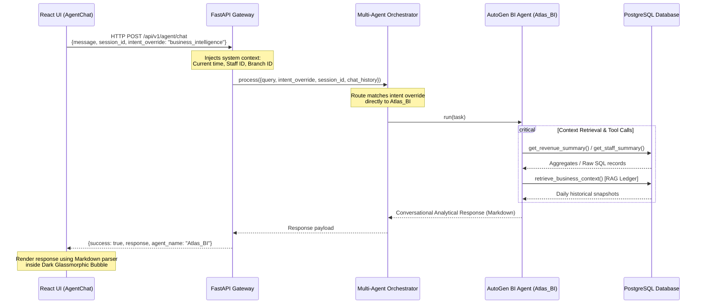

# Admin AI Business Assistant (Atlas) - Query Task Sheet & System Integration Blueprint

This document serves as the operational guide and integration blueprint for the Business Intelligence AI chatbot (**Atlas**) on the admin side of the SalonAI platform. It defines how Atlas responds to administrators across all possible query types and details the smart frontend-to-backend communication architecture.

---

## Part 1: Chatbot Response Behavior & Query Task Sheet

Atlas acts as an elite corporate consultant, operations advisor, and financial analyst for salon owners (Admins). The chatbot is programmed to respond in a **McKinsey-style analyst tone** (objective, precise, structured, and action-oriented) and format analytical output using **clean Markdown tables and bullet points**.

Below is the query mapping sheet detailing the categories, sample queries, tool calls, and response formats:

| Category | Example Admin Query | Underlying Tool Call(s) | Expected Chatbot Response Format |
| :--- | :--- | :--- | :--- |
| **1. Revenue & Sales** | "Show me a summary of our revenue this month. Which service or branch is the top earner?" | `get_revenue_summary()` <br> `get_dashboard_summary()` | A structured table breaking down total, weekly, and monthly revenue, alongside service-wise and branch-wise revenue distribution. |
| **2. Staff Performance** | "Who are our top performing stylists? Who has the highest rating or utilization?" | `get_staff_summary()` | A ranking table of stylists showing: <br> • Stylist Name & Role <br> • Completed Bookings Count <br> • Revenue Generated <br> • Utilization Rate % <br> • Average Customer Rating ★ |
| **3. Customer VIP & LTV** | "List our VIP customers and show customer retention rate." | `get_customer_summary()` <br> `get_retention_analytics()` (SQL fallback) | Summary cards showing repeat visitor ratios, followed by an ordered Markdown table listing VIP clients sorted by Lifetime Value (LTV). |
| **4. CRM Leads Pipeline** | "What is our lead conversion rate? How many leads are currently in the funnel?" | `get_lead_summary()` | A breakdown of the sales pipeline: new, contacted, interested, converted, and lost lead counts, and the overall conversion rate percentage. |
| **5. Reputation & Sentiment** | "What are customers complaining about? Show average review ratings." | `get_review_summary()` | Summary of positive vs. negative review volumes, average star rating, and a bulleted list highlighting the primary complaint categories (e.g. Waiting Time). |
| **6. Predictive Forecasting** | "What is next month's expected revenue and appointments volume?" | `forecast_revenue()` | Linear regression projection (+8% target model) outlining expected revenue, expected appointments count, and predicted lead capture. |
| **7. Period-over-Period RAG** | "Why is revenue dropping? Compare with the last 3 months performance." | `retrieve_business_context(days=90)` | A comparative ledger matching current metrics against historical daily snapshots to pinpoint drops in conversions, stylist ratings, or upsell acceptances. |
| **8. Custom Raw SQL queries** | "How many senior stylists do we have? List active services under ₹500." | `query_raw_analytics_database(sql_select_query)` | A dynamically generated table reflecting rows and columns from the executed read-only SQL query (safety limit of 50 rows enforced). |

---

### Example Response Scenarios

#### Scenario A: Period-over-Period RAG Comparison
**Admin:** *"How did our bookings and lead conversions change compared to last month?"*
**Atlas Response:**
> "Based on historical daily snapshots retrieved via Business Metrics RAG, here is the period-over-period comparison:
>
> | Metric | Previous Month (Avg) | Current Month (Avg) | Delta | Trend |
> | :--- | :---: | :---: | :---: | :---: |
> | Daily Revenue | ₹14,250.00 | ₹15,480.00 | +8.6% | 📈 |
> | Daily Appointments | 24 | 26 | +8.3% | 📈 |
> | Lead Conversion Rate | 22.4% | 19.8% | -2.6% | 📉 |
> | Upsell Revenue | ₹1,850.00 | ₹2,100.00 | +13.5% | 📈 |
>
> **Analysis & Recommendations:**
> 1. **Lead Conversion Dip:** Although total bookings and revenue are up, lead conversion rates have dipped by 2.6%. This correlates with a minor increase in customer complaints regarding 'Waiting Time'. 
> 2. **Action Item:** Ensure lead follow-up campaigns are executed within the 30-minute lookback window to recover abandoned booking sessions before prospect interest cools."

#### Scenario B: Custom SQL Execution
**Admin:** *"List all branches in City 'Downtown' along with their active status."*
**Atlas Response:**
> "Executing analytical SELECT query on whitelisted table `branches`...
> 
> | ID | Name | Code | City | Active Status |
> | :--- | :--- | :--- | :--- | :---: |
> | 7a82b9c0-128f-4ad8 | Downtown Elite | DE-01 | Downtown | Active |
> | 9f82d2c1-289e-4bd9 | Downtown Express | DX-02 | Downtown | Inactive |
>
> *Note: Database queries are executed in read-only transaction mode and limited to a maximum of 50 records for safety.*"

---

## Part 2: Smart Integration & Connection Blueprint

The connection between the frontend React interface and the backend AutoGen Business Intelligence agent is designed for speed, security, and contextual accuracy.



### 1. Request Payload Structure (Frontend to Backend)
When the Admin dashboard renders the `<AgentChat intentOverride="business_intelligence" />` component, the frontend sends structured payloads to the backend API:

```typescript
// Payload mapping in frontend/src/components/AgentChat/AgentChat.tsx
const payload = {
  "message": "Compare this week's revenue with last week's.",
  "session id": activeSessionId, // Maps to snake_case field 'session_id' in Pydantic
  "chat history": chatHistoryForBackend, // List of last 5 messages to preserve memory
  "intent override": "business_intelligence" // Bypasses classifier, routes straight to BI Agent
};
const response = await apiClient.post('/agent/chat', payload);
```

### 2. Contextual Prompt Enrichment (FastAPI Route)
In `backend/api/routes/agent_routes.py`, the backend automatically enriches the query with context before invoking the agent. This ensures that Atlas is aware of:
- **System Date & Time**: Enables calculations like "yesterday", "last week", or "next Tuesday" relative to the server time.
- **Logged-in Admin Information**: Injects context about who is chatting (Staff name, ID, role, and branch location) so query scopes can be adjusted dynamically.

### 3. Intent Override Routing (Orchestrator)
The backend `MultiAgentOrchestrator` uses a hybrid classification pipeline:
- **Keyword Pre-classifier (Zero-latency)**: Matches queries containing words like "revenue", "forecast", or "stylist" to the Business Intelligence intent.
- **Intent Override**: When `intent_override` is passed as `"business_intelligence"`, the orchestrator bypasses classification entirely and assigns the query directly to `Atlas_BI` (represented by the `BIAgent` class).

### 4. Background Execution & Timeout Defense
AutoGen processes complex multi-step reasoning and multiple tool executions. To prevent HTTP connection timeouts, the FastAPI gateway implements a **3-second hybrid timeout shield**:
- If `BIAgent` completes execution within 3.0 seconds, the response is returned **synchronously** to the frontend chatbox.
- If it exceeds 3.0 seconds, the task is **forked to a background worker**, and a status response (`"Processing your request..."`) is immediately returned to prevent connection timeouts. Once the background execution finishes, the output is saved in the customer's chat logs database, which the chat logs history refreshes dynamically.

### 5. Secure SQL Sandbox Engine
When the agent executes custom queries via `query_raw_analytics_database()`, it uses a double-layered sandbox in `backend/tools/bi_tools.py`:
- **Read-Only Enforcer**: The query string must strictly start with `SELECT` (case-insensitive). Keywords like `UPDATE`, `INSERT`, `DELETE`, `DROP`, `ALTER`, `TRUNCATE`, `;`, or `--` are forbidden.
- **Whitelisted Schemas**: Queries are restricted to the 7 whitelisted tables: `branches`, `staff`, `customers`, `services`, `appointments`, `leads`, and `reviews`.
- **Atomic Rollback Safeguard**: The session is run with an automatic transaction rollback immediately after row fetching, preventing any data manipulation.
