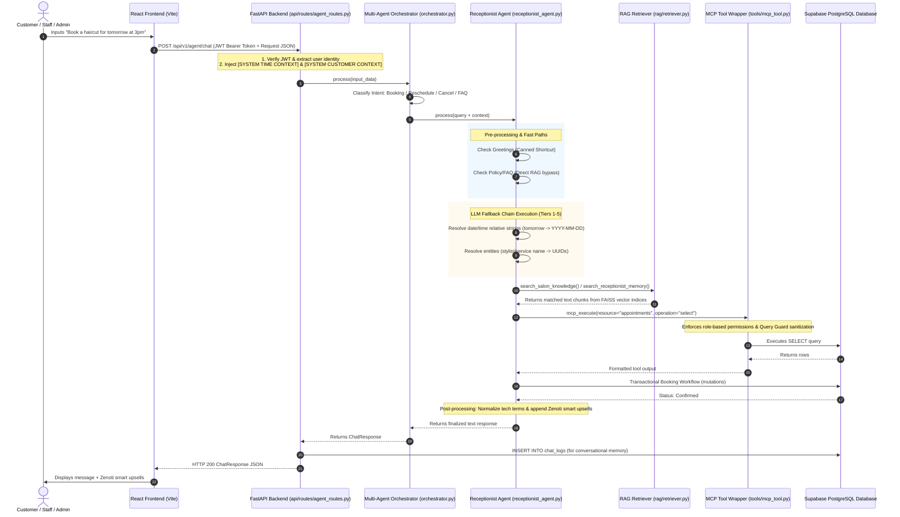

# Clara the AI Receptionist Assistant — Technical Workflow & Integration Guide

This document provides an in-depth, end-to-end technical explanation of **Clara (the AI Receptionist Assistant)** in the SalonAI Workforce Platform. It details the complete workflow, including how she is routed, how she handles LLM fallbacks and circuit breakers, and how she interacts with the database via **MCP (Model Context Protocol)**, **RAG (Retrieval-Augmented Generation)**, and **Transactional Workflows**.

---

## 1. End-to-End Request Lifecycle & Flow

When a user chats with Clara, the query traverses multiple application layers. The diagram below illustrates this path:



---

## 2. Multi-Agent Orchestration & Intent Classification

Every chat request entering `/api/v1/agent/chat` is received by the `MultiAgentOrchestrator` ([orchestrator.py](file:///c:/Users/ADMIN/OneDrive/Desktop/saloon/saloon-AI/backend/agents/orchestrator.py)). The orchestrator routes the query using a two-stage classification pipeline:

```
                  [ incoming chat query ]
                             │
                             ▼
                Stage 1: Keyword Classification
                 (Zero-latency Regex Match)
               ┌─────────────┴─────────────┐
        Known Intent                Unknown Intent
             │                             │
             ▼                             ▼
       [Route Agent]            Stage 2: LLM Classifier
                               (Fallback lightweight call)
                                           │
                                    ┌──────┴──────┐
                              Parsed Label      Failure
                                    │              │
                                    ▼              ▼
                              [Route Agent]   [Default: Clara]
```

1. **Stage 1: Keyword Pre-Classification (Deterministic)**
   * A dictionary of keywords (`_INTENT_KEYWORDS`) scans the incoming string.
   * If terms like `book`, `appointment`, `cancel`, `haircut`, `stylist`, or `slot` score the highest, it immediately classifies the intent as `AgentIntent.BOOKING` and forwards it to Clara, skipping LLM classification entirely to save tokens and latency.
2. **Stage 2: LLM Classifier (Fallback)**
   * If keyword scoring is ambiguous, a lightweight LLM call (`IntentClassifier` assistant) evaluates the query and returns one of the enum values: `booking`, `lead_followup`, `upsell`, `reputation`, or `business_intelligence`.
3. **Intent Override Bypass**
   * If the API request contains an `intent_override` (e.g., when the Admin dashboard forces chat routing to a specific specialist like `business_intelligence`), classification is skipped entirely, and the query is sent directly to the designated agent.

---

## 3. Clara's Internal Processing Pipelines

Once Clara is activated, she runs a pipeline focused on accuracy, reliability, and speed:

### 3.1 Fast Paths (No LLM / No Token Cost)
* **Greetings Shortcut:** If the query is a simple greeting (`"hello"`, `"hi"`, `"hey"`), `receptionist_agent.py` returns a canned warm response, consuming **0 LLM tokens**.
* **FAQ/Policy Shortcut:** If the query matches policy keywords (`"cancellation policy"`, `"business hours"`, `"refunds"`), Clara bypasses the LLM and runs a direct vector database lookup on the `receptionist_knowledge` index. If a high-confidence match is found, it is formatted and returned instantly.

### 3.2 Dynamic Tool Selection & History Fetch Limit
To minimize token bloat and keep context windows focused, Clara uses dynamic tool reduction (`_select_agent_tools`). She registers 15 tools but only mounts the tools relevant to the detected request type:
* **Booking query:** Mounts `book_new_appointment`, `check_stylist_availability`, `get_available_services`, `get_available_staff`.
* **Cancellation query:** Mounts `cancel_existing_appointment` and `check_customer_booking_history`.
* **Rescheduling query:** Mounts `reschedule_existing_appointment`, `check_stylist_availability`, and `check_customer_booking_history`.
* **History query:** Mounts `check_customer_booking_history` which fetches up to **50 records** (increased from 5) to guarantee a broad retrieval history that includes upcoming appointments.

### 3.3 Receptionist Planner & Intent Gateways
Clara uses a structured LLM planner (`_run_planner`) to decompose customer requests:
* **History vs Availability:** The planner explicitly separates `history` (checking one's own booked appointments, e.g. "do I have any appointments on date") from `availability` (checking free slots at the salon for new appointments).
* **Smart History Routing (`is_specific_query`):** Simple history lists bypass the LLM and return formatted templates. However, if the query contains month/date keywords, weekdays, relative time indicators, question patterns, or numbers/digits, it is classified as a specific query and routed to the LLM with the customer's history injected, enabling the LLM to answer date-specific questions (e.g. "You don't have any appointments scheduled for June 15th").
* **Prioritized Prompt Compression:** To prevent prompt token bloat while ensuring future bookings are never lost, `compress_history_for_prompt` partitions the history into active bookings (`CONFIRMED`, `PENDING`) and past bookings. It selects all active bookings (up to 15) and only fills the remainder with past bookings (up to 8).

### 3.4 LLM Fallback Queue & Circuit Breakers
If a call must go to an LLM, Clara is backed by a resilient **Sequential Fallback Queue** that routes queries through available providers:

| Tier | Provider | Model / Endpoint | Role |
| :--- | :--- | :--- | :--- |
| **Tier 1** | Hugging Face | `Qwen/Qwen2.5-72B-Instruct` | Primary LLM (if enabled) |
| **Tier 2** | Groq | `llama-3.3-70b-versatile` | Secondary (Primary fallback, best speed/quality) |
| **Tier 3** | Groq | `llama-3.1-8b-instant` | Lightweight Groq Fallback |
| **Tier 4** | Gemini (API) | `gemini-2.0-flash` | Secondary Cloud Fallback |
| **Tier 5** | Gemini (API) | `gemini-2.0-flash-lite` | Ultra-safe Backup (higher quota limits) |

* **Model Cooldowns:** If a provider returns a `429` (rate limit) or connection timeout, that model is placed on a cooldown registry (`MODEL_COOLDOWN`) and skipped in subsequent runs.
* **Circuit Breaker:** If total failures cross `8`, the circuit breaker trips. Clara enters **Emergency Mode**, immediately responding with a friendly fallback message guiding the user to manual forms, protecting backend services from cascading failures.

---

## 4. Entity Resolution & Argument Repair

To ensure database queries do not fail due to loose human language, Clara performs pre-execution sanitization:

```
[ Human Query ] ──────────────────► [ Date/Time Repair ] ────────────────► [ Entity Resolver ] ──────────────────► [ Target UUIDs / ISO Strings ]
"tomorrow at 3pm with Priya"        "2026-06-14T15:00:00Z"                 Priya -> "p1-uuid"                     "Service ID: s1-uuid", etc.
                                    (Normalized via System Time)           Haircut -> "s1-uuid"
```

1. **Date/Time Normalization:**
   * **`repair_date()`:** Resolves expressions like `"tomorrow"`, `"next Tuesday"`, `"day after tomorrow"`, and informal formats like `"june 8th"` into ISO-compliant `YYYY-MM-DD` strings. It uses the `[SYSTEM TIME CONTEXT]` injected by the API layer as a base date.
   * **`repair_time()`:** Standardizes terms like `"5pm"`, `"3-4pm slot"`, or `"noon"` into standard 24-hour start times (`HH:MM`).
2. **Database Entity Resolution:**
   * Before executing bookings, names of stylists or services are processed by `utils/entity_resolver.py` (`resolve_staff()`, `resolve_service()`, `resolve_branch()`).
   * It runs a database lookup, resolving names to their respective **UUID primary keys** (e.g., resolving the name *"James"* to the staff UUID `"staff-uuid-1234"`).
3. **Placeholder Safeguards:**
   * If the LLM generates default placeholders (e.g. `"first_branch_id"`, `"default_service_id"`), Clara's wrapper interceptor catches them and resolves them to the first active record in the database.

---

## 5. RAG (Retrieval-Augmented Generation) Architecture

Clara connects to the **RAG Pipeline** through the `SalonRAGRetriever` ([rag/retriever.py](file:///c:/Users/ADMIN/OneDrive/Desktop/saloon/saloon-AI/backend/rag/retriever.py)). 

### 5.1 Embedding Model Configuration
Embeddings are managed by a factory pattern that ensures local operations with cloud resilience:
* **Hugging Face (`all-MiniLM-L6-v2`):** Runs locally on CPU if PyTorch is available.
* **Gemini Embedding Fallback:** If local PyTorch bindings fail on Windows, the system automatically falls back to `models/gemini-embedding-2` via Google API.

### 5.2 FAISS Vector Store Indices
RAG retrieves matching content across three distinct index families saved in `backend/data/faiss_indices/`:

```
┌──────────────────────────────────────────────────────────────────────────────────────────────────────┐
│                                       FAISS Vector Index Families                                    │
├───────────────────────────────┬─────────────────────────────────────┬────────────────────────────────┤
│    receptionist_knowledge     │        customer_interactions        │         agent_memory           │
├───────────────────────────────┼─────────────────────────────────────┼────────────────────────────────┤
│ • Admin policies (PDF/TXT)    │ • Past 500 appointments             │ • 28 individual indexes        │
│ • Active Special Offers       │ • Customer review comments          │   (7 agents × 4 levels)        │
│ • Salon FAQ documents         │ • CRM lead pipelines                │ • Daily → Weekly → Monthly     │
│ (Rebuilt on upload/edit)      │ (Rebuilt daily from PostgreSQL)     │   → Yearly consolidations      │
└───────────────────────────────┴─────────────────────────────────────┴────────────────────────────────┘
```

### 5.3 Retriever Interface
Clara invokes search wrappers which return context blocks formatted for LLM prompts:
* **`search_receptionist_knowledge(query)`:** Queries policies/rules. If no matches are found, Clara responds: *"I couldn't find that information in the salon knowledge base."*
* **`search_receptionist_memory(query)`:** Scans Clara's own daily and weekly summaries of past activities to recall context.
* **`search_customer_memory(query, customer_id)`:** Resolves the logged-in customer identity and searches consolidated memory profiles to find past stylist preferences or service details.

---

## 6. MCP (Model Context Protocol) Connection

For database read operations, the application uses **Model Context Protocol (MCP)** standards. The tool wrapper `mcp_execute()` ([tools/mcp_tool.py](file:///c:/Users/ADMIN/OneDrive/Desktop/saloon/saloon-AI/backend/tools/mcp_tool.py)) acts as the gatekeeper for all agent data access.

```
┌───────────────┐        mcp_execute(...)        ┌──────────────┐
│  Clara Agent  ├───────────────────────────────►│  MCP Wrapper │
└───────────────┘                                └──────┬───────┘
                                                        │ Checks context &
                                                        │ applies Query Guard
                                                        ▼
┌───────────────┐        executes query          ┌──────────────┐
│  PostgreSQL   │◄───────────────────────────────┤   SalonMCP   │
└───────────────┘                                └──────────────┘
```

### 6.1 MCP Read Workflow (`mcp_execute`)
When Clara needs customer records (like booking history), she calls:
```python
mcp_execute(
    resource="appointments",
    operation="select",
    filters={"customer_id": customer_uuid},
    agent_name="Clara",
    user_context={"user_id": user_uuid, "role": "CUSTOMER", "customer_id": customer_uuid}
)
```
1. **Context Ingestion:** The wrapper builds an `MCPContext` object containing the caller's ID and role.
2. **Query Guard Verification (`query_guard.py`):** 
   * Validates filters against security policies.
   * If a customer attempts to query another customer's ID, the Query Guard intercepts the call and raises a security violation.
3. **Database Execution (`salon_mcp.py`):** Reads the database using SQLAlchemy engine pools.
4. **Audit Logging & Metrics:** Logs the query latency and parameters to `MCPAuditLogger` for monitoring. (The call keyword argument is set to `agent_name=agent_name` to align with `MCPAuditLogger.log_action`'s signature and prevent silent logger crashes).
5. **Legacy Fallback:** If the MCP server encounters an exception, it falls back to direct SQLAlchemy models in admin mode to prevent agent crash.

### 6.2 MCP Write Workflow (`mcp_write`)
For other agents (like upsell or reputation), database writes (INSERT, UPDATE, DELETE) run through `mcp_write()`. Clara, however, routes her critical appointment changes directly to **transactional workflows** to ensure strict business logic validation.

---

## 7. Transactional Booking Workflows

Clara modifies database states using transaction workflows ([booking_workflow.py](file:///c:/Users/ADMIN/OneDrive/Desktop/saloon/saloon-AI/backend/workflows/booking_workflow.py)). These workflows isolate operations from the LLM, ensuring that mutations only occur after database validation:

* **`book_appointment_workflow()`:**
  * Coordinates booking parameters, checks for stylist availability overlaps, validates branch operating hours, inserts the record into Supabase, and fires internal notifications.
* **`cancel_appointment_workflow()`:**
  * Performs cancellation checks (verifying the cancellation window is open) and adjusts customer loyalty points if penalty policies apply.
* **`reschedule_appointment_workflow()`:**
  * Validates availability for the new time slot, updates the appointment record, and updates the scheduling state.
* **`check_availability_workflow()`:**
  * Queries active bookings and stylist schedules to compile available slots for a given date.

---

## 8. Post-Processing & Output Normalization

Before the orchestrator sends Clara's response back to the frontend, it passes through two post-processing layers:

### 8.1 Response Normalization & Envelope Formatting
The method `normalize_response()` acts as a sanitation filter:
* **Tech Term Masking:** Replaces technical jargon (e.g. `"sqlite"`, `"postgresql"`, `"429"`, `"UUID"`, `"db transaction"`) with user-friendly terminology (e.g. `"system"`, `"reference number"`, `"booking system"`, `"temporary high volume"`).
* **Format Cleanup:** Rewrites raw dictionary tool responses into conversational paragraphs if the LLM output falls back to structured formats.
* **Envelope Mapping:** Before rendering, Clara's post-LLM parser scans response envelopes for `response_type == "appointment_history"` or reviews. This routes history data directly to the styling history summary prompt to generate a friendly greeting and clean list, rather than incorrectly attempting to fit it into the booking confirmation template.

### 8.2 Zenoti Smart Upsells Injection
If the response indicates a confirmed booking, the normalizer intercepts it and appends targeted product recommendations (`append_upsells_if_booking_confirmed()`):
* **Haircut booked:** Appends suggestions for *Hair Spa ($55)*, *Special Head Massage ($25)*, and *Professional Beard Styling ($35)*.
* **Massage booked:** Appends suggestions for *Luxury Facial Treatment ($120)* and *Himalayan Sea Salt Foot Wash ($30)*.
* **Other bookings:** Appends suggestions for *Signature Precision Haircut ($85)* and *Special Head Massage ($25)*.

The resulting output displays as a clean markdown confirmation block including a **🎁 Recommended Add-on Treatments** section.
