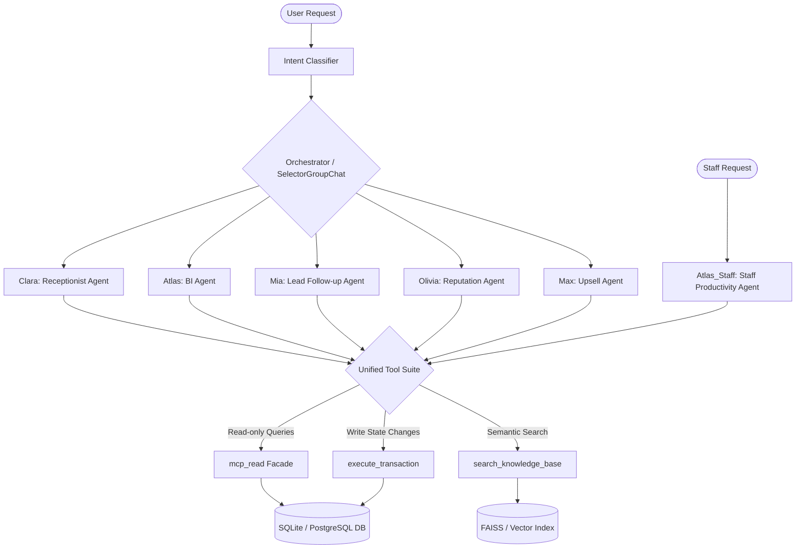

# SalonAI Workforce System Architecture & Workflow Document

Welcome to the complete overview of the SalonAI platform's agentic workforce architecture. This document details the system design, the agent suite, the unified tools, the RAG domains, the MCP database facade, and the internal data flows of the system.

---

## 1. System Overview & Core Philosophy

SalonAI is built as a modular, enterprise-grade multi-agent platform designed for salon operations. Rather than using monolithic code or a single complex agent with dozens of specific tools, the platform uses:
- **Separation of Concerns:** A set of 6 specialized agents, each managing a specific feature boundary (bookings, staff productivity, BI metrics, lead follow-ups, upsells, reputation management).
- **Centralized Routing & Orchestration:** An orchestrator agent that classifies user intents and runs a group chat for collaborative task completion.
- **SaaS-Level Unified Interface:** All database reads, write transactions, and RAG lookups are routed through three unified, generalized tools. This keeps LLM prompt tokens minimal, maximizes agent accuracy, and simplifies the codebase.



---

## 2. Agent Workforce Directory

### 2.1 Multi-Agent Orchestrator (`Orchestrator`)
* **File:** [orchestrator.py](file:///c:/Users/ADMIN/OneDrive/Desktop/saloon/saloon-AI/backend/agents/orchestrator.py)
* **Role:** Team Coordinator and router.
* **Workflow:**
  1. Receives incoming queries and checks social "Fast-Paths" (trivial hello, thanks, farewell words) to return canned replies instantly with zero LLM costs.
  2. Runs a lightweight intent classifier (`IntentClassifier` agent) using a low-token prompt to assign the query to one of the specific categories (`booking`, `lead_followup`, `upsell`, `reputation`, `business_intelligence`).
  3. Enforces Role-Based Access Control (RBAC). If a Customer tries to query business intelligence, they are automatically demoted to `booking` (receptionist Clara).
  4. Spins up a `SelectorGroupChat` containing allowed specialist agents, routes the query to the chosen agent, runs the group chat asynchronously, and returns the final formatted conversational response.

### 2.2 Clara: Receptionist Agent (`Clara_Receptionist`)
* **File:** [receptionist_agent.py](file:///c:/Users/ADMIN/OneDrive/Desktop/saloon/saloon-AI/backend/agents/receptionist_agent.py)
* **Role:** Customer Booking & FAQ Specialist.
* **Responsibilities:**
  * Checks stylist availability and available service slots.
  * Books new appointments, reschedules existing ones, and processes cancellations.
  * Resolves entity names (e.g. mapping "haircut" to the specific Bridal Haircut service ID, or "Isabella" to Isabella Martinez's staff ID).
  * Answers customer questions regarding cancellation policies, operating hours, prices, and refunds.

### 2.3 Atlas: Staff Productivity Agent (`Atlas_Staff`)
* **File:** [staff_assistant_agent.py](file:///c:/Users/ADMIN/OneDrive/Desktop/saloon/saloon-AI/backend/agents/staff_assistant_agent.py)
* **Role:** Employee Operations Assistant.
* **Responsibilities:**
  * Handles logged-in staff schedule lookups (today, tomorrow, next week).
  * Retrieves stylist performance metrics (average rating, completion rate, lifetime generated revenue).
  * Registers stylist leave requests and lists active leaves.
  * Fetches historical treatment notes, hair formulas, and preferences for upcoming customers.
  * Dispatches SMS/notification reminders to clients scheduled for the day.

### 2.4 Atlas: BI Agent (`Atlas_BI`)
* **File:** [bi_agent.py](file:///c:/Users/ADMIN/OneDrive/Desktop/saloon/saloon-AI/backend/agents/bi_agent.py)
* **Role:** Business Intelligence Analyst.
* **Responsibilities:**
  * Computes dashboard analytics summaries, total monthly revenue, and period-over-period breakdowns.
  * Compares staff performance levels, utilization rates, and commission statistics.
  * Generates business operational insights, reports on cancellation trends, and forecasts next month's revenue.

### 2.5 Mia: Lead Follow-up Agent (`Mia_LeadFollowup`)
* **File:** [lead_followup_agent.py](file:///c:/Users/ADMIN/OneDrive/Desktop/saloon/saloon-AI/backend/agents/lead_followup_agent.py)
* **Role:** CRM Pipeline & Campaign Specialist.
* **Responsibilities:**
  * Tracks and manages prospective client pipelines and conversion analytics.
  * Registers new leads and advances lead stages.
  * Drafts outreach campaign messages and schedules follow-up reminders.

### 2.6 Olivia: Reputation Agent (`Olivia_Reputation`)
* **File:** [reputation_agent.py](file:///c:/Users/ADMIN/OneDrive/Desktop/saloon/saloon-AI/backend/agents/reputation_agent.py)
* **Role:** Customer Feedback & Reputation Manager.
* **Responsibilities:**
  * Retrieves and filters customer review histories and rating analytics.
  * Computes the overall salon reputation scorecard.
  * Drafts professional review responses and escalates critical negative feedback.

### 2.7 Max: Upsell Agent (`Max_Upsell`)
* **File:** [upsell_agent.py](file:///c:/Users/ADMIN/OneDrive/Desktop/saloon/saloon-AI/backend/agents/upsell_agent.py)
* **Role:** Service Upgrades & Bundle Strategist.
* **Responsibilities:**
  * Generates personalized service recommendation lists for customers based on styling history.
  * Tracks upsell conversion rates and draft targeted promotional campaigns.

---

## 3. The Unified Tool Interface (Phase 2)

To keep the agent prompts small and prevent model planning failures, the agents are restricted to **three generalized tools** which act as facade entry points to the backend:

### 3.1 Database Read Facade (`mcp_read`)
* **File:** [mcp_tool.py](file:///c:/Users/ADMIN/OneDrive/Desktop/saloon/saloon-AI/backend/tools/mcp_tool.py)
* **Signatures:** `mcp_read(resource, operation, filters, agent_name, user_context, limit, offset, metric, group_by)`
* **Routing Logic:**
  * Accepts stringified parameters (Union of Dict/str) to tolerate LLM format variations.
  * Routes queries dynamically based on the requested `resource` string:
    * `services` -> returns service catalog lists.
    * `staff` -> returns stylist list or checks available staff for a slot.
    * `schedule` / `today_schedule` / `next_customer` -> calls staff database services.
    * `customers` / `customer_history` / `customer_preferences` -> calls client records.
    * `dashboard` / `revenue` / `ai_insights` / `forecast` -> routes to BI analytics database operations.
    * `reviews` / `upsell_analytics` / `leads` -> routes to their respective subsystems.
  * Fallback option: If the facade mapping matches a registered DB model directly, it executes a clean SQLAlchemy query with security filters (`mcp_execute` -> `SalonMCP`).

### 3.2 Semantic Memory Facade (`search_knowledge_base`)
* **File:** [rag_unified.py](file:///c:/Users/ADMIN/OneDrive/Desktop/saloon/saloon-AI/backend/tools/rag_unified.py)
* **Signatures:** `search_knowledge_base(domain, query, customer_id, staff_id)`
* **Routing Logic:**
  * Routes search queries to static text documents or semantic vector indices:
    * `policies` / `all_context` -> queries salon operations standards and corporate SOP documents.
    * `faq` -> queries standard customer Q&A database.
    * `business_hours` / `cancellation_policy` / `refund_policy` -> extracts static rules.
    * `customer_styling` / `interactions` -> queries past styling preferences and CRM log memory.
    * `lead_memory` / `upsell_memory` / `reputation_memory` / `staff_memory` -> queries agent-specific vector files.

### 3.3 Transaction Dispatcher (`execute_transaction`)
* **File:** [transaction_unified.py](file:///c:/Users/ADMIN/OneDrive/Desktop/saloon/saloon-AI/backend/tools/transaction_unified.py)
* **Signatures:** `execute_transaction(action, parameters)`
* **Routing Logic:**
  * Validates action names and parses parameters before committing changes to the database.
  * Triggers state mutations based on the requested `action` string:
    * `book_appointment` -> inserts confirmed appointment.
    * `cancel_appointment` -> updates appointment status to `CANCELLED`.
    * `reschedule_appointment` -> updates start times.
    * `register_lead` / `advance_lead_status` / `send_followup` -> updates CRM data.
    * `create_leave_request` -> inserts leave log record.
    * `draft_review_response` / `escalate_review` -> updates review status.
    * `accept_upsell_recommendation` -> links upgrade service to the appointment.

---

## 4. Internal Workflow & Data Connections

Let's look at how the different parts of the system connect when a user interacts with the API:

```
[User Message] 
      │
      ▼
1. api/routes/chat.py (Receives query, checks session ID)
      │
      ▼
2. MultiAgentOrchestrator.process(query, user_role)
      │
      ├─► Rule-based Greeting check -> Returns Clara greeting immediately (Fast-Path)
      │
      ▼
3. Classifier Agent (Evaluates query, returns classification string e.g. "booking")
      │
      ▼
4. validate_role_intent(role, classified_intent) -> demotes if role is unauthorized
      │
      ▼
5. SelectorGroupChat (Runs agent conversation turn with routed agent: Clara_Receptionist)
      │
      ▼
6. Clara_Receptionist (Processes text, identifies tool needed)
      │
      ├─► Needs availability: calls mcp_read(resource="appointments", operation="check_availability", filters=...)
      ├─► Needs rules: calls search_knowledge_base(domain="cancellation_policy")
      └─► Needs booking: calls execute_transaction(action="book_appointment", parameters=...)
      │
      ▼
7. Unified Tools (Parse strings, run validations, communicate with DB/Memory)
      │
      ▼
8. OpenAIChatCompletionClient (Extracts response, parses tool outputs, returns text to Orchestrator)
      │
      ▼
9. chat.py API (Formats payload, returns JSON response to user)
```

---

## 5. Summary of Key Connection Nodes

| Connection Node | From | To | Protocol/Interface | Purpose |
|---|---|---|---|---|
| **API Chat Router** | [chat.py](file:///c:/Users/ADMIN/OneDrive/Desktop/saloon/saloon-AI/backend/api/routes/chat.py) | [orchestrator.py](file:///c:/Users/ADMIN/OneDrive/Desktop/saloon/saloon-AI/backend/agents/orchestrator.py) | Python async method call | Initiates user sessions and parses role contexts |
| **Agent Selector** | [orchestrator.py](file:///c:/Users/ADMIN/OneDrive/Desktop/saloon/saloon-AI/backend/agents/orchestrator.py) | Specialist Agents | AutoGen `SelectorGroupChat` | Assembles conversational groups based on classified intent |
| **Tool Adapter** | [openai_client_adapter.py](file:///c:/Users/ADMIN/OneDrive/Desktop/saloon/saloon-AI/backend/core/openai_client_adapter.py) | Unified Tools | Regex tag extractor / OpenAI Tools API | Converts text and XML outputs into runnable Python tool instances |
| **Database Facade** | [mcp_tool.py](file:///c:/Users/ADMIN/OneDrive/Desktop/saloon/saloon-AI/backend/tools/mcp_tool.py) | SQLAlchemy DB | SQL queries / direct method calls | Isolates data schemas and applies row-level permission guards |
| **RAG Facade** | [rag_unified.py](file:///c:/Users/ADMIN/OneDrive/Desktop/saloon/saloon-AI/backend/tools/rag_unified.py) | RAG Vectors | FAISS semantic retrievers / static documents | Retrieves context matching policies and preferences |
| **Transaction Facade**| [transaction_unified.py](file:///c:/Users/ADMIN/OneDrive/Desktop/saloon/saloon-AI/backend/tools/transaction_unified.py) | Business Logic Services | Database mutations / state transitions | Dispatches updates to CRM, leaves, bookings, and notifications |

---
*Document compiled for Kethambabu (saloon-AI).*
