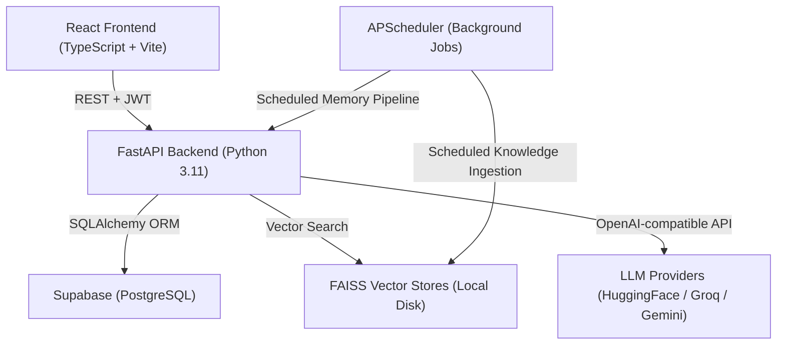
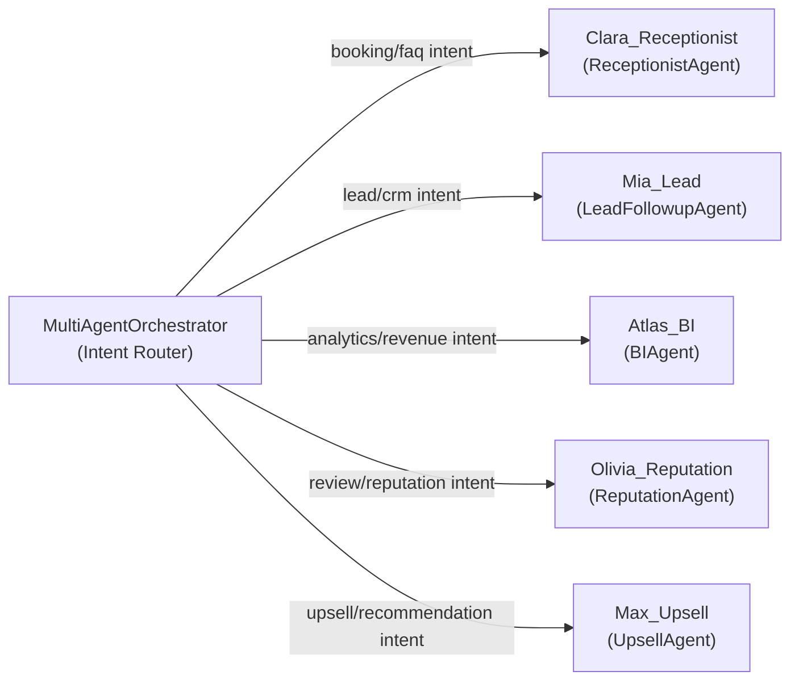
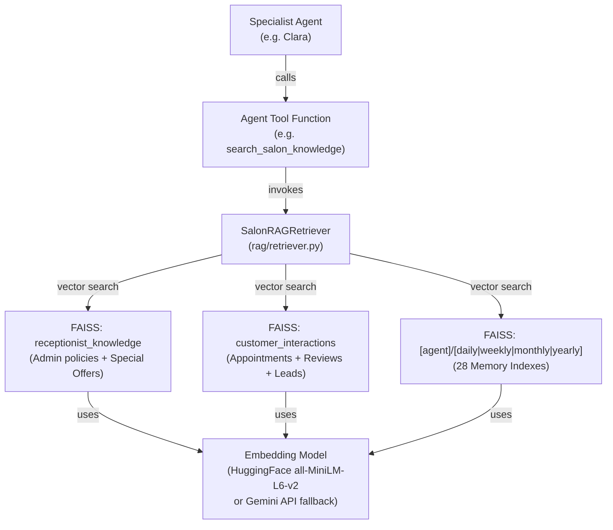
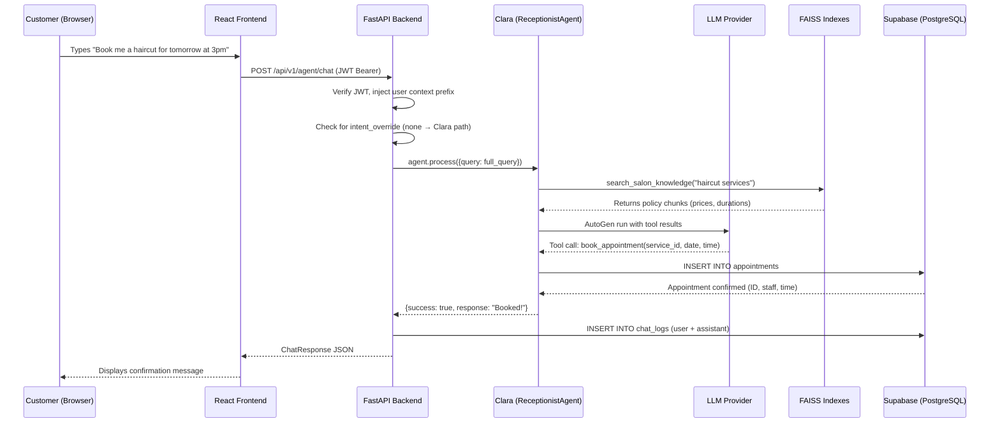
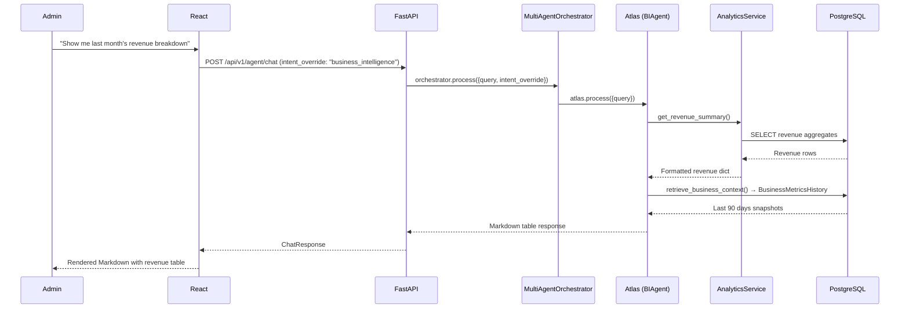
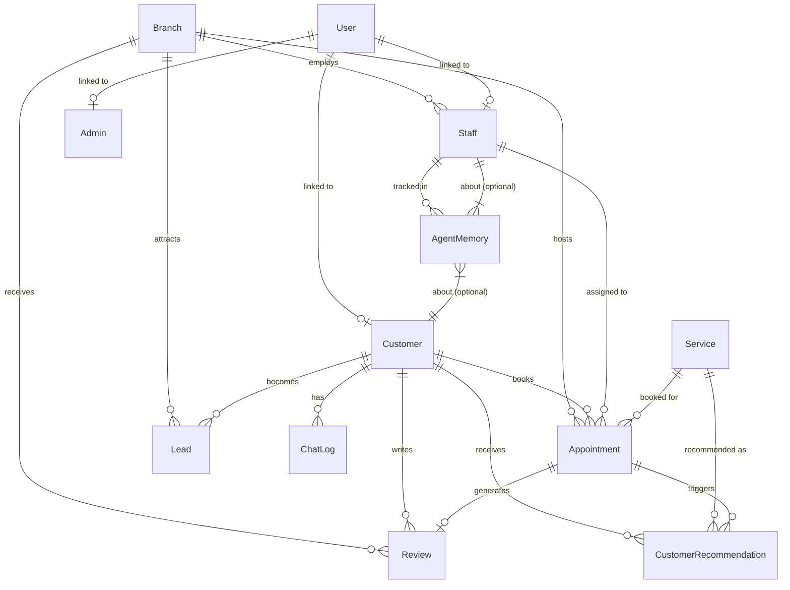
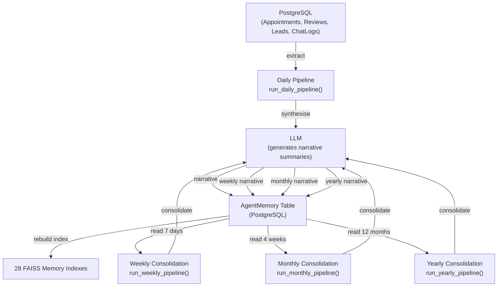

# SalonAI Workforce Platform — Complete Technical Documentation

> **Handover document for new developers.** This document covers every layer of the SalonAI Workforce Platform: business context, architecture, database, agents, RAG pipelines, API contracts, and deployment guidance. Read it end-to-end before touching any code.

---

## Table of Contents

1. [Project Overview](#1-project-overview)
2. [Complete System Architecture](#2-complete-system-architecture)
3. [Technology Stack](#3-technology-stack)
4. [Project Folder Structure](#4-project-folder-structure)
5. [Database Architecture](#5-database-architecture)
6. [API Reference](#6-api-reference)
7. [AI Agent Architecture](#7-ai-agent-architecture)
8. [RAG (Retrieval-Augmented Generation) Architecture](#8-rag-retrieval-augmented-generation-architecture)
9. [Memory Pipeline](#9-memory-pipeline)
10. [Authentication & Security](#10-authentication--security)
11. [Frontend Architecture](#11-frontend-architecture)
12. [Background Scheduler & Jobs](#12-background-scheduler--jobs)
13. [LLM Configuration & Fallback Chain](#13-llm-configuration--fallback-chain)
14. [Configuration & Environment Variables](#14-configuration--environment-variables)
15. [Inter-Service Data Flow (End-to-End Request Lifecycle)](#15-inter-service-data-flow-end-to-end-request-lifecycle)
16. [Services Catalogue](#16-services-catalogue)
17. [Known Limitations & Technical Debt](#17-known-limitations--technical-debt)
18. [Future Enhancement Roadmap](#18-future-enhancement-roadmap)

---

## 1. Project Overview

### 1.1 Project Name
**SalonAI Workforce Platform**

### 1.2 Project Objective
An AI-powered, multi-agent salon management platform that automates receptionist operations, CRM lead follow-up, business intelligence, reputation monitoring, upsell recommendations, and autonomous memory consolidation — all from a single conversational interface.

### 1.3 Business Problem Being Solved
Modern multi-branch salons suffer from:
- **Fragmented customer engagement** — no consistent follow-up with leads and lapsed customers.
- **Manual receptionist bottlenecks** — booking, rescheduling, and FAQ handling require human labour around the clock.
- **Zero real-time analytics** — managers lack instant visibility into revenue, staff performance, and customer satisfaction.
- **Poor reputation management** — critical reviews go unresponded for days.
- **No upsell automation** — stylists recommend add-ons inconsistently.

SalonAI solves all of the above using LLM-driven specialist agents, each backed by live PostgreSQL data and a vector-search RAG memory layer.

### 1.4 Target Users
| Role | Description |
|------|-------------|
| **Admin / Owner** | Full access to dashboards, analytics, agent AI, staff management, knowledge base, and memory pipeline controls |
| **Staff / Stylist** | Appointment views, their own performance metrics, an AI chat assistant for internal queries |
| **Customer / User** | Book & cancel appointments, review history, chat with Clara the AI Receptionist, view loyalty points |

### 1.5 Key Capabilities
- **Conversational booking & FAQ** via Clara (Receptionist AI)
- **CRM lead follow-up** via Mia (Lead Follow-Up Agent)
- **Real-time business intelligence** via Atlas (BI Analyst)
- **Reputation monitoring & auto-response** via Olivia (Reputation Agent)
- **Upsell recommendations** via Max (Upsell Agent)
- **Hierarchical AI memory** (daily → weekly → monthly → yearly) stored in 28 FAISS indexes
- **Three-tier LLM fallback** (HuggingFace → Groq → Gemini)
- **Role-based access control** with JWT + refresh token rotation
- **Admin knowledge base** — upload policy PDFs and special offers that feed directly into the RAG layer

### 1.6 High-Level Architecture Overview



---

## 2. Complete System Architecture

### 2.1 Frontend Architecture

The frontend is a **React + TypeScript** single-page application (SPA) built with **Vite** as the bundler. It uses `HashRouter` for client-side routing (no server-side routing required), making it easy to serve from a static host.

**Routing Strategy:**
- `/` — Public landing page with auto-redirect if authenticated
- `/login`, `/signup`, `/forgot-password`, `/reset-password` — Auth pages
- `/admin/*` — Admin dashboard (role guard: `Admin`)
- `/staff/*` — Staff dashboard (role guard: `Staff`)
- `/user/*` — Customer dashboard (role guard: `User`)
- `/unauthorized` — Blocked access page

**Auth Guard (`ProtectedRouteWrapper`):** A React component that reads from `AuthContext`. Unauthenticated users are redirected to `/login`; wrong-role users are redirected to `/unauthorized`.

**State Management:**
- `AuthContext` — global auth state (user, role, tokens, isAuthenticated)
- `store/` — Zustand or Context-based local feature state
- API calls are abstracted in `src/api/` and `src/services/`

### 2.2 Backend Architecture

The backend is a **FastAPI** application (Python 3.11) with an async-first design. It is structured as a modular monolith with the following major modules:

| Module | Path | Responsibility |
|--------|------|----------------|
| `main.py` | `backend/` | App entry point, CORS, lifespan events, router mounting |
| `core/` | `backend/core/` | Config, security (JWT/bcrypt), LLM config manager |
| `db/` | `backend/db/` | SQLAlchemy models, DB engine, session factory |
| `api/routes/` | `backend/api/routes/` | All FastAPI route handlers |
| `agents/` | `backend/agents/` | AutoGen-powered specialist AI agents |
| `rag/` | `backend/rag/` | Embedding models, document chunking, FAISS ingest |
| `services/` | `backend/services/` | Business logic services (analytics, memory, knowledge) |
| `tools/` | `backend/tools/` | Decoupled database tool functions for agent use |

**App Lifespan (startup/shutdown):**
1. LLM config validation (`validate_llm_startup()`)
2. Database health check (`check_db_health()`)
3. FAISS interaction index build (`RAGIngestor.ingest_interactions()`)
4. APScheduler start (daily memory pipeline, weekly/monthly consolidations, offer expiry)

### 2.3 Database Architecture

- **Provider:** Supabase (PostgreSQL, hosted)
- **ORM:** SQLAlchemy 2.x (sync sessions, psycopg2 driver)
- **Connection Pooling:** `pool_size=5`, `max_overflow=3`, `pool_recycle=1800s`, `pool_pre_ping=True`
- **Migrations:** Alembic (implied by `prisma/` directory exists for reference — actual migrations are SQLAlchemy-based)

### 2.4 AI Architecture

The platform uses **Microsoft AutoGen** (`autogen_agentchat`) to power each specialist agent. Every agent is an `AssistantAgent` with a curated tool list and a persona-specific system prompt.

**Agent-to-LLM Communication:**
- All agents share `OpenAIChatCompletionClient` adapter
- The client speaks the OpenAI API spec (compatible with Groq, HuggingFace Inference, and Gemini's compatibility layer)
- Three-tier fallback: HuggingFace → Groq → Gemini (per-request, not session-sticky)

### 2.5 Agent Architecture



**Intent Routing (two-stage classifier):**
1. **Rule-based keyword matching** — fast regex/keyword scan over the query string (e.g. "revenue", "lead", "review")
2. **LLM fallback classifier** — if no keyword match, asks the LLM to classify the intent

### 2.6 RAG Architecture



**Three FAISS Index Families:**
1. `receptionist_knowledge` — Admin-uploaded policies (PDF/TXT) + active special offers
2. `customer_interactions` — Appointment, review, and lead records from PostgreSQL (rebuilt daily)
3. `[agent]/[level]` — 28 long-term agent memory indexes (7 agents × 4 levels)

### 2.7 Data Flow Diagrams

#### Customer Books an Appointment



#### Admin Asks Business Intelligence Question



### 2.8 End-to-End Request Lifecycle

1. **Browser** makes a `POST /api/v1/agent/chat` with JWT + `ChatRequest` payload
2. **FastAPI** validates JWT → resolves `User` → injects role/context prefix to query
3. If `intent_override` is set → routes to **`MultiAgentOrchestrator`** → specialist agent
4. Otherwise → routes to **`ReceptionistAgent` (Clara)** directly
5. Agent builds full query (history + memory context + latest message)
6. AutoGen `AssistantAgent.run()` loop: LLM chooses tool calls → tool executes → LLM synthesises final answer
7. **Chat logs** are written to PostgreSQL (`ChatLog` table) for both sides of the conversation
8. Response returned as `ChatResponse` JSON

---

## 3. Technology Stack

### 3.1 Frontend Technologies
| Technology | Version | Purpose |
|------------|---------|---------|
| React | 18 | UI component framework |
| TypeScript | 5 | Type safety |
| Vite | Latest | Build tool & dev server |
| React Router DOM | 6 | Client-side routing (HashRouter) |
| TailwindCSS | 3 | Utility-first CSS |
| Zustand / Context | — | State management |
| Axios / Fetch | — | HTTP client for API calls |

### 3.2 Backend Technologies
| Technology | Version | Purpose |
|------------|---------|---------|
| Python | 3.11 | Runtime |
| FastAPI | Latest | Web framework |
| Uvicorn | Latest | ASGI server |
| SQLAlchemy | 2.x | ORM |
| psycopg2 | Latest | PostgreSQL driver |
| Pydantic / pydantic-settings | 2.x | Validation + settings |
| PyJWT | Latest | JWT encode/decode |
| bcrypt | Latest | Password hashing |
| APScheduler | 3.x | Background job scheduler |
| Microsoft AutoGen (`autogen-agentchat`) | 0.4+ / 0.10+ | Multi-agent framework |
| LangChain Core / Community | Latest | Document / vector abstractions |
| LangChain FAISS | Latest | FAISS vector store integration |
| FAISS (faiss-cpu) | Latest | Local vector similarity search |
| HuggingFace Sentence Transformers | Latest | Local embedding model |
| pypdf | Latest | PDF text extraction |

### 3.3 AI/ML Technologies
| Technology | Purpose |
|------------|---------|
| HuggingFace `all-MiniLM-L6-v2` | Default embedding model (offline, CPU) |
| Gemini `gemini-embedding-2` | Embedding fallback (API, when PyTorch unavailable) |
| HuggingFace `Qwen/Qwen2.5-72B-Instruct` | Primary LLM (via HF Inference Router) |
| Groq `llama-3.3-70b-versatile` | Secondary LLM (fast inference) |
| Groq `llama-3.1-8b-instant` | Groq fallback LLM |
| Google `gemini-2.0-flash` | Final LLM fallback |

### 3.4 Infrastructure & External Services
| Service | Purpose |
|---------|---------|
| Supabase | PostgreSQL hosting + connection pooler |
| FAISS (local disk) | Vector index persistence at `backend/data/faiss_indices/` |
| HuggingFace Inference API | Hosted LLM endpoint (`router.huggingface.co/v1`) |
| Groq API | High-throughput LLM endpoint |
| Google Gemini API | Backup LLM + embeddings |

---

## 4. Project Folder Structure

```
saloon-AI/
├── backend/
│   ├── main.py                        # FastAPI app entry point
│   ├── agents/
│   │   ├── __init__.py                # Base Agent ABC
│   │   ├── orchestrator.py            # MultiAgentOrchestrator (intent router)
│   │   ├── receptionist_agent.py      # Clara — Booking & FAQ
│   │   ├── bi_agent.py                # Atlas — Business Intelligence
│   │   ├── lead_followup_agent.py     # Mia — CRM Lead Follow-Up
│   │   ├── reputation_agent.py        # Olivia — Reviews & Reputation
│   │   └── upsell_agent.py            # Max — Upsell Recommendations
│   ├── api/
│   │   ├── deps.py                    # FastAPI dependencies (get_current_user, RoleChecker)
│   │   └── routes/
│   │       ├── __init__.py            # Route aggregator (mounts all sub-routers)
│   │       ├── agent_routes.py        # POST /agent/chat
│   │       ├── auth_routes.py         # POST /auth/login, /signup, /me, etc.
│   │       ├── analytics_routes.py    # GET /analytics/*
│   │       ├── core_routes.py         # GET /services, /branches, etc.
│   │       ├── customer_routes.py     # GET/POST /customers/*
│   │       ├── staff_routes.py        # GET/POST /staff/*
│   │       ├── memory_routes.py       # POST /memory/run-daily, etc.
│   │       ├── admin_knowledge_routes.py # POST /admin/knowledge/*
│   │       ├── notification_routes.py # GET/POST /notifications/*
│   │       ├── recommendation_routes.py # POST /recommendations/*
│   │       ├── review_routes.py       # GET/POST /reviews/*
│   │       └── storage_routes.py      # POST /storage/upload
│   ├── core/
│   │   ├── config.py                  # Pydantic Settings (env vars)
│   │   ├── llm_config.py              # LLMConfigManager (3-tier fallback)
│   │   ├── openai_client_adapter.py   # AutoGen-compatible OpenAI client
│   │   └── security.py               # JWT + bcrypt helpers
│   ├── db/
│   │   ├── database.py                # SQLAlchemy engine + session factory
│   │   ├── models.py                  # All ORM model definitions
│   │   └── __init__.py                # DB exports
│   ├── rag/
│   │   ├── embeddings.py              # EmbeddingConfig, model factory, GeminiAPIEmbeddings
│   │   ├── ingest.py                  # DocumentChunker, RAGIngestor, build_interaction_documents()
│   │   └── retriever.py               # SalonRAGRetriever, agent tool wrappers
│   ├── services/
│   │   ├── analytics_service.py       # Revenue, customer, staff, lead summaries
│   │   ├── forecast_service.py        # +8% revenue forecast model
│   │   ├── insights_service.py        # Auto-generated business insights
│   │   ├── memory_pipeline_service.py # Daily/Weekly/Monthly/Yearly memory pipeline
│   │   ├── notification_service.py    # Notification dispatching
│   │   ├── rag_service.py             # Business metrics RAG context
│   │   └── receptionist_rag_service.py # Admin policy + offer knowledge management
│   ├── tools/
│   │   ├── bi_tools.py                # Raw SQL query tool, service popularity
│   │   ├── lead_tools.py              # CRM lead CRUD, followup, analytics
│   │   ├── receptionist_tools.py      # Booking, availability, history tools
│   │   └── review_tools.py            # Review CRUD, sentiment, escalation
│   └── data/
│       └── faiss_indices/             # Persisted FAISS vector indexes (gitignored)
│           ├── customer_interactions  # Dynamic: appointments + reviews + leads
│           ├── receptionist_knowledge # Admin knowledge base (policies + offers)
│           ├── receptionist/daily/    # Agent memory indexes (28 total)
│           ├── receptionist/weekly/
│           ├── ...                    # (7 agents × 4 levels)
│           └── business_intelligence/yearly/
├── frontend/
│   ├── index.html
│   ├── vite.config.ts
│   ├── tailwind.config.js
│   └── src/
│       ├── App.tsx                    # Root component + route definitions
│       ├── main.tsx                   # React DOM mount
│       ├── api/                       # API client setup (Axios base URL, headers)
│       ├── components/
│       │   ├── Admin/                 # Admin dashboard & sub-pages
│       │   ├── AgentChat/             # Chat interface (shared across roles)
│       │   ├── Auth/                  # Login, Signup, ForgotPassword, ResetPassword
│       │   ├── Customer/              # Customer booking & history views
│       │   ├── Staff/                 # Staff dashboard
│       │   ├── Loyalty/               # Customer loyalty points UI
│       │   ├── Public/                # Landing page, Unauthorized page
│       │   ├── analytics/             # Chart components
│       │   ├── Layout.tsx             # Shell with nav/sidebar
│       │   └── index.ts               # Component barrel exports
│       ├── context/
│       │   └── AuthContext.tsx         # Auth state provider
│       ├── hooks/                     # Custom React hooks
│       ├── services/                  # Service layer for auth, agent, analytics
│       ├── store/                     # Zustand/Context stores
│       └── types/                     # TypeScript interfaces
├── prisma/                            # Prisma schema (reference only, not used in runtime)
├── .env                               # Environment variables (never committed)
├── requirements.txt                   # Python dependencies
└── likhith.md                         # This document
```

---

## 5. Database Architecture

### 5.1 Complete Schema

All models live in `backend/db/models.py`. The database uses **UUID primary keys** throughout.

#### Core Models

**`Branch`** — Salon locations
```
id (UUID PK), name, code, address, city, phone, email, is_active, created_at
```

**`User`** — Authentication accounts
```
id (UUID PK), email (unique), hashed_password, role (UserRole enum), is_active,
refresh_token, staff_id (FK → Staff), customer_id (FK → Customer), created_at
```

**`UserRole` enum:** `ADMIN`, `OWNER`, `MANAGER`, `STAFF`, `CUSTOMER`

**`Admin`** — Admin profile records
```
id (UUID PK), user_id (FK → User), first_name, last_name, email, phone
```

**`Staff`** — Stylist / employee records
```
id (UUID PK), branch_id (FK → Branch), first_name, last_name, email, phone,
role (varchar, e.g. "Senior Stylist"), is_active, specialties, bio, avatar_url,
rating (computed/cached), created_at
```

**`Customer`** — Customer profiles
```
id (UUID PK), first_name, last_name, full_name (generated), email, phone,
is_active, loyalty_points, notes, created_at
```

**`Service`** — Salon service catalogue
```
id (UUID PK), name, description, price (Decimal), duration_minutes, category,
is_active, created_at
```

**`Appointment`** — Core booking entity
```
id (UUID PK), customer_id (FK), branch_id (FK), staff_id (FK, nullable),
service_id (FK), start_time, end_time, status (AppointmentStatus), notes, created_at
```

**`AppointmentStatus` enum:** `PENDING`, `CONFIRMED`, `COMPLETED`, `CANCELLED`, `NO_SHOW`

**`Review`** — Customer reviews
```
id (UUID PK), customer_id (FK), branch_id (FK), appointment_id (FK), rating (1-5),
comment, sentiment (ReviewSentiment), ai_response, status (ReviewStatus), created_at
```

**`ReviewSentiment` enum:** `POSITIVE`, `NEUTRAL`, `NEGATIVE`, `CRITICAL`
**`ReviewStatus` enum:** `PENDING`, `APPROVED`, `REJECTED`

**`Lead`** — CRM prospect pipeline
```
id (UUID PK), branch_id (FK, nullable), full_name, email, phone, source,
status (LeadStatus), notes, preferred_date, service_name, customer_id (FK, nullable), created_at
```

**`LeadStatus` enum:** `NEW`, `CONTACTED`, `INTERESTED`, `CONVERTED`, `LOST`

**`ChatLog`** — Agent conversation history
```
id (UUID PK), session_id (string), user_id (FK), customer_id (FK, nullable),
staff_id (FK, nullable), agent_type (varchar), sender ('user'|'assistant'), message, created_at
```

**`CustomerRecommendation`** — Upsell offers
```
id (UUID PK), customer_id (FK), appointment_id (FK), recommended_service_id (FK),
reason, accepted (bool), accepted_at, created_at
```

**`Notification`** — In-app notification store
```
id (UUID PK), user_id (FK), title, message, type, is_read, created_at
```

**`KnowledgeDocument`** — Admin-uploaded policy documents
```
id (UUID PK), title, document_type (varchar), content (TEXT), version (int),
is_active (bool), is_deleted (bool), created_at
```

**`SpecialOffer`** — Time-bounded promotional offers
```
id (UUID PK), title, description, discount_pct (float), start_date, end_date,
is_active (bool), is_deleted (bool), created_at
```

**`AgentMemory`** — LLM-synthesised memory snapshots (all 28 memory types)
```
id (UUID PK), agent_name (varchar), level ('daily'|'weekly'|'monthly'|'yearly'),
target_date (date, nullable), target_year (int, nullable),
customer_id (FK, nullable), staff_id (FK, nullable), content (TEXT), created_at
```

**`BusinessMetricsHistory`** — Daily snapshot for BI RAG
```
id (UUID PK), metric_date (date), revenue (Decimal), appointments (int),
lead_conversion (float), average_rating (float), upsell_revenue (Decimal),
top_service (varchar), top_staff (varchar), created_at
```

### 5.2 Entity Relationship Diagram



---

## 6. API Reference

All endpoints are prefixed with `/api/v1`. Authentication uses `Bearer <access_token>` in the `Authorization` header.

### 6.1 Authentication Endpoints (`/auth`)

| Method | Path | Auth | Description |
|--------|------|------|-------------|
| POST | `/auth/login` | Public | Email + password login. Returns JWT access + refresh tokens. Handles multi-role selection. |
| POST | `/auth/signup` | Public (Admin-protected for ADMIN role) | Register new user. Automatically creates role-specific profile (Staff/Customer/Admin). Returns tokens. |
| POST | `/auth/refresh` | Public | Rotate refresh token. Issues new access + refresh pair. |
| POST | `/auth/logout` | JWT Required | Revoke refresh token (server-side invalidation). |
| GET | `/auth/me` | JWT Required | Get current user profile (id, email, role, staff_id, customer_id). |
| GET | `/auth/users` | Admin Only | List all users with role mapping. |
| POST | `/auth/users/{user_id}/toggle` | Admin Only | Toggle user active/suspended status. |
| POST | `/auth/forgot-password` | Public | Initiate password recovery (returns mock token for dev). |
| POST | `/auth/reset-password` | Public | Complete password reset with recovery token. |

**Login Request Body:**
```json
{
  "email": "user@salon.com",
  "password": "password123",
  "selected_role": "STAFF"
}
```

**Login Response:**
```json
{
  "access_token": "eyJ...",
  "refresh_token": "eyJ...",
  "token_type": "bearer",
  "role": "STAFF",
  "email": "user@salon.com",
  "success": true,
  "user": { "id": "...", "role": "STAFF", "staff_id": "..." }
}
```

### 6.2 Agent Chat Endpoint (`/agent`)

| Method | Path | Auth | Description |
|--------|------|------|-------------|
| POST | `/agent/chat` | JWT Required | Send a message to the AI agents. Primary endpoint for all AI interactions. |

**Chat Request Body:**
```json
{
  "message": "Book a haircut for tomorrow at 3pm",
  "session id": "session-abc-123",
  "chat history": [
    {"role": "user", "content": "What services do you offer?"},
    {"role": "assistant", "content": "We offer haircuts, coloring..."}
  ],
  "intent override": "business_intelligence"
}
```
> **Note:** The API uses space-delimited keys (`"session id"`, `"chat history"`, `"intent override"`) as validation aliases for frontend compatibility.

**Intent Override Values:**
- `null` or omitted → Routes to **Clara (ReceptionistAgent)**
- `"business_intelligence"` → Routes to **Atlas (BIAgent)**
- `"lead_followup"` → Routes to **Mia (LeadFollowupAgent)**
- `"reputation"` → Routes to **Olivia (ReputationAgent)**
- `"upsell"` → Routes to **Max (UpsellAgent)**

**Chat Response:**
```json
{
  "success": true,
  "session id": "session-abc-123",
  "response": "I've booked your Precision Haircut for tomorrow at 3:00 PM...",
  "agent_name": "Clara"
}
```

**Timeout Behaviour:** The endpoint waits up to **30 seconds**. If the agent exceeds this, it forks the processing into a `BackgroundTask` and returns `"Processing your request..."` immediately. The response is stored to `ChatLog` when the background task completes.

### 6.3 Analytics Endpoints (`/analytics`)

| Method | Path | Auth | Description |
|--------|------|------|-------------|
| GET | `/analytics/dashboard` | Admin/Staff | Core KPIs: revenue, bookings, new customers, conversion rate, avg rating |
| GET | `/analytics/revenue` | Admin | Detailed revenue (by service, branch, staff, daily chart) |
| GET | `/analytics/customers` | Admin | Customer LTV, retention, VIP identification |
| GET | `/analytics/staff` | Admin | Staff performance rankings |
| GET | `/analytics/leads` | Admin | Lead pipeline distribution |
| GET | `/analytics/reviews` | Admin | Reputation scorecard |
| GET | `/analytics/upsell` | Admin | Upsell acceptance metrics |
| GET | `/analytics/forecast` | Admin | Next-month revenue forecast |
| GET | `/analytics/insights` | Admin | AI-generated business insights |

### 6.4 Core Data Endpoints (`/services`, `/branches`)

| Method | Path | Auth | Description |
|--------|------|------|-------------|
| GET | `/services` | Public | List all active services |
| GET | `/services/{id}` | Public | Service detail |
| GET | `/branches` | Public | List all active branches |
| POST | `/branches` | Admin | Create branch |

### 6.5 Customer Endpoints (`/customers`)

| Method | Path | Auth | Description |
|--------|------|------|-------------|
| GET | `/customers/me` | Customer | Own profile |
| GET | `/customers/me/appointments` | Customer | Own booking history |
| POST | `/customers/appointments` | Customer | Create booking (Clara also uses this via tools) |
| DELETE | `/customers/appointments/{id}` | Customer | Cancel booking |
| GET | `/customers/me/reviews` | Customer | Own reviews |
| POST | `/customers/reviews` | Customer | Submit review |

### 6.6 Memory Pipeline Endpoints (`/memory`)

| Method | Path | Auth | Description |
|--------|------|------|-------------|
| POST | `/memory/run-daily` | Admin | Trigger daily memory pipeline (manual override) |
| POST | `/memory/run-weekly` | Admin | Trigger weekly consolidation |
| POST | `/memory/run-monthly` | Admin | Trigger monthly consolidation |
| POST | `/memory/rebuild-index` | Admin | Rebuild FAISS index for a specific agent+level |
| GET | `/memory/status` | Admin | Check pipeline status |

### 6.7 Admin Knowledge Base Endpoints (`/admin/knowledge`)

| Method | Path | Auth | Description |
|--------|------|------|-------------|
| GET | `/admin/knowledge/documents` | Admin | List all uploaded policy documents |
| POST | `/admin/knowledge/upload` | Admin | Upload PDF or TXT policy document (multipart form) |
| DELETE | `/admin/knowledge/documents/{id}` | Admin | Soft-delete document + rebuild FAISS |
| GET | `/admin/knowledge/offers` | Admin | List special offers |
| POST | `/admin/knowledge/offers` | Admin | Create a special offer |
| PUT | `/admin/knowledge/offers/{id}` | Admin | Update special offer |
| DELETE | `/admin/knowledge/offers/{id}` | Admin | Soft-delete offer + rebuild FAISS |

### 6.8 Other Endpoints
- **`/notifications`** — User notification CRUD
- **`/recommendations`** — Upsell recommendation CRUD
- **`/reviews`** — Review management (including admin moderation)
- **`/leads`** — Lead CRUD (admin/staff access)
- **`/storage/upload`** — Supabase storage integration
- **`/health`** — Health check (returns `{"status": "healthy"}`)

---

## 7. AI Agent Architecture

### 7.1 Base Agent (`agents/__init__.py`)
All agents inherit from an abstract `Agent` base class that defines the `process(input_data: dict) -> dict` interface.

### 7.2 Clara — Receptionist Agent (`receptionist_agent.py`)

**Persona:** Clara, the Head Salon Receptionist  
**Model:** `AssistantAgent` (AutoGen)  
**Session Memory:** In-process dict (session_id → message list, bounded to last 10 exchanges)

**Tool Set (12 tools):**
| Tool | Purpose |
|------|---------|
| `check_availability` | Query open time slots by service/branch/date |
| `book_appointment` | INSERT appointment into DB |
| `cancel_appointment` | Cancel booking + update status |
| `reschedule_appointment` | Update booking time |
| `get_appointment_history` | Customer booking history lookup |
| `get_services` | List available services |
| `get_branches` | List salon branches |
| `get_staff` | List stylists |
| `search_salon_knowledge` | FAISS search on receptionist_knowledge index |
| `search_customer_interactions` | FAISS search on customer_interactions index |
| `search_receptionist_memory` | FAISS search on receptionist daily memory |
| `search_customer_memory` | FAISS search on customer memory |

**Special Features:**
- **Date/time repair** — `repair_date_time()` normalises natural language dates ("tomorrow", "next Tuesday") using system time context injected at API layer
- **History compression** — Long conversation histories are compressed before sending to LLM to avoid token limit breaches
- **Context injection** — The API layer prepends `[SYSTEM TIME CONTEXT]` and `[SYSTEM CUSTOMER CONTEXT]` to every query, providing the agent with the logged-in customer's ID, name, and loyalty points

### 7.3 Atlas — Business Intelligence Agent (`bi_agent.py`)

**Persona:** Atlas, BI Analyst  
**Tool Set (14 tools):**

| Tool | Purpose |
|------|---------|
| `get_dashboard_summary` | Core KPIs |
| `get_revenue_summary` | Revenue breakdown |
| `get_customer_summary` | Customer LTV + retention |
| `get_staff_summary` | Staff performance |
| `get_lead_summary` | Lead pipeline |
| `get_review_summary` | Reputation KPIs |
| `get_upsell_summary` | Upsell metrics |
| `generate_ai_insights` | AI-generated bullet points |
| `forecast_revenue` | +8% projection model |
| `retrieve_business_context` | Last 90-day metrics RAG |
| `query_raw_analytics_database` | Safe read-only SQL (`SELECT` only, LIMIT 50 auto-appended) |
| `trigger_returning_cohort_reminders` | Manual reminder dispatch |
| `search_salon_knowledge` | Policy/FAQ lookup |
| `search_bi_memory` | BI memory FAISS search |

**SQL Safety:** The raw SQL tool validates that queries are `SELECT`-only and appends `LIMIT 50` before execution, protecting against injection.

### 7.4 Mia — Lead Follow-Up Agent (`lead_followup_agent.py`)

**Persona:** Mia, CRM Lead Specialist  
**Tool Set (12 tools):**

| Tool | Purpose |
|------|---------|
| `find_abandoned_bookings` | Detect cancelled/no-show customers not rebooked |
| `search_leads` | Filter CRM lead pipeline by status/branch/source |
| `register_new_lead` | INSERT new prospect |
| `advance_lead_status` | Transition pipeline stage (NEW→CONTACTED→CONVERTED→LOST) |
| `send_followup_reminder` | Schedule email/SMS/phone reminder |
| `create_personalized_message` | Generate AI-crafted follow-up message |
| `view_conversion_analytics` | Conversion rate, source effectiveness |
| `view_pipeline_snapshot` | Current pipeline stage counts |
| `search_customer_interactions` | Customer interaction history |
| `search_salon_knowledge` | Policy/FAQ lookup |
| `search_lead_memory` | Lead follow-up memory |
| `search_customer_memory` | Customer profile memory |

### 7.5 Olivia — Reputation Agent (`reputation_agent.py`)

**Persona:** Olivia, Reputation & Review Manager  
**Tool Set (8 tools):**

| Tool | Purpose |
|------|---------|
| `view_customer_reviews` | Filter reviews by customer/staff/sentiment/rating |
| `view_review_analytics` | Reputation scorecard |
| `find_critical_reviews` | Fetch CRITICAL sentiment reviews requiring escalation |
| `draft_review_response` | Auto-generate or register custom response |
| `view_reputation_scorecard` | Overall metrics scorecard |
| `escalate_customer_review` | Flag review to management |
| `search_salon_knowledge` | Policy/FAQ lookup |
| `search_reputation_memory` | Reputation memory FAISS search |

### 7.6 Max — Upsell Agent

**Persona:** Max, Upsell & Cross-Sell Strategist  
**Capabilities:** Service recommendation, cross-sell suggestions based on appointment history and customer profile.

### 7.7 MultiAgentOrchestrator (`orchestrator.py`)

The Orchestrator is a thin routing layer, **not** an AutoGen group-chat coordinator. It:
1. Receives `{query, intent_override, session_id, chat_history}`
2. **If `intent_override` is set** → maps directly to the corresponding agent (skips classification)
3. **Else** → runs a two-stage intent classifier:
   - Stage 1: Keyword matching against intent dictionaries
   - Stage 2: LLM-based intent classification as fallback
4. Calls `agent.process(input_data)` and returns the result

**Agent Mapping:**
```python
AGENT_MAP = {
    "receptionist":          ReceptionistAgent  → "Clara"
    "lead_followup":         LeadFollowupAgent  → "Mia"
    "business_intelligence": BIAgent            → "Atlas"
    "reputation":            ReputationAgent    → "Olivia"
    "upsell":                UpsellAgent        → "Max"
}
```

**LLM Response Post-Processing:** If the AutoGen response message is a raw dict or JSON (e.g., a raw tool output), the Orchestrator has an intermediary step that prompts the LLM again to convert it to natural language before returning it to the user.

---

## 8. RAG (Retrieval-Augmented Generation) Architecture

### 8.1 Embedding Pipeline (`rag/embeddings.py`)

The embedding layer uses a **factory pattern** with automatic fallback:

```
get_embedding_model(config)
  ├── Provider: HUGGINGFACE (default)
  │   ├── Checks if PyTorch is available (_check_torch_available())
  │   ├── If YES → HuggingFaceEmbeddings("all-MiniLM-L6-v2", device="cpu")
  │   └── If NO  → Falls back to Gemini API embeddings
  └── Provider: GEMINI
      └── GeminiAPIEmbeddings("models/gemini-embedding-2")
```

`GeminiAPIEmbeddings` is a custom LangChain-compatible class that calls the Gemini batch embed API directly (bypasses PyTorch entirely), processing in batches of 100 texts.

**Configuration via `EMBEDDING_PROVIDER` env var:** `"huggingface"` (default) or `"gemini"`

### 8.2 Document Chunking (`rag/ingest.py`)

**`DocumentChunker`** wraps `RecursiveCharacterTextSplitter` with defaults:
- `chunk_size = 500` characters
- `chunk_overlap = 50` characters
- Separators: `["\n\n", "\n", ". ", ", ", " ", ""]`

Each chunk is enriched with metadata: `chunk_index`, `chunk_total`, `content_hash` (MD5 hex, first 12 chars).

**Important:** A custom pure-Python `RecursiveCharacterTextSplitter` fallback is bundled in `ingest.py` for environments where `langchain_text_splitters` fails due to PyTorch DLL errors on Windows.

### 8.3 FAISS Index Management

All FAISS indexes are persisted to `backend/data/faiss_indices/` as pairs of `index.faiss` + `index.pkl` files.

#### Index 1: `customer_interactions`
- **Builder:** `RAGIngestor.ingest_interactions()`
- **Source:** PostgreSQL — last 500 Appointments + Reviews + Leads
- **Rebuilt:** At app startup + periodically by scheduler
- **Content format examples:**
  - Appointment: `"Appointment for Jane Doe at Main Branch. Service: Precision Haircut ($45.00, 45 min). Stylist: Priya Sharma. Date: 2026-06-10 15:00 to 15:45. Status: COMPLETED."`
  - Review: `"Customer review by Jane Doe at Downtown Branch. Rating: 5/5 stars. Comment: Amazing service! Status: APPROVED."`
  - Lead: `"Lead: Michael Johnson. Email: m@gmail.com. Phone: +1-555-0101. Source: Instagram Ad. Status: NEW. Branch interest: Main Branch. Notes: Interested in beard trim."`

#### Index 2: `receptionist_knowledge`
- **Builder:** `ReceptionistRAGService.rebuild_receptionist_knowledge_index()`
- **Source:** `KnowledgeDocument` table (active policies) + `SpecialOffer` table (current date-valid offers)
- **Rebuilt:** Every time an admin uploads/deletes a document or creates/updates/deletes an offer
- **Chunk size:** 512 / overlap 64 (slightly larger for policy documents)

#### Indexes 3–30: Agent Memory (28 indexes)
- **Path:** `data/faiss_indices/{agent_name}/{level}/`
- **Builder:** `MemoryPipelineService.rebuild_agent_memory_index()`
- **Source:** `AgentMemory` PostgreSQL table
- **7 agents:** `receptionist`, `customer`, `staff`, `lead`, `upsell`, `reputation`, `business_intelligence`
- **4 levels:** `daily`, `weekly`, `monthly`, `yearly`

### 8.4 SalonRAGRetriever (`rag/retriever.py`)

The `SalonRAGRetriever` is the unified query interface used by all agents. It maintains lazy-loaded references to all FAISS indexes and exposes named search functions.

**Multi-index fusion:** The retriever can merge results from multiple FAISS indexes (e.g., knowledge + interactions) ranked by similarity score, with configurable `k` (top-k) per index.

**Agent tool wrappers (importable functions for AutoGen tools):**

| Function | Indexes Searched |
|----------|-----------------|
| `search_salon_knowledge(query, k=5)` | `receptionist_knowledge` |
| `search_customer_interactions(query, k=5)` | `customer_interactions` |
| `search_receptionist_memory(query, k=5)` | `receptionist/daily`, `receptionist/weekly` |
| `search_customer_memory(query, k=5)` | `customer/daily`, `customer/weekly` |
| `search_staff_memory(query, k=5)` | `staff/daily`, `staff/weekly` |
| `search_lead_memory(query, k=5)` | `lead/daily`, `lead/weekly` |
| `search_upsell_memory(query, k=5)` | `upsell/daily`, `upsell/weekly` |
| `search_reputation_memory(query, k=5)` | `reputation/daily`, `reputation/weekly` |
| `search_bi_memory(query, k=5)` | `business_intelligence/daily`, `business_intelligence/monthly` |

---

## 9. Memory Pipeline

The memory pipeline is the system that makes the AI agents "remember" past business activity. It runs on a schedule and synthesises raw database records into narrative summaries, storing them in both PostgreSQL (`AgentMemory`) and FAISS for vector search.

### 9.1 Architecture



### 9.2 Daily Pipeline (`run_daily_pipeline`)

Runs at **midnight** (via APScheduler). For each agent:

| Agent | Data Extracted | Memory Written |
|-------|----------------|----------------|
| `receptionist` | Day's appointments + RECEPTIONIST chat logs | Reception narrative (bookings, cancellations, customer questions) |
| `customer` | Per-customer: appointments + chats + reviews | Customer profile snapshot (services used, spend, preferences) |
| `staff` | Per-stylist: appointments + reviews | Staff performance snapshot (completions, revenue, avg rating) |
| `lead` | Day's new leads | Lead follow-up summary (new, converted, lost) |
| `upsell` | Day's CustomerRecommendations | Upsell performance snapshot (offers, acceptance rate, revenue) |
| `reputation` | Day's reviews | Reputation snapshot (avg rating, positive/negative counts, comments) |
| `business_intelligence` | BusinessMetricsHistory snapshot | BI narrative (revenue, conversions, top service, top staff) |

**Per-customer and per-staff memories** are stored with `customer_id`/`staff_id` isolation, allowing individual entity memory retrieval.

### 9.3 Weekly Consolidation (`run_weekly_pipeline`)

Reads 7 daily `AgentMemory` records → LLM synthesises → stores single weekly `AgentMemory` record. Customer and staff agents use isolated consolidation (per-entity grouping).

### 9.4 Monthly Consolidation (`run_monthly_pipeline`)

Reads last 4 weekly `AgentMemory` records → LLM synthesises → stores single monthly `AgentMemory`.

### 9.5 Yearly Consolidation (`run_yearly_pipeline`)

Reads 12 monthly records → LLM synthesises → stores single yearly `AgentMemory` (indexed by `target_year`).

### 9.6 Index Rebuild

After each pipeline run, `rebuild_agent_memory_index()` is called for each modified agent. This:
1. Queries ALL `AgentMemory` records for `agent_name + level`
2. Constructs `Document` objects with formatted `page_content` and rich metadata
3. Deletes the old FAISS directory (`shutil.rmtree`)
4. Recreates a fresh FAISS index from all documents
5. Saves to disk

---

## 10. Authentication & Security

### 10.1 JWT Strategy

| Token Type | Expiry | Purpose |
|-----------|--------|---------|
| Access Token | **15 minutes** | API request authentication |
| Refresh Token | **7 days** | Issue new access tokens |

**Algorithm:** HS256  
**Signing Key:** `SECRET_KEY` env var  

**Access Token Payload:**
```json
{
  "sub": "<user_uuid>",
  "role": "ADMIN",
  "type": "access",
  "exp": <unix_timestamp>
}
```

**Refresh Token Payload:**
```json
{
  "sub": "<user_uuid>",
  "type": "refresh",
  "jti": "<unique_uuid>",
  "exp": <unix_timestamp>
}
```

### 10.2 Refresh Token Rotation

- On login: Refresh token stored in `User.refresh_token` column
- On `/auth/refresh`: Old token validated against DB, new pair issued, new refresh token stored (old invalidated)
- On `/auth/logout`: `User.refresh_token` set to `null`
- On account suspension (`/auth/users/{id}/toggle`): Refresh token nulled immediately

### 10.3 Password Hashing

bcrypt with auto-generated salt (`bcrypt.gensalt()`). Cost factor is bcrypt default (12 rounds).

### 10.4 Role-Based Access Control (RBAC)

`api/deps.py` provides:
- `get_current_user(token: str, db: Session)` — Decodes JWT, looks up User, raises 401 if inactive
- `RoleChecker(allowed_roles: list[UserRole])` — FastAPI dependency that raises 403 if role not allowed

**Multi-role users** (same email registered under multiple roles) trigger a role selection flow on login: the API returns `require_role_selection: true` + `available_roles` list. The frontend prompts the user to pick, then re-POSTs with `selected_role`.

### 10.5 CORS Configuration

Configured in `main.py`:
- **Allowed Origins:** `http://localhost:5173`, `http://localhost:5174`, `http://localhost:3000`, `http://127.0.0.1:5173/74/3000`
- **Allow Credentials:** `true`
- Override via `CORS_ORIGINS` env var (comma-separated or JSON array)

---

## 11. Frontend Architecture

### 11.1 Authentication Flow

```mermaid
graph LR
    LOGIN["Login Form"]
    API["/auth/login"]
    CTX["AuthContext"]
    LS["localStorage\n(token, refreshToken, user)"]
    DASH["Role Dashboard"]

    LOGIN -->|POST credentials| API
    API -->|JWT tokens + user| LOGIN
    LOGIN -->|setAuth()| CTX
    CTX -->|persist| LS
    CTX -->|redirect| DASH
```

`AuthContext` reads from `localStorage` on mount to restore sessions. Token refresh is handled automatically before API calls if the access token is expired.

### 11.2 Role-Based Dashboards

| Role | Dashboard Component | Features |
|------|---------------------|---------|
| `Admin` | `AdminDashboard` | Analytics charts, agent chat (all intents), staff management, knowledge base admin, memory pipeline controls, user management |
| `Staff` | `StaffDashboard` | Own appointment schedule, performance metrics, agent chat (staff mode) |
| `User` (Customer) | `UserDashboard` | Book appointments, view history, chat with Clara, loyalty points, reviews |

### 11.3 AgentChat Component

Shared conversational interface used across all dashboards. Features:
- Session ID generation (per conversation)
- Chat history accumulation (last N messages passed to API)
- Intent override selector (Admin can switch between agents: Clara / Atlas / Mia / Olivia / Max)
- Markdown rendering for agent responses (tables, bullet points)
- Loading states and error handling

### 11.4 Component Structure

```
components/
├── Admin/
│   ├── AdminDashboard.tsx          # Tab-based admin portal
│   ├── AnalyticsDashboard.tsx      # Revenue, retention charts
│   ├── StaffManagement.tsx         # CRUD for staff records
│   ├── KnowledgeBase.tsx           # Upload policies, manage offers
│   └── MemoryPipeline.tsx          # Manual memory pipeline triggers
├── AgentChat/
│   └── AgentChat.tsx              # Conversational AI interface
├── Auth/
│   ├── Login.tsx
│   ├── Signup.tsx
│   ├── ForgotPassword.tsx
│   └── ResetPassword.tsx
├── Customer/
│   ├── AppointmentBooking.tsx
│   └── AppointmentHistory.tsx
├── Staff/
│   └── StaffDashboard.tsx
├── Loyalty/
│   └── LoyaltyCard.tsx
├── Public/
│   ├── LandingPage.tsx
│   └── Unauthorized.tsx
└── analytics/
    └── (Chart components using recharts/chart.js)
```

---

## 12. Background Scheduler & Jobs

The scheduler uses **APScheduler 3.x** (`BackgroundScheduler`), configured in `main.py` during the app lifespan startup.

### 12.1 Scheduled Jobs

| Job | Trigger | Description |
|-----|---------|-------------|
| **Daily Memory Pipeline** | `cron: 00:05 daily` | Runs all 7 agent daily summaries for yesterday |
| **Weekly Memory Consolidation** | `cron: Monday 00:30` | Consolidates last 7 daily memories per agent |
| **Monthly Memory Consolidation** | `cron: 1st of month 01:00` | Consolidates last 4 weekly memories per agent |
| **Interaction Index Rebuild** | `cron: 02:00 daily` | Rebuilds `customer_interactions` FAISS from DB |
| **Offer Expiry Deactivation** | `cron: 00:01 daily` | Deactivates expired special offers, rebuilds knowledge FAISS |
| **Returning Cohort Reminders** | `cron: 10:00 daily` | Dispatches reminders to customers with ≥2 completed appointments |

### 12.2 Manual Triggers

All scheduler jobs can also be triggered manually via Admin API endpoints (`/memory/run-daily`, etc.), useful for testing or backfilling.

---

## 13. LLM Configuration & Fallback Chain

### 13.1 Provider Chain

`LLMConfigManager.get_provider_chain()` returns an **ordered list** of LLM configs, tried in sequence per-request:

```
Tier 1: HuggingFace (Qwen/Qwen2.5-72B-Instruct)
  └── URL: https://router.huggingface.co/v1
  └── Key: HUGGINGFACE_API_KEY
  └── Enabled if: HUGGINGFACE_ENABLED=true (default)

Tier 2: Groq Primary (llama-3.3-70b-versatile)
  └── URL: https://api.groq.com/openai/v1
  └── Key: GROQ_API_KEY

Tier 3: Groq Fallback (llama-3.1-8b-instant)
  └── Same URL and key as Tier 2

Tier 4: Google Gemini (gemini-2.0-flash)
  └── URL: https://generativelanguage.googleapis.com/v1beta/openai/
  └── Key: GEMINI_API_KEY or GOOGLE_API_KEY
```

### 13.2 Fallback Trigger Conditions

- HTTP 429 (rate limit)
- `tool_use_failed` or `failed_generation` in error response
- `failed to call a function` in error body
- Any `OSError` / connection timeout from the provider

### 13.3 Rate Limit Parsing

When a Groq 429 is hit, `handle_rate_limit_error()` parses the error message to extract `Limit`, `Used`, and `Requested` token counts for logging.

### 13.4 Singleton Pattern

`get_llm_config()` returns a module-level singleton `LLMConfigManager`. The provider chain is reconstructed **per-request** via `get_provider_chain()`, so rate-limit fallbacks do NOT permanently shift the singleton's state. The next request always starts fresh from HuggingFace.

---

## 14. Configuration & Environment Variables

All configuration is managed via Pydantic `Settings` in `backend/core/config.py`, loaded from `.env`.

| Variable | Default | Required | Description |
|----------|---------|----------|-------------|
| `DATABASE_URL` | — | **Yes** | Supabase PostgreSQL connection string (psycopg2 format) |
| `SECRET_KEY` | `your-secret-key-change-in-production` | **Yes (prod)** | JWT signing key |
| `GEMINI_API_KEY` | — | Recommended | Google Gemini API key (embedding fallback + LLM fallback) |
| `GROQ_API_KEY` | — | Recommended | Groq API key (primary/secondary LLM) |
| `HUGGINGFACE_API_KEY` | — | Optional | HuggingFace Inference API key |
| `HUGGINGFACE_MODEL` | `Qwen/Qwen2.5-72B-Instruct` | No | HuggingFace model identifier |
| `HUGGINGFACE_ENABLED` | `true` | No | Enable HuggingFace as primary LLM tier |
| `GROQ_MODEL` | `llama-3.3-70b-versatile` | No | Override primary Groq model |
| `EMBEDDING_PROVIDER` | `huggingface` | No | `huggingface` or `gemini` |
| `ENVIRONMENT` | `development` | No | `development` or `production` |
| `DEBUG` | `false` | No | Enable FastAPI debug mode |
| `HOST` | `0.0.0.0` | No | Server bind address |
| `PORT` | `8000` | No | Server port |
| `CORS_ORIGINS` | `[localhost:5173/74/3000]` | No | Allowed frontend origins (comma-sep or JSON) |
| `LOG_LEVEL` | `INFO` | No | Python logging level |
| `ENABLE_RAG` | `true` | No | Enable RAG subsystem |
| `ENABLE_AGENTS` | `true` | No | Enable AI agents |
| `MAX_PROMPT_TOKENS` | `4500` | No | Max tokens in a single LLM prompt |
| `DATABASE_ECHO` | `false` | No | Log SQL queries to stdout |
| `SUPABASE_URL` | — | Optional | Supabase project URL (for storage) |
| `SUPABASE_ANON_KEY` | — | Optional | Supabase anon key |
| `SUPABASE_SERVICE_ROLE_KEY` | — | Optional | Supabase service role key (admin operations) |

---

## 15. Inter-Service Data Flow (End-to-End Request Lifecycle)

### 15.1 Standard Chat Request (Clara / ReceptionistAgent)

```
Browser
  → POST /api/v1/agent/chat (Bearer <access_token>)
  → FastAPI: JWT decode → resolve User from DB
  → Inject [SYSTEM TIME CONTEXT] + [SYSTEM CUSTOMER/STAFF CONTEXT] prefix
  → Check intent_override (none → Clara path)
  → get_receptionist_agent() [lazy singleton]
  → asyncio.wait_for(agent.process(query), timeout=30s)
    → AutoGen AssistantAgent.run(task=full_query)
      → LLM: selects tool (e.g., book_appointment)
      → tool: INSERT INTO appointments (PostgreSQL)
      → LLM: final response generation
  → INSERT INTO chat_logs (user message + assistant response)
  → Return ChatResponse JSON
```

**Timeout path (>30s):**
```
  → asyncio.wait_for raises TimeoutError
  → background_tasks.add_task(run_agent_in_background, query)
  → Return ChatResponse {response: "Processing your request..."}
  → Background: agent.process() completes
  → Background: INSERT INTO chat_logs
```

### 15.2 Admin Knowledge Upload → RAG Index Update

```
Admin
  → POST /api/v1/admin/knowledge/upload (multipart: file + title + doc_type)
  → ReceptionistRAGService.upload_policy_document()
    → Extract text (pypdf or UTF-8 decode)
    → Deactivate old versions of same doc_type
    → INSERT KnowledgeDocument (content, version++)
    → rebuild_receptionist_knowledge_index()
      → Load all active KnowledgeDocument records
      → Load current SpecialOffer records
      → DocumentChunker.chunk_text() for each
      → FAISS.from_documents() → save_local(receptionist_knowledge/)
  → Return KnowledgeDocument metadata
```

### 15.3 Memory Pipeline (Daily, scheduled midnight)

```
APScheduler (midnight)
  → MemoryPipelineService.run_daily_pipeline(db, target_date)
    → Query: Appointments, ChatLogs, Reviews, Leads, CustomerRecommendations for target_date
    → For each agent (7):
      → Build structured data summary text
      → LLM.create(system_prompt, user_content) → narrative summary
      → _save_agent_memory(db, agent_name, level="daily", content, target_date)
        → UPSERT into AgentMemory table
    → For each modified agent:
      → rebuild_agent_memory_index(db, agent_name, "daily")
        → Query all AgentMemory for agent+level
        → shutil.rmtree old FAISS folder
        → FAISS.from_documents(documents, embedding_model)
        → save_local()
```

---

## 16. Services Catalogue

| Service Class | File | Key Methods |
|--------------|------|-------------|
| `AnalyticsService` | `services/analytics_service.py` | `get_dashboard_summary`, `get_revenue_summary`, `get_customer_summary`, `get_staff_summary`, `get_lead_summary`, `get_review_summary`, `get_upsell_summary`, `send_returning_cohort_reminders` |
| `InsightsService` | `services/insights_service.py` | `generate_ai_insights` |
| `ForecastService` | `services/forecast_service.py` | `get_forecast_metrics` (applies +8% model to last 30-day averages) |
| `MemoryPipelineService` | `services/memory_pipeline_service.py` | `run_daily_pipeline`, `run_weekly_pipeline`, `run_monthly_pipeline`, `run_yearly_pipeline`, `rebuild_agent_memory_index` |
| `ReceptionistRAGService` | `services/receptionist_rag_service.py` | `upload_policy_document`, `delete_policy_document`, `create_special_offer`, `update_special_offer`, `delete_special_offer`, `rebuild_receptionist_knowledge_index`, `deactivate_expired_offers` |
| `RAGService` | `services/rag_service.py` | `retrieve_business_context` (queries BusinessMetricsHistory for Atlas) |
| `NotificationService` | `services/notification_service.py` | Notification creation and dispatch |

---

## 17. Known Limitations & Technical Debt

### 17.1 Password Recovery
`/auth/forgot-password` returns a **mock reset token** (`reset-token-{user.id}`) rather than sending an email. No email service (SMTP, SendGrid) is integrated. **Must be wired to a real email provider before production.**

### 17.2 FAISS is Local-Only
All FAISS indexes are stored on the **local filesystem** of the backend server. This means:
- Multi-instance/horizontal scaling is not supported without shared volume mounts or migrating to a hosted vector DB (Pinecone, Qdrant, Weaviate)
- FAISS data is lost if the container restarts without a persistent volume

### 17.3 No SMS/Email Dispatch
Lead follow-up reminders (`send_followup_reminder`) and cohort reminders are **logged to the Notification table** but not dispatched externally. Email/SMS integration (Twilio, SendGrid) is a future step.

### 17.4 In-Process Session Memory
Agent conversation memory (`_conversation_memory` dict) is **in-process only**. If the FastAPI process restarts, all conversation context is lost. Migrate to Redis or DB-backed session storage for production.

### 17.5 Single-Tenant Architecture
The platform has no organisation/tenant isolation. All branches, staff, and customers share the same database without multi-tenancy partitioning. Adding a `salon_id` / `organisation_id` to every model would be required for SaaS deployment.

### 17.6 Yearly Pipeline Not Auto-Scheduled
The `run_yearly_pipeline()` method exists but is not added to the APScheduler configuration in `main.py`. It must be triggered manually via the Admin API.

### 17.7 Chat Timeout Returns Stale Response
When agent processing exceeds 30 seconds, the API returns `"Processing your request..."` and forks to a background task. The background task stores the actual response to `ChatLog`, but the **frontend is never notified** of the completed response (no WebSocket/polling mechanism).

### 17.8 Mock PDF Viewer
The knowledge base section allows document upload, but the current frontend may display a preview placeholder rather than a true inline PDF viewer.

---

## 18. Future Enhancement Roadmap

### 18.1 Real-Time Agent Response (WebSocket)
Replace the 30-second timeout + background task pattern with a **WebSocket-based streaming response**. Agents push tokens as they are generated, eliminating the "Processing..." state.

### 18.2 Multi-Tenancy Support
Add `organisation_id` to all core models, enable per-tenant FAISS indexes, and implement tenant-scoped authentication for a true SaaS platform.

### 18.3 Email & SMS Integration
Integrate **SendGrid** (email) and **Twilio** (SMS) for:
- Lead follow-up reminders
- Appointment confirmation emails
- Loyalty point reward notifications
- Password reset emails

### 18.4 Hosted Vector Store Migration
Migrate FAISS indexes to a managed vector database (**Qdrant Cloud** or **Pinecone**) to enable:
- Horizontal scaling
- Real-time index updates
- Multi-node deployments

### 18.5 RAG v2 — Hybrid Search
Add **BM25 keyword search** alongside FAISS vector search, combining results with RRF (Reciprocal Rank Fusion) for significantly better retrieval accuracy on structured data like service names, staff names, and dates.

### 18.6 Automated End-to-End Testing
Add a pytest test suite covering:
- API endpoint contract tests
- Agent tool call mocking
- RAG retrieval unit tests
- Memory pipeline integration tests

### 18.7 Admin Analytics Dashboard v2
Extend the frontend analytics dashboard with:
- Recharts / Recharts + D3 real-time line charts (revenue over time)
- Branch comparison heatmaps
- Cohort retention waterfall charts

### 18.8 Mobile App (React Native)
Extend the customer-facing UI to a React Native mobile app using the same FastAPI backend, with push notifications for booking reminders.

### 18.9 LangGraph Multi-Step Agent Workflows
Replace the current single-shot AutoGen `AssistantAgent.run()` with **LangGraph**-based workflows for multi-step operations (e.g., detect abandoned bookings → score → generate message → schedule reminder → update CRM), enabling more reliable tool-chaining with full observability.

### 18.10 Audit Log
Add a universal `AuditLog` model to track all state-changing operations (bookings, cancellations, lead status changes, memory pipeline runs) for compliance and debugging.

---

*Document written by: Antigravity AI Code Assistant*  
*Last updated: June 2026*  
*Based on source code analysis of the SalonAI Workforce Platform at `saloon-AI/` repository*
