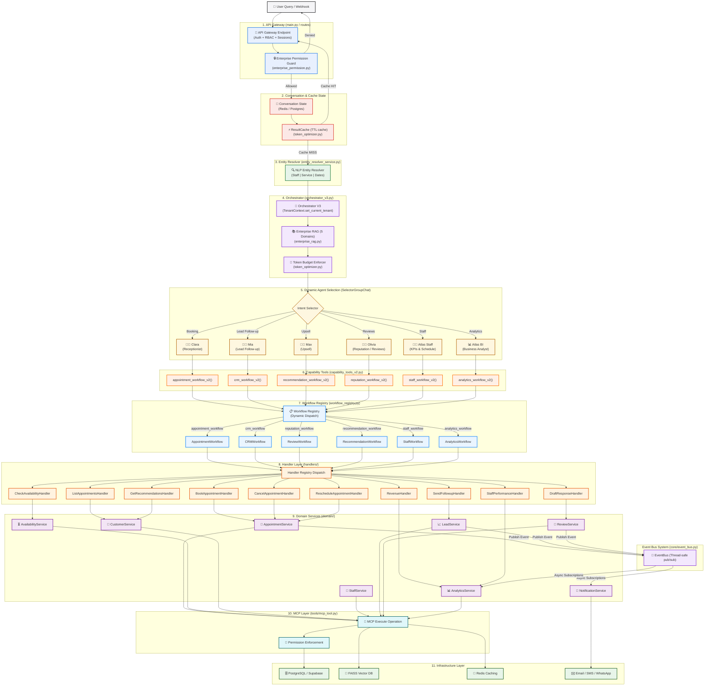

# SalonAI End-to-End Enterprise Architecture & Workflow Diagram

This document contains a detailed, comprehensive visualization and explanation of the end-to-end request workflow in the SalonAI Enterprise SaaS Platform. It maps the flow of a customer or staff request through the 12 architectural layers.

---

## 1. High-Level Architectural Layout (ASCII Representation)

Below is the complete, high-level workflow block diagram showing the flow of control and data:

```text
┌─────────────────────────────┐
│           USER              │
└──────────────┬──────────────┘
               │
               ▼
┌─────────────────────────────┐
│        API Gateway          │
│   Auth + RBAC + Sessions    │
└──────────────┬──────────────┘
               │
               ▼
┌─────────────────────────────┐
│      Conversation State     │
│     Redis / PostgreSQL      │
└──────────────┬──────────────┘
               │
               ▼
┌─────────────────────────────┐
│       Entity Resolver       │
│ Staff │ Service │ Dates     │
└──────────────┬──────────────┘
               │
               ▼
┌─────────────────────────────┐
│        Orchestrator         │
│ AutoGen Workforce Manager   │
└──────────────┬──────────────┘
               │
               ▼
     Dynamic Agent Selection

 ┌──────────┬─────────┬─────────┬─────────┬─────────┬─────────┐
 │  Clara   │   Mia   │   Max   │ Olivia  │ Atlas S │ AtlasBI │
 │Reception │  Lead   │ Upsell  │Reviews  │ Staff   │   BI    │
 └────┬─────┴────┬────┴────┬────┴────┬────┴────┬────┴────┬────┘
      │          │         │         │         │         │
      ▼          ▼         ▼         ▼         ▼         ▼

 ┌─────────────────────────────────────────────────────┐
 │                Capability Tools                     │
 ├─────────────────────────────────────────────────────┤
 │ appointment_workflow()                              │
 │ crm_workflow()                                      │
 │ recommendation_workflow()                           │
 │ reputation_workflow()                               │
 │ staff_workflow()                                    │
 │ analytics_workflow()                                │
 └─────────────────────┬───────────────────────────────┘
                       │
                       ▼

 ┌─────────────────────────────────────────────────────┐
 │                 Workflow Layer                      │
 ├─────────────────────────────────────────────────────┤
 │ AppointmentWorkflow                                 │
 │ CRMWorkflow                                         │
 │ ReviewWorkflow                                      │
 │ RecommendationWorkflow                              │
 │ StaffWorkflow                                       │
 │ AnalyticsWorkflow                                   │
 └─────────────────────┬───────────────────────────────┘
                       │
                       ▼

 ┌─────────────────────────────────────────────────────┐
 │                  Handler Layer                      │
 ├─────────────────────────────────────────────────────┤
 │ BookAppointmentHandler                              │
 │ ListAppointmentsHandler                             │
 │ CancelAppointmentHandler                            │
 │ RescheduleAppointmentHandler                        │
 │ RevenueHandler                                      │
 │ StaffPerformanceHandler                             │
 │ LeadFollowupHandler                                 │
 │ ReviewResponseHandler                               │
 │ UpsellRecommendationHandler                         │
 └─────────────────────┬───────────────────────────────┘
                       │
                       ▼

 ┌─────────────────────────────────────────────────────┐
 │                Domain Services                      │
 ├─────────────────────────────────────────────────────┤
 │ AvailabilityService                                 │
 │ AppointmentService                                  │
 │ CustomerService                                     │
 │ StaffService                                        │
 │ LeadService                                         │
 │ ReviewService                                       │
 │ AnalyticsService                                    │
 │ NotificationService                                 │
 └─────────────────────┬───────────────────────────────┘
                       │
                       ▼

 ┌─────────────────────────────────────────────────────┐
 │                     MCP Layer                       │
 ├─────────────────────────────────────────────────────┤
 │ Database Access                                     │
 │ Permission Enforcement                              │
 │ Query Execution                                     │
 │ External Integrations                               │
 └─────────────────────┬───────────────────────────────┘
                       │
                       ▼

 ┌─────────────────────────────────────────────────────┐
 │                 Infrastructure                      │
 ├─────────────────────────────────────────────────────┤
 │ PostgreSQL / Supabase                               │
 │ FAISS / Vector DB                                   │
 │ Redis                                               │
 │ Email / SMS                                         │
 │ WhatsApp                                            │
 └─────────────────────────────────────────────────────┘
```

---

## 2. In-Depth Workflow Sequence (Mermaid Flowchart)

This diagram tracks conditional branches, caches, RAG context injection, token optimization, event broadcasting, and the internal registry routing mechanisms.



---

## 3. Request Lifecycle State Diagram (Mermaid stateDiagram-v2)

This state chart visualizes the lifecycle state transitions of a user request from intake to final response formulation:

```mermaid
stateDiagram-v2
    [*] --> RequestReceived : User input arrives at API Gateway
    
    state RequestReceived {
        [*] --> Authentication
        Authentication --> SessionValidation : Valid Token
        SessionValidation --> PlanGating : Valid Session
    }
    
    RequestReceived --> AuthorizationFailed : Permission check fails
    AuthorizationFailed --> [*] : Return 403 / Access Denied
    
    RequestReceived --> ContextEnrichment : Authorized
    
    state ContextEnrichment {
        [*] --> StateLoading : Load conversation history
        StateLoading --> ParameterExtraction : EntityResolver parses dates/stylists
        ParameterExtraction --> RAGRetrieval : Load domain context from FAISS
        RAGRetrieval --> TokenOptimization : Compress context & budget check
    }
    
    ContextEnrichment --> CacheChecking
    
    state CacheChecking {
        [*] --> CacheLookup
        CacheLookup --> CacheHit : Match in Redis ResultCache
        CacheLookup --> CacheMiss : No active cache match
    }
    
    CacheChecking --> ResponseFormulation : CacheHit
    CacheChecking --> AgentSelection : CacheMiss
    
    state AgentSelection {
        [*] --> IntentClassification
        IntentClassification --> AgentRouting : SelectorGroupChat selects Agent
        AgentRouting --> AgentExecution : Agent prompt enriched
    }
    
    AgentSelection --> CapabilityDispatch
    
    state CapabilityDispatch {
        [*] --> ToolInvocation : Agent selects tool_v2
        ToolInvocation --> ContextCreation : Build HandlerContext
        ContextCreation --> RegistryLookup : WorkflowRegistry.dispatch
    }
    
    CapabilityDispatch --> HandlerExecution
    
    state HandlerExecution {
        [*] --> InputValidation : validate(ctx)
        InputValidation --> PreExecutionCheck : Valid params
        PreExecutionCheck --> ServiceCall : handle(ctx)
    }
    
    HandlerExecution --> ServiceExecution
    
    state ServiceExecution {
        [*] --> BusinessLogicRun : Service runs query/logic
        BusinessLogicRun --> DBQuery : Read/Write data
        BusinessLogicRun --> EventGeneration : Trigger domain event
        EventGeneration --> EventPublishing : Publish to EventBus
    }
    
    ServiceExecution --> EventDispatching
    
    state EventDispatching {
        [*] --> BusProcessing : Broadcast to subscribers
        BusProcessing --> NotificationAlert : SMS/Email sent
        BusProcessing --> MetricAggregation : Update analytics dashboard
    }
    
    ServiceExecution --> ResponseFormulation : Result returned to Agent
    ResponseFormulation --> Formatting : LLM formats JSON result to markdown/natural language
    Formatting --> [*] : Send output to User
```



---

## 4. Layer-by-Layer Architecture Details

### 1. API Gateway Layer
* **Role**: The entrypoint for all HTTP requests, WhatsApp webhooks, and client chat connections. Resolves auth tokens, verifies tenant details, and fetches the tenant's current plan (Free, Starter, Growth, Enterprise).
* **Key Files**: [backend/main.py](file:///c:/Users/ADMIN/OneDrive/Desktop/saloon/saloon-AI/backend/main.py), [backend/api/](file:///c:/Users/ADMIN/OneDrive/Desktop/saloon/saloon-AI/backend/api/), [backend/routes/](file:///c:/Users/ADMIN/OneDrive/Desktop/saloon/saloon-AI/backend/routes/), [backend/services/enterprise_permission.py](file:///c:/Users/ADMIN/OneDrive/Desktop/saloon/saloon-AI/backend/services/enterprise_permission.py).

### 2. Conversation State & Caching Layer
* **Role**: Fetches previous conversation turns to maintain context and implements a `ResultCache` to cache repeated/hot analytics and availability queries. This avoids redundant LLM/database processing.
* **Key Files**: [backend/services/conversation_state_service.py](file:///c:/Users/ADMIN/OneDrive/Desktop/saloon/saloon-AI/backend/services/conversation_state_service.py), [backend/core/token_optimizer.py](file:///c:/Users/ADMIN/OneDrive/Desktop/saloon/saloon-AI/backend/core/token_optimizer.py).

### 3. Entity Resolver Layer
* **Role**: Parses user queries using rules and NLP regex to resolve dates (e.g., "Monday 3 PM" -> UTC timestamp), staff (stylist names -> IDs), and services ("haircut" -> ID). This populates parameters prior to LLM routing.
* **Key Files**: [backend/services/entity_resolver_service.py](file:///c:/Users/ADMIN/OneDrive/Desktop/saloon/saloon-AI/backend/services/entity_resolver_service.py).

### 4. Orchestrator Layer
* **Role**: Manages multi-tenant isolation, sets the `TenantContext`, enriches prompt templates with domain-specific RAG contexts, and enforces token constraints (compressing long history and cutting prompt sizes to remain under the 3000-token cap).
* **Key Files**: [backend/agents/orchestrator_v3.py](file:///c:/Users/ADMIN/OneDrive/Desktop/saloon/saloon-AI/backend/agents/orchestrator_v3.py), [backend/core/tenant_context.py](file:///c:/Users/ADMIN/OneDrive/Desktop/saloon/saloon-AI/backend/core/tenant_context.py), [backend/rag/enterprise_rag.py](file:///c:/Users/ADMIN/OneDrive/Desktop/saloon/saloon-AI/backend/rag/enterprise_rag.py).

### 5. Dynamic Agent Selection Layer
* **Role**: Uses AutoGen's `SelectorGroupChat` to dynamically select which specialized agent should handle the user's message.
* **Key Files**: [backend/agents/orchestrator_v3.py](file:///c:/Users/ADMIN/OneDrive/Desktop/saloon/saloon-AI/backend/agents/orchestrator_v3.py) (incorporating Clara, Mia, Max, Olivia, Atlas Staff, and Atlas BI).

### 6. Capability Tools Layer
* **Role**: Clean, high-level tools exposed to AutoGen agents (e.g., `appointment_workflow_v2()`). Rather than writing SQL or invoking DB transactions directly, the agents call these capability tools. The tools parse inputs, construct a `HandlerContext`, and invoke the registry.
* **Key Files**: [backend/tools/capability_tools_v2.py](file:///c:/Users/ADMIN/OneDrive/Desktop/saloon/saloon-AI/backend/tools/capability_tools_v2.py).

### 7. Workflow Layer
* **Role**: Orchestrates high-level business flows. Uses the `WorkflowRegistry` to resolve registered workflows based on key string names and routes actions dynamically to their target handler.
* **Key Files**: [backend/core/workflow_registry.py](file:///c:/Users/ADMIN/OneDrive/Desktop/saloon/saloon-AI/backend/core/workflow_registry.py), [backend/workflows/](file:///c:/Users/ADMIN/OneDrive/Desktop/saloon/saloon-AI/backend/workflows/).

### 8. Handler Layer
* **Role**: Single-responsibility classes implementing the `BaseHandler` class. Each handler executes a 3-step lifecycle: `validate() → permission_check() → handle()`.
* **Key Files**: [backend/handlers/base.py](file:///c:/Users/ADMIN/OneDrive/Desktop/saloon/saloon-AI/backend/handlers/base.py), [backend/handlers/appointment_handlers.py](file:///c:/Users/ADMIN/OneDrive/Desktop/saloon/saloon-AI/backend/handlers/appointment_handlers.py), [backend/handlers/crm_handlers.py](file:///c:/Users/ADMIN/OneDrive/Desktop/saloon/saloon-AI/backend/handlers/crm_handlers.py), [backend/handlers/analytics_handlers.py](file:///c:/Users/ADMIN/OneDrive/Desktop/saloon/saloon-AI/backend/handlers/analytics_handlers.py), etc.

### 9. Domain Services Layer
* **Role**: Executes the core business logic (e.g. creating/modifying DB records, calculating slots). Publishes events (e.g. `AppointmentBookedEvent`) to the in-process `EventBus` to notify decoupled subscribers.
* **Key Files**: [backend/domain/](file:///c:/Users/ADMIN/OneDrive/Desktop/saloon/saloon-AI/backend/domain/).

### 10. MCP Layer (Model Context Protocol)
* **Role**: Acts as the interface for data access. Wraps database operations, enforces tenant row-level security boundaries, runs queries, and integrates with external interfaces securely.
* **Key Files**: [backend/tools/mcp_tool.py](file:///c:/Users/ADMIN/OneDrive/Desktop/saloon/saloon-AI/backend/tools/mcp_tool.py), [backend/mcp/](file:///c:/Users/ADMIN/OneDrive/Desktop/saloon/saloon-AI/backend/mcp/).

### 11. Infrastructure Layer
* **Role**: The core database structures, vector indices, messaging systems, and background job storage engines.
* **Key Components**: PostgreSQL/Supabase, Redis cache cluster, FAISS Vector database indices, WhatsApp API, Twilio SMS/SendGrid email relays.

---

## 5. End-to-End Tracing Example: Booking an Appointment

To show how the layers interact, let's trace a user request: **"Hey, please book a haircut with Clara on Monday at 3 PM for Likhith"**.

```text
  [ User ]
     │
     ▼ (1) POST /api/chat {"query": "Hey, please book a haircut with Clara...", "tenant_id": "salon-123"}
  [ API Gateway ]
     │
     ▼ (2) verify token + plan -> get_settings() -> check_enterprise_permission()
  [ Permission Guard ]
     │
     ▼ (3) load session -> fetch chat history
  [ Conversation State ]
     │
     ▼ (4) resolve_entity_context() -> resolves service="haircut", date="Monday 3 PM", customer="Likhith"
  [ Entity Resolver ]
     │
     ▼ (5) process(input_data) -> set_current_tenant("salon-123")
  [ Orchestrator V3 ]
     │
     ▼ (6) load RAG context (policy + customer) -> compress -> check token budget
  [ Token Enforcer / RAG ]
     │
     ▼ (7) intent: BOOKING -> selects "Clara_Receptionist" agent
  [ Dynamic Agent Selection ]
     │
     ▼ (8) agent calls appointment_workflow_v2(action="book", params={"service_id": "...", "start_time": "..."})
  [ Capability Tools ]
     │
     ▼ (9) constructs HandlerContext -> workflow_registry.dispatch("appointment_workflow", "book", ctx)
  [ Workflow Layer ]
     │
     ▼ (10) resolves to BookAppointmentHandler -> execute()
  [ Handler Layer ]
     │
     ▼ (11) runs validate() -> checks RBAC permissions -> handle() -> calls AppointmentService.book()
  [ Domain Service (AppointmentService) ]
     ├─────────────────────────────────────────┐
     ▼ (12) calls mcp_execute() to insert record │ (13) publishes AppointmentBookedEvent
  [ MCP Layer ]                                [ Event Bus ]
     │                                            │
     ▼ (14) Runs transaction                      ▼ (15) Broadcasts to subscribers
  [ PostgreSQL Database ]                     [ NotificationService ]
                                                  │
                                                  ▼ (16) Triggers WhatsApp Cloud API
                                              [ WhatsApp / Infrastructure ]
```
