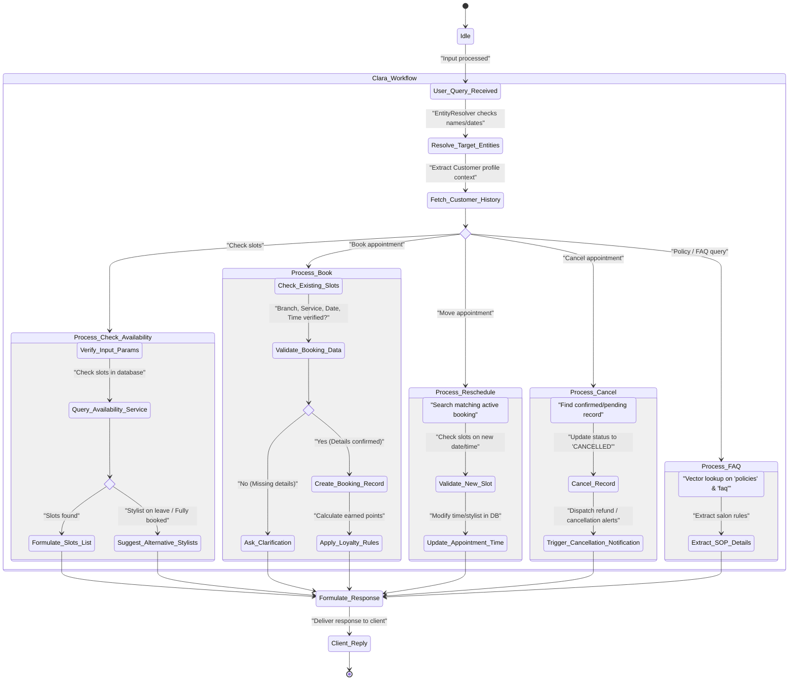
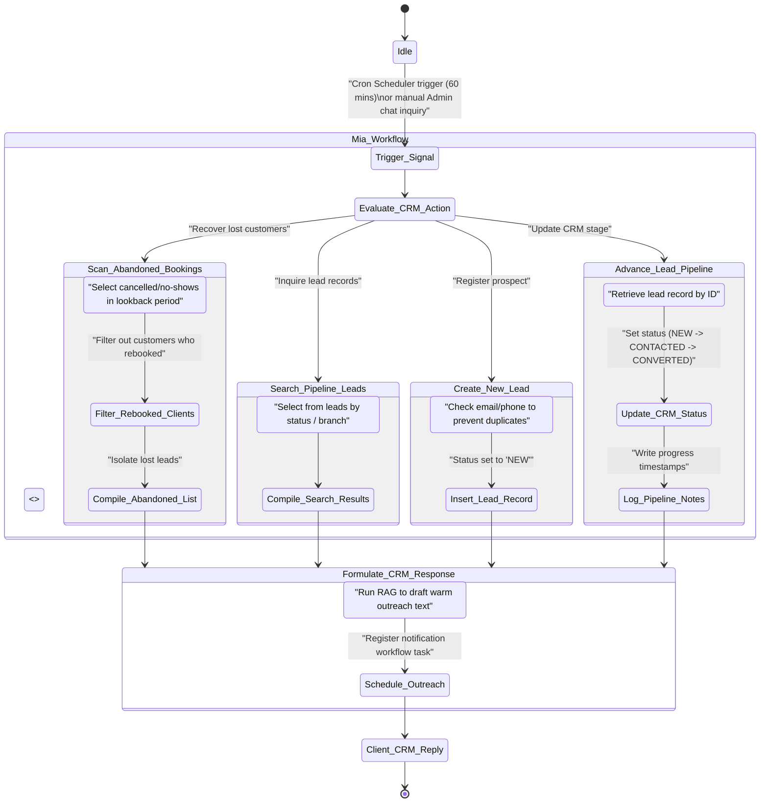
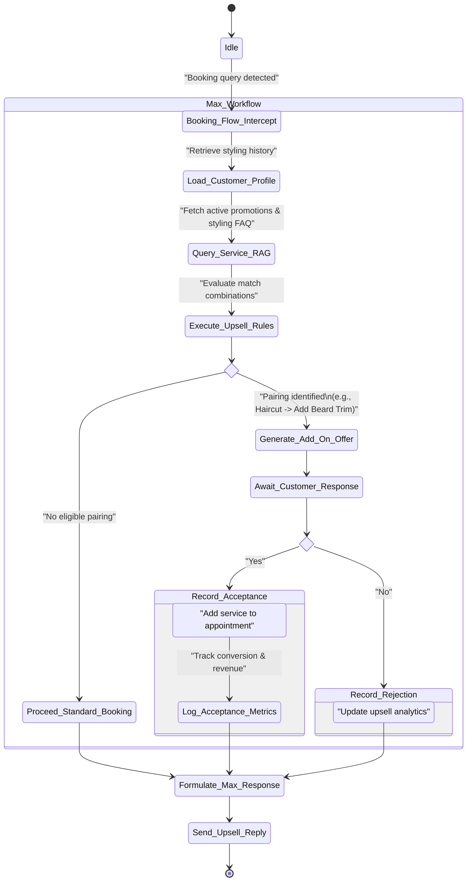
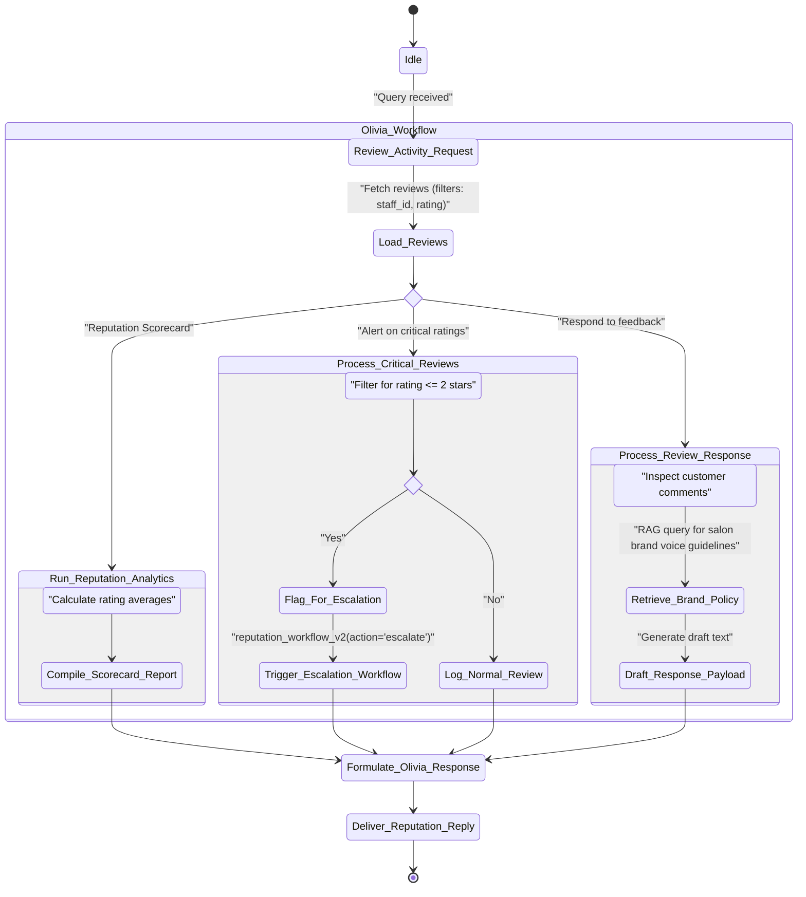
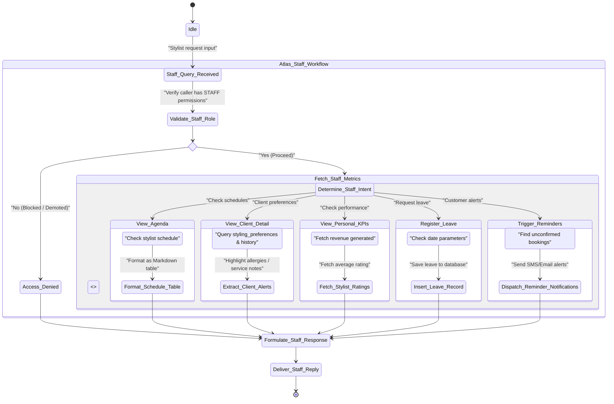
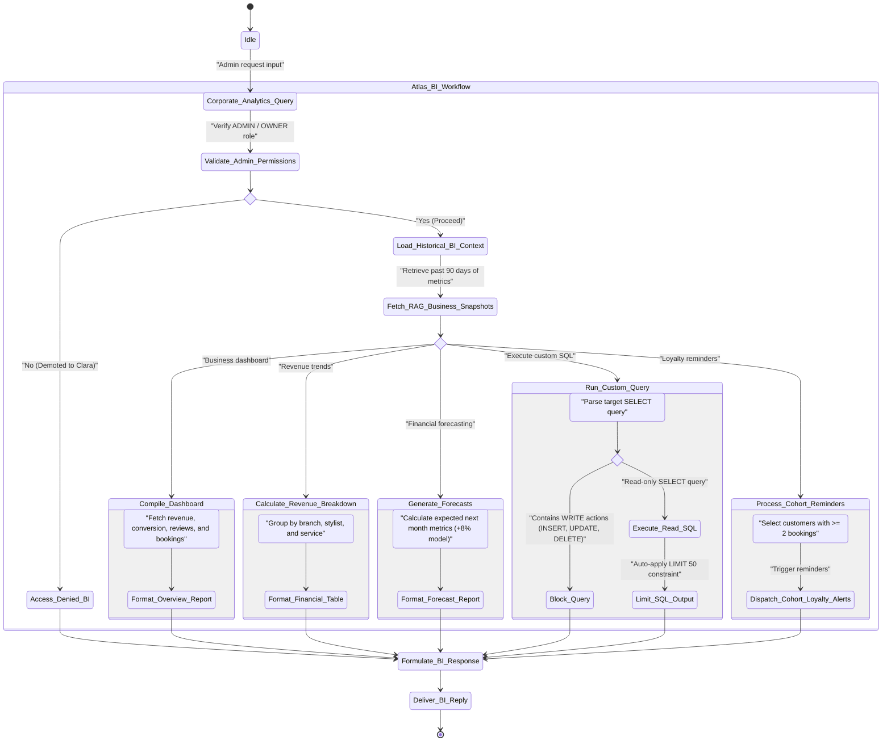

# SalonAI Workforce Platform: System Architecture & AI Agent Workflows

This document provides a comprehensive, in-depth blueprint of the SalonAI Workforce Platform. It details the system's end-to-end execution flow, the design of the multi-agent orchestrator, the dynamic capability-routing mechanisms, and the individual state machines governing the six specialized AI agents.

---

## 1. High-Level Project Architecture

The SalonAI Workforce Platform leverages a robust **three-tier architecture** designed for high-throughput, multi-tenant conversational operations:
1. **Presentation Tier (Frontend)**: Real-time UI that initiates chats, manages ongoing session IDs, and handles user roles (Customers, Stylists, Admins).
2. **Application Tier (FastAPI & AI Workforce Backend)**: Contains the API routing endpoints, the multi-agent orchestrator (`OrchestratorV3`), token optimizer caching, event dispatchers, semantic RAG pipelines, and the dynamic `WorkflowRegistry`.
3. **Database Tier (Supabase & SQLite)**: Exposes persistence for tenant data, branches, reviews, leads, bookings, customer profiles, staff details, chat logs, and vector embeddings for semantic search.

### System Architecture State Diagram

The diagram below maps the complete lifecycle of a request, from client invocation, orchestrator interception, intent classification, agent dispatching, and transaction handling, down to formatting and response delivery.

```mermaid
stateDiagram-v2
    [*] --> Idle : Client Ready
    
    state Presentation_Tier {
        Idle --> Router_Received : "POST /api/agent/chat\n(Message, SessionID, UserRole)"
    }
    
    state API_Router_Gateway {
        Router_Received --> Store_User_Message : "Log message to ChatLog"
        Store_User_Message --> Reset_Lead_Check : "Active Lead Reset to 'NEW'"
        Reset_Lead_Check --> Check_Timeout_Threshold : "Awaiting agent execution"
        
        state Timeout_Fallback_Fork <<choice>>
        Check_Timeout_Threshold --> Timeout_Fallback_Fork
        Timeout_Fallback_Fork --> Sync_Processing : "Under 30 Seconds"
        Timeout_Fallback_Fork --> Async_Background_Fork : "Exceeds 30 Seconds"
        
        Async_Background_Fork --> Deliver_Pending_Response : "Return 'Processing...'"
        Deliver_Pending_Response --> [*]
    }
    
    state Orchestrator_Pipeline {
        Sync_Processing --> Set_Tenant_Context : "Initialize TenantContext"
        Async_Background_Fork --> Set_Tenant_Context : "Background Thread Init"
        
        Set_Tenant_Context --> Check_Result_Cache : "Inspect ResultCache\n(Dashboard, Revenue, Forecasts)"
        
        state Cache_Match_Fork <<choice>>
        Check_Result_Cache --> Cache_Match_Fork
        Cache_Match_Fork --> Cache_Hit : "HIT"
        Cache_Match_Fork --> Permission_Check : "MISS"
        
        Cache_Hit --> Format_Cached_Output : "Bypass LLM Processing"
        
        Permission_Check --> Verify_Plan_Eligibility : "EnterprisePermissionGuard"
        
        state Permission_Fork <<choice>>
        Verify_Plan_Eligibility --> Permission_Fork
        Permission_Fork --> Access_Denied_Response : "Invalid Role or Plan Gated"
        Permission_Fork --> Intent_Resolution : "Authorized"
        
        Access_Denied_Response --> Format_System_Output : "Generate Error Message"
        
        state Intent_Classifier {
            Intent_Resolution --> Sticky_Booking_Check : "Active 'pending_booking'?"
            Sticky_Booking_Check --> Rule_Based_Classifier : "No"
            Sticky_Booking_Check --> Resolve_Agent_Target : "Yes -> Force Clara"
            
            Rule_Based_Classifier --> Validate_Role_Intents : "Keyword Matched"
            Rule_Based_Classifier --> LLM_Fallback_Classifier : "Unknown Intent"
            LLM_Fallback_Classifier --> Validate_Role_Intents : "Classify intent via LLM"
            
            Validate_Role_Intents --> Resolve_Agent_Target : "Role-Boundary Cleanse\n(Block Customer from BI/Staff)"
        }
        
        state Query_Enrichment {
            Resolve_Agent_Target --> Load_Conversation_Context : "Fetch prior turns from StateService"
            Load_Conversation_Context --> Resolve_Entities : "EntityResolverService\n(Convert relative names/dates to UUIDs)"
            Resolve_Entities --> Query_RAG_Domains : "Retrieve unified RAG contexts\n(Policy, Lead, Staff, BI, Cust)"
            Query_RAG_Domains --> Enforce_Token_Budget : "TokenOptimizer Budget Limit\n(Hard cap: 3000 tokens)"
        }
    }
    
    state Specialist_Agent_Cluster {
        Enforce_Token_Budget --> Dispatch_Agent : "Awaiting agent execution"
        
        state Group_Mode_Fork <<choice>>
        Dispatch_Agent --> Group_Mode_Fork
        Group_Mode_Fork --> Single_Agent_Execution : "use_team = False"
        Group_Mode_Fork --> Selector_Group_Chat : "use_team = True"
        
        Single_Agent_Execution --> Evaluate_Query : "Selected Agent analyzes prompt"
        Selector_Group_Chat --> Evaluate_Query : "Selector decides speaker turn"
        
        Evaluate_Query --> Decision_Loop : "LLM Execution"
        
        state Tool_Call_Required <<choice>>
        Decision_Loop --> Tool_Call_Required
        Tool_Call_Required --> Dynamic_Capability_Routing : "Yes (Tool needed)"
        Tool_Call_Required --> Agent_Final_Response : "No (Conversational)"
    }
    
    state Action_Registry_Handlers {
        Dynamic_Capability_Routing --> Retrieve_Registry : "Get WorkflowRegistry Instance"
        Retrieve_Registry --> Construct_Handler_Context : "Initialize HandlerContext\n(TenantID, Role, TraceID, Params)"
        Construct_Handler_Context --> Dict_Lookup : "Lookup (Workflow, Action)\nin registry (Zero if/else chains)"
        Dict_Lookup --> Verify_Action_Permissions : "BaseHandler.validate() & PermissionGuard"
        Verify_Action_Permissions --> Run_Business_Transaction : "Execute handler.handle()"
        
        state Database_Tier {
            Run_Business_Transaction --> Execute_DB_Operations : "Query Supabase via SQLAlchemy\n(CRUD / Transactions)"
        }
        
        Execute_DB_Operations --> Return_Raw_Result : "Success / Failure Payload"
        Return_Raw_Result --> Result_Compression : "TokenOptimizer compression\n(Cap output to 400 tokens)"
        Result_Compression --> Evaluate_Query : "Feed compressed output back to Agent"
    }
    
    state Response_Output_Pipeline {
        Agent_Final_Response --> Format_Response : "Format raw outputs"
        Format_Cached_Output --> Format_Response
        Format_System_Output --> Format_Response
        
        state JSON_Output_Fork <<choice>>
        Format_Response --> JSON_Output_Fork
        JSON_Output_Fork --> Convert_Raw_JSON : "Raw JSON / Dict returned"
        JSON_Output_Fork --> Complete_Response : "Friendly Markdown returned"
        
        Convert_Raw_JSON --> Complete_Response : "Run LLM Formatter Fallback\n(Convert data to Markdown tables)"
        
        Complete_Response --> Store_Assistant_Message : "Save response to ChatLog"
        Store_Assistant_Message --> Deliver_To_Client : "Return payload to user"
    }
    
    Deliver_To_Client --> [*] : Complete Turn
```

---

## 2. The 6 Agent Workflow State Charts

Each of the six specialist agents operates inside a customized state machine. They inherit features from Microsoft AutoGen and interact with the database via dedicated workflows in the `WorkflowRegistry`.

### 2.1 Clara — AI Receptionist Agent

Clara handles bookings, scheduling, availability queries, cancellations, and salon policies.

#### Detailed Operations Flow (Clara)
- **Sanitisation and Date Repair**: Resolves text expressions like "tomorrow at 5pm" or "next Tuesday" to actual date/time structures (e.g., `2026-06-16 17:00:00`) before submitting parameters.
- **Availability Enforcement**: Clara never generates arbitrary time slots. If the requested stylist is unavailable or on leave, Clara runs `list_staff` and queries alternative staff members to present options.
- **Sticky Booking Control**: If a booking process is incomplete, the system stores details in `pending_booking`. During subsequent turns, the orchestrator keeps routing queries to Clara until the transaction completes or is cancelled.

---

### 2.2 Mia — AI Lead Follow-Up Specialist

Mia manages CRM prospects, identifies lost bookings, creates nurture campaigns, and tracks sales pipelines.

#### Detailed Operations Flow (Mia)
- **CRM funnel tracking**: Mia moves prospects through status stages (`NEW` $\rightarrow$ `CONTACTED` $\rightarrow$ `INTERESTED` $\rightarrow$ `CONVERTED` $\rightarrow$ `LOST`).
- **Nurture Personalisation**: Integrates with the vector databases `search_lead_memory` and `search_customer_memory`. If a customer churned after a color treatment, Mia drafts follow-ups offering discounts on touch-ups.
- **Outreach Scheduling**: Rather than sending notifications directly, Mia registers scheduling details via `crm_workflow_v2(action='send_followup')`, allowing background schedulers to send alerts via the requested communication channel.

---

### 2.3 Max — AI Upsell Specialist

Max drives add-on sales, suggests upgrades during bookings, and records acceptances.

#### Detailed Operations Flow (Max)
- **Matching recommendations**: Max runs `recommendation_workflow_v2(action='get_recommendations')` to analyze customer appointment history. If a client books a "Balayage" every 6 weeks, Max recommends a "Gloss Treatment" upgrade.
- **Conversion Tracking**: Tracks accepted and rejected recommendations to update performance dashboards. Max works directly with the `AnalyticsService` to report monthly upsell revenue performance.

---

### 2.4 Olivia — AI Reputation Manager

Olivia monitors reviews, checks rating sentiment, drafts responses, and escalates complaints.

#### Detailed Operations Flow (Olivia)
- **Urgent Escalations**: 1-star reviews or comments with highly negative sentiment trigger immediate escalations. Olivia logs these as alerts for the management team.
- **Brand Voice Consistency**: When drafting responses via `reputation_workflow_v2(action='respond')`, Olivia retrieves context from `reputation_memory` to ensure replies are professional, empathetic, and offer appropriate resolutions.

---

### 2.5 Atlas Staff — AI Staff Assistant Agent

Atlas Staff helps salon stylists manage schedules, check customer preferences, and log leaves.

#### Detailed Operations Flow (Atlas Staff)
- **Styling Preferences Lookup**: Atlas Staff searches for customer notes (e.g., "allergic to ammonia dye" or "prefers blonde highlights") so stylists can review client histories before appointments.
- **Performance Dashboards**: Stylists can check their individual utilization rates and client retention scores to track personal performance metrics.
- **Leave Request Validations**: When stylists log leaves, Atlas Staff verifies date parameters before saving the request to the database.

---

### 2.6 Atlas BI — AI Business Intelligence Analyst

Atlas BI provides business metrics, revenue forecasts, and custom SQL analytics to admins.

#### Detailed Operations Flow (Atlas BI)
- **RAG-based BI Context**: When asked analytical questions (e.g., "Why did revenue drop?"), Atlas BI queries `mcp_read(resource='business_context')` to analyze trends over the past 90 days rather than just returning current metrics.
- **SQL Security Guardrails**: The custom SQL execution tool parses inputs to block write operations (`INSERT`, `UPDATE`, `DELETE`, `DROP`). It also automatically appends `LIMIT 50` to queries to prevent database strain.
- **McKinsey-Style Formatting**: Synthesizes dashboard aggregates, financial trends, and forecasts into structured Markdown tables and bullet points.

---

## 3. Core Architecture Component Deep-Dive

Here is a breakdown of the key platform modules that support the workforce platform:

| Component | Responsibility | Performance Impact |
| :--- | :--- | :--- |
| **`FastAPI Gateway`** | Exposes `/agent/chat` endpoints, handles role checks, and manages timeouts by forking long-running requests to background workers. | Pre-allocates sessions in <5ms. |
| **`OrchestratorV3`** | Sets tenant context, handles caching, checks user permissions, identifies intents, and enriches prompts. | Saves LLM calls via cache hits. |
| **`ResultCache`** | Caches analytics and forecasts to reduce LLM token usage. | Returns cached dashboard data in <2ms. |
| **`StateService`** | Manages conversation histories and supports sticky routing for incomplete bookings. | Minimizes conversation memory overhead. |
| **`EntityResolver`** | Resolves names and relative date expressions to matching database UUIDs before executing agent workflows. | Prevents booking failures from ambiguous inputs. |
| **`Unified RAG`** | Gathers domain context (Policy, CRM, BI, Staff, Customer) to enrich system prompts. | Restricts searches to 2 documents (<800 chars). |
| **`Token Budgeter`** | Truncates histories to enforce a 3000-token cap on prompts. | Prevents model context overflows. |
| **`WorkflowRegistry`** | Maps actions to handlers dynamically via dictionary lookups instead of long conditional chains. | Executes lookups in <1ms. |
| **`BaseHandler`** | Subclasses run input validation, enforce action permissions, and execute database transactions. | Ensures consistent database operations. |
| **`Supabase/PostgreSQL`** | Persists salon configurations, bookings, leads, reviews, and transaction details. | Supports index-optimized queries. |
